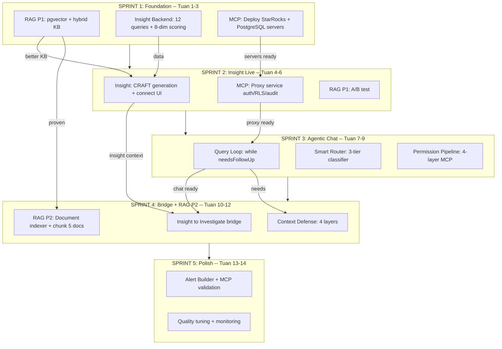

# Nexus AI Engine v2 -- Ke Hoach Nang Cap Chi Tiet

Ban luu trong repo: `docs/plans/nexus-ai-engine-upgrade.md` (co the commit len Git). Ban trong `.cursor/plans/` chi la ban cache local neu co.

## Kiem tra dieu kien van hanh (pre-flight)

Truoc khi kiem thu RAG hybrid, Insight, MCP: **ma nguon da co migration** nhung **PostgreSQL phai thuc su ap dung** (va co extension pgvector). Neu `SELECT` duoi day khong thay `vector` / cot `embedding`, hay xu ly remediation.

### Checklist (danh dau tung muc)


| Nhom                       | Viec kiem tra                                                                                                                                                                                                  | Ghi chu ngan                                                                                                                                               |
| -------------------------- | -------------------------------------------------------------------------------------------------------------------------------------------------------------------------------------------------------------- | ---------------------------------------------------------------------------------------------------------------------------------------------------------- |
| **Postgres dung instance** | Connection string API dang dung (`ConnectionStrings:DefaultConnection` trong [appsettings.json](../../backend/MediationPro.Api/appsettings.json)) trung DB ban query                                           | Tranh nham `mediationpro` vs `mediationpro_hangfire`                                                                                                       |
| **Extension vector**       | `SELECT * FROM pg_extension WHERE extname = 'vector';`                                                                                                                                                         | Neu rong: cai goi **pgvector** tren server hoac image Docker co san; user can quyen `CREATE EXTENSION` (superuser / RDS: extension phai duoc ho tro + bat) |
| **Cot embedding KB**       | `information_schema.columns` / `\d ai_knowledge_base`                                                                                                                                                          | Neu thieu: chay EF migration (lenh duoi) toi dung database                                                                                                 |
| **Bang RAG (Sprint 4)**    | Ton tai `rag_documents`, `rag_chunks`                                                                                                                                                                          | Migration [20260405155315_AddNexusAiEngineSchema.cs](../../backend/MediationPro.Infrastructure/Migrations/20260405155315_AddNexusAiEngineSchema.cs) (gop schema + pgvector)    |
| **Embedding API**          | OpenAI enabled + api_key trong `ai_provider_configs` (cung hang voi chat) — [EmbeddingService.cs](../../backend/MediationPro.Infrastructure/Services/AiAssistant/EmbeddingService.cs) `IsEmbeddingAvailableAsync` | Khong co key: hybrid chi keyword; log `[KB][RAG-AB]` van co nhanh fallback                                                                                 |
| **StarRocks Insight**      | `StarRocks:ConnectionString`; du lieu `gold.fact_daily_app_metrics` (hoac bang ma [AppInsightSnapshotBuilder](../../backend/MediationPro.Infrastructure/Services/AppInsight/AppInsightSnapshotBuilder.cs) doc) | Neu tat StarRocks hoac thieu dong: snapshot partial / `data_gaps`                                                                                          |
| **MCP**                    | `Mcp:StarRocks:Url`, `Mcp:Postgres:Url`; container healthy                                                                                                                                                     | Khong bat buoc cho pgvector; can cho agentic / MCP path                                                                                                    |
| **API / quyen**            | JWT; quyen man hinh insight (`view-ai-insight`, `regenerate-insight`, …)                                                                                                                                       | [AppInsightsController.cs](../../backend/MediationPro.Api/Controllers/AppInsightsController.cs)                                                            |


### SQL copy-paste

```sql
-- Dang ket noi dung database?
SELECT current_database();

-- Extension pgvector
SELECT extname, extversion FROM pg_extension WHERE extname = 'vector';

-- Cot embedding tren bang KB
SELECT column_name, data_type, udt_name
FROM information_schema.columns
WHERE table_schema = 'public'
  AND table_name = 'ai_knowledge_base'
  AND column_name = 'embedding';

-- Bang RAG (Sprint 4)
SELECT table_name
FROM information_schema.tables
WHERE table_schema = 'public'
  AND table_name IN ('rag_documents', 'rag_chunks')
ORDER BY table_name;
```

### Remediation: ap dung migration (tu thu muc goc repo)

```bash
dotnet ef database update --project backend/MediationPro.Infrastructure/MediationPro.Infrastructure.csproj --startup-project backend/MediationPro.Api/MediationPro.Api.csproj
```

- Migration gop (co file `.Designer.cs`): [20260405155315_AddNexusAiEngineSchema.cs](../../backend/MediationPro.Infrastructure/Migrations/20260405155315_AddNexusAiEngineSchema.cs) — `mcp_audit_logs`, `ai_session_memories`, `rag_*`, `CREATE EXTENSION vector`, cot `embedding` + ivfflat tren `ai_knowledge_base` va `rag_chunks`.

### Loi: `extension "vector" is not available` / khong tim thay `vector.control`

Postgres **chua cai binary pgvector** tren may/container. Image `postgres:16` mac dinh **khong** co extension nay. Can cai **truoc** khi chay `dotnet ef database update`.

**Docker (khuyen nghi):** doi image sang build co pgvector, cung major version Postgres:

```yaml
# Vi du: thay postgres:16 -> pgvector/pgvector:pg16
image: pgvector/pgvector:pg16
```

Hoac tag tuong ung `pg15`, `pg17` — xem [pgvector/pgvector](https://github.com/pgvector/pgvector) tren Docker Hub.

**Ubuntu/Debian (Postgres cai tren host):**

```bash
sudo apt install postgresql-16-pgvector   # thay 16 bang phien ban cluster cua ban
```

**RDS / Azure / Cloud SQL:** bat extension **vector** trong console (neu nha cung cap ho tro); neu khong ho tro thi phai dung instance/loai Postgres co pgvector.

Sau khi server da co pgvector, vao DB chay (superuser hoac role du quyen):

```sql
CREATE EXTENSION IF NOT EXISTS vector;
```

Roi chay lai `dotnet ef database update`.

---

## Hien trang codebase va moi truong

**Ma nguon (repo):** Cac hang muc trong plan da duoc trien khai trong code; trang thai cong viec xem YAML todos o dau file (`completed`).

**Snapshot luc lap plan (tham khao lich su):** Truoc dot nang cap, codebase da co CRAFT, AiAssistant, KB keyword, Insight v1, Hangfire; chua co MCP, vector/RAG day du, agentic loop, v.v. Doan nay giu y nghia **truoc/sau thiet ke**, khong mo ta trang thai file hien tai.

**Diem chinh sau nang cap (code hien tai):**

- Embedding + hybrid KB: [KnowledgeBaseService.cs](../../backend/MediationPro.Infrastructure/Services/AiAssistant/KnowledgeBaseService.cs), migration [20260405155315_AddNexusAiEngineSchema.cs](../../backend/MediationPro.Infrastructure/Migrations/20260405155315_AddNexusAiEngineSchema.cs)
- MCP proxy + permission: [McpPermissionPipeline.cs](../../backend/MediationPro.Infrastructure/Services/McpProxy/McpPermissionPipeline.cs), [McpProxyService.cs](../../backend/MediationPro.Infrastructure/Services/McpProxy/McpProxyService.cs)
- **MCP Discipline (doc 125) — da trien khai:** prompt khuon kho [McpDisciplineSystemPrompt.cs](../../backend/MediationPro.Infrastructure/Services/AiAssistant/McpDisciplineSystemPrompt.cs) + [AgenticQueryLoop.cs](../../backend/MediationPro.Infrastructure/Services/AiAssistant/AgenticQueryLoop.cs); Gate date [McpDateFilterGuard.cs](../../backend/MediationPro.Infrastructure/Services/McpProxy/McpDateFilterGuard.cs); RLS bo qua dim lookup [McpRlsInjector.cs](../../backend/MediationPro.Infrastructure/Services/McpProxy/McpRlsInjector.cs); burst + session + timeout [McpRateLimiter.cs](../../backend/MediationPro.Infrastructure/Services/McpProxy/McpRateLimiter.cs), [McpDisciplineConfig.cs](../../backend/MediationPro.Infrastructure/Services/McpProxy/McpDisciplineConfig.cs), [Program.cs](../../backend/MediationPro.Api/Program.cs) (HttpClient MCP); CRAFT bo sung [CraftPromptBuilder.cs](../../backend/MediationPro.Infrastructure/Services/AiAssistant/CraftPromptBuilder.cs); App Insight grounding [AppInsightMarkdownGenerator.cs](../../backend/MediationPro.Infrastructure/Services/AppInsight/AppInsightMarkdownGenerator.cs); cau hinh `Mcp:Discipline` trong [appsettings.json](../../backend/MediationPro.Api/appsettings.json); ops [docker/mcp/README.md](../../docker/mcp/README.md). Tai lieu: [125_-_MCP_Discipline_Guide.md](../125_-_MCP_Discipline_Guide.md).
- Insight / snapshot / scoring: [AppInsightSnapshotBuilder.cs](../../backend/MediationPro.Infrastructure/Services/AppInsight/AppInsightSnapshotBuilder.cs), orchestrator, API [AppInsightsController.cs](../../backend/MediationPro.Api/Controllers/AppInsightsController.cs)
- Agentic: [AgenticQueryLoop.cs](../../backend/MediationPro.Infrastructure/Services/AiAssistant/AgenticQueryLoop.cs), endpoint `ask-agentic` tren [AiAssistantController.cs](../../backend/MediationPro.Api/Controllers/AiAssistantController.cs)

**Moi truong:** Neu DB **chua** co `vector` / cot `embedding` mac du code da merge — thuong la **chua `database update` dung instance**, hoac Postgres **chua cai pgvector**. Xem muc **Pre-flight** o tren.

---

## Dependency Map Tong The



---

## Hoan thanh gian doan: MCP Discipline (doc 125)

**Trang thai:** **Hoan thanh** (thang 4/2026). Day la lop **ky luat** tren MCP + agentic + App Insight (khong thay the Sprint 1–5 trong bieu do; nam **chen** giua Sprint 3 va cong viec Sprint 4).

**Muc tieu da dat:**

- L1–L2: System prompt MCP (gold → silver → bronze, date window, LIMIT, toi da ~6 tool query/phien, `<thinking>` truoc tool, anti-pattern) gan vao vong agentic; CRAFT co bullet StarRocks date + LIMIT.
- Gate 4: StarRocks analytics **bat buoc** co dieu kien ngay/partition (heuristic); mien tru metadata + truy van **chi** bang dim whitelist.
- Gate 5b: **Khong** inject `app_id` khi query **chi** tham chieu bang dimension trong `Mcp:Discipline:RlsSkipDimensionTables` (StarRocks); Postgres khong inject RLS qua injector nay.
- Gate 6: Gioi han **burst** theo phien (mac dinh 3/phut), **session** (mac dinh 6) va **ngay** (200) doc tu `IConfiguration`; `AgenticQueryLoop` dong bo `MaxQueriesPerSession` voi proxy.
- HTTP MCP StarRocks: `Timeout` theo `Mcp:Discipline:StarRocksTimeoutSeconds` (mac dinh 30s).
- Agentic: Khi MCP that bai, noi dung tool message co **huong dan loi** co cau truc (khong retry vo nghia).
- App Insight: Prompt markdown **chi** so lieu tu snapshot/anomalies; neu co `dataGaps` thi phai noi ro.

**Kiem thu tu dong (repo):**

- Chay harness: `dotnet run --project backend/MediationPro.Infrastructure.Tests/MediationPro.Infrastructure.Tests.csproj` — co test `McpDateFilter*` va `McpStarRocksSqlHelpers` (dimension-only vs join fact).

---

## Sprint tiep theo (uu tien sau MCP Discipline)

Tiep tuc **Sprint 4** trong ke hoach goc Nexus (chua doi so thu tu sprint tren bieu do):

1. **Bridge Insight → Investigate** — endpoint + UI “Investigate”, [InsightInvestigateService.cs](../../backend/MediationPro.Infrastructure/Services/AiAssistant/InsightInvestigateService.cs).
2. **Context defense + session memory** — on dinh hoi thoai dai ([ContextDefenseManager.cs](../../backend/MediationPro.Infrastructure/Services/AiAssistant/ContextDefense/ContextDefenseManager.cs), [SessionMemoryService.cs](../../backend/MediationPro.Infrastructure/Services/AiAssistant/SessionMemoryService.cs)).
3. **RAG P2** — indexer tai lieu, 3-kenh tim trong [KnowledgeBaseService.cs](../../backend/MediationPro.Infrastructure/Services/AiAssistant/KnowledgeBaseService.cs) khi da index du chunk.

**Ghi chu:** Neu can sprint nho tiep theo chi MCP, co the uu tien Gate 7 (canh bao / cat ~1000 dong response) hoac fine-tune heuristic date filter theo log that.

---

## Checklist kiem thu output theo Sprint

Dung bang nay de **hoi quy** (regression) sau moi dot trien khai. Quy uoc:

- Danh dau `- [ ]` -> `- [x]` khi **PASS**.
- Ghi **bang chung ngan**: thoi gian (UTC+7), `app_id` (AdMob) hoac `app_row_id` noi bo, user/role, 1-2 field trong JSON response hoac `SqlState` neu FAIL.
- Chay **Pre-flight** (muc dau file) truoc khi ket luan loi do moi truong.
- Moi API duoi day can **JWT hop le** va **dung quyen** (insight, AI assistant, admin) — xem attribute `[Authorize]` tren controller.

### MCP Discipline (doc 125) — checklist kiem thu sprint vua trien khai

**Cau hinh & doc**

- [ ] Trong [appsettings.json](../../backend/MediationPro.Api/appsettings.json) (hoac override moi truong) co khoi `Mcp:Discipline`: `RequireDateFilterForAnalytics`, `MaxQueriesPerSession`, `MaxQueriesPerMinutePerSession`, `MaxQueriesPerUserPerDay`, `StarRocksTimeoutSeconds`, `RlsSkipDimensionTables` dung y dinh deploy.
- [ ] [docker/mcp/README.md](../../docker/mcp/README.md) da doc phan `Discipline` / doc 125 — team biet chinh sua gioi han ma khong sua code.

**Tu dong**

- [ ] `dotnet build` thanh cong: `MediationPro.Infrastructure`, `MediationPro.Api`, `MediationPro.Infrastructure.Tests`.
- [ ] `dotnet run --project backend/MediationPro.Infrastructure.Tests/MediationPro.Infrastructure.Tests.csproj`: PASS tat ca test, gom `McpDateFilter*` va `McpStarRocksSqlHelpers dimension-only vs mixed`.

**Proxy StarRocks (qua luong MCP that — agentic hoac goi noi bo)**

- [ ] SQL vao `gold.*` / `silver.*` / `bronze.*` **khong** co dieu kien ngay (vd. chi `WHERE app_id = ...`) bi **tu choi** voi message ro rang (date filter).
- [ ] SQL cung bang fact co `date` / `event_date` / ... hoac `DATE_SUB(CURDATE(), ...)` duoc **cho qua** (neu cac gate khac OK).
- [ ] Query **chi** `silver.dim_country` (hoac dim khac trong whitelist) **khong** bi inject `app_id` lam loi cot; join fact + dim van **co** RLS nhu cu.
- [ ] Sau **N** query trong cung phien (N = `MaxQueriesPerMinutePerSession`) trong < 60s: lan N+1 bi tu choi burst (neu cau hinh mac dinh 3/phut).
- [ ] Sau **MaxQueriesPerSession** query MCP trong phien agentic: tu choi ro rang; so `mcpQueriesUsed` khong vuot nguong cau hinh.
- [ ] Truy van MCP StarRocks cham hon `StarRocksTimeoutSeconds`: client timeout, khong treo vo han; log co the truy vet.

**Agentic**

- [ ] `POST .../ask-agentic`: mo hinh nhan duoc block ky luat MCP (thinking / layer / LIMIT); khong vuot ~6 lan goi tool SQL hop le trong mot cau hoi don gian (hoac dung voi gioi han cau hinh).
- [ ] Khi MCP tra loi that bai (permission / syntax / timeout): phan tool message co **huong dan** (doc §6.1 — khong lap lai SQL y het, don gian hoa / doc loi).

**App Insight (khong MCP)**

- [ ] Sinh lai insight (regenerate hoac job): markdown **khong** tua so revenue/DAU khong co trong snapshot JSON; neu payload co `dataGaps` / partial thi van ban **thua nhan** thieu du lieu.

**Audit (khong doi logic, hoi quy)**

- [ ] `mcp_audit_logs` van ghi khi query duoc thu thi hoac bi tu choi som (tuy implementation) — xac nhan team van truy vet duoc.

---

### Sprint 1 — Foundation (RAG P1, Insight data, MCP deploy)

**Database & migration**

- [ ] `dotnet ef database update` khong con migration pending tren dung DB `DefaultConnection`.
- [ ] Extension `vector`; cot `ai_knowledge_base.embedding`; bang `mcp_audit_logs`, `ai_session_memories`, `rag_documents`, `rag_chunks` (theo migration [20260405155315_AddNexusAiEngineSchema.cs](../../backend/MediationPro.Infrastructure/Migrations/20260405155315_AddNexusAiEngineSchema.cs)).
- [ ] Neu sau **PgBouncer (transaction pool)**: connection string co `Max Auto Prepare=0` (tranh loi Npgsql column count mismatch).

**Provider OpenAI (embedding + chat)**

- [ ] Trong DB `ai_provider_configs`: hang `openai`, `is_enabled = true`, `api_key_encrypted` co du lieu; `AiSettings:EncryptionKey` khop khi giai ma (xem [AiProviderConfigService.cs](../../backend/MediationPro.Infrastructure/Services/AiAssistant/AiProviderConfigService.cs)).

**Knowledge Base — hybrid + auto-embed**

- [ ] `POST /api/v1/ai-assistant/knowledge-base` tao entry moi → khong log `Auto-embed failed`; sau vai giay `SELECT embedding IS NOT NULL FROM ai_knowledge_base WHERE id = '<id>'` (hoac kiem qua UI admin KB).
- [ ] `PATCH`/`PUT` cap nhat `content` entry → embed duoc cap nhat tuong tu.
- [ ] `GET /api/v1/ai-assistant/knowledge-base` (co filter) → ket qua tim kiem on dinh; voi cung query, khi co embedding thi thu tu/relevance hop ly hon keyword-only.

**App Insight — snapshot & scoring (backend)**

- [ ] `GET /api/app-insights/apps/{appId}/dates` (`appId` = AdMob `App.AppId`, URL-encode) tra danh sach ngay (co the rong neu chua chay job).
- [ ] `GET /api/app-insights/apps/{appId}/daily?date=YYYY-MM-DD` tra payload hop le: markdown/snapshot, neu co thi `dimensionScores` / `healthTier` / `schemaVersion` (theo [AppInsightSnapshotBuilder.cs](../../backend/MediationPro.Infrastructure/Services/AppInsight/AppInsightSnapshotBuilder.cs), [AppHealthDimensionScorer.cs](../../backend/MediationPro.Infrastructure/Services/AppInsight/AppHealthDimensionScorer.cs)).
- [ ] `GET` / `PATCH /api/app-insights/apps/{appId}/settings` (quyen `configure-insight`) doc/ghi cau hinh insight theo app.
- [ ] StarRocks: du lieu gold (vd. `fact_daily_app_metrics`) ton tai cho app thu nghiem — neu thieu, chap nhan `data_gaps` nhung API khong 500.

**MCP server (DevOps / Docker)**

- [ ] Stack [docker/mcp](../../docker/mcp/) (StarRocks MCP + Postgres MCP) **healthy**; map host -> container dung (8080 trong container).
- [ ] API doc lap: `Mcp:StarRocks:Url`, `Mcp:Postgres:Url` trong cau hinh trung voi noi API chay toi duoc (localhost:18080/18081 hoac hostname noi bo).

---

### Sprint 2 — Insight Live + MCP proxy

**Tao insight & feed**

- [ ] Hangfire [DailyAppInsightJob](../../backend/MediationPro.Jobs/DailyAppInsightJob.cs) hoac `POST /api/app-insights/generation-runs/trigger` (body `insightDate`) chay xong khong exception trong log.
- [ ] `POST /api/app-insights/apps/{appId}/regenerate` (optional body) tra message thanh cong; sau do `GET .../daily` co noi dung moi.
- [ ] `GET /api/app-insights/daily-feed` tra danh sach insight theo ngay cho nhieu app (dung cho man tong quan).

**Giao dien Insight**

- [ ] Man **App detail** → tab AI Insights ([app-ai-insights-tab.tsx](../../frontend/components/apps/app-detail/app-ai-insights-tab.tsx)): health banner, radar (an/khong an dung rule >= 3 dimension), markdown/rendered, chuyen ngay tren lich.
- [ ] User khong quyen insight: **403** tren cac route insight (vd. `view-ai-insight`).

**MCP proxy (auth / RLS / audit)**

- [ ] Sau khi co luong goi MCP (Sprint 3 agentic hoac test noi bo), bang `mcp_audit_logs` co ban ghi moi voi `user_id`, query da classify ([McpPermissionPipeline.cs](../../backend/MediationPro.Infrastructure/Services/McpProxy/McpPermissionPipeline.cs)).
- [ ] Truy van **write** hoac bang cam bi **tu choi** co ly do ro (khong thuc thi tren StarRocks/Postgres).
- [ ] (Sau doc 125) Xem them checklist **MCP Discipline** o tren: date guard, dim-only RLS, burst/session, timeout HTTP.

**RAG P1 A/B (neu da bat log)**

- [ ] Log hoac metric so sanh keyword-only vs hybrid (neu team da bat trong [KnowledgeBaseService.cs](../../backend/MediationPro.Infrastructure/Services/AiAssistant/KnowledgeBaseService.cs) / monitoring).

---

### Sprint 3 — Agentic chat + Smart router + Permission day du

**Endpoint agentic**

- [ ] `POST /api/v1/ai-assistant/ask-agentic` (body theo [AskRequestDto](../../backend/MediationPro.Core/DTOs/AiAssistant/AskRequestDto.cs)) tra `AskAgenticResponseDto`: `status`, `iterations`, `mcpQueriesUsed`, `toolExecutions` (khi co tool).
- [ ] Cau **khong can DB** (dinh nghia/metric): hoan thanh voi it vong lap, khong bat buoc MCP.
- [ ] Cau **can SQL/du lieu**: co `toolExecutions` thanh cong hoac loi tu MCP/permission co message de doc.
- [ ] Vuot **gioi han session/ngay** va **burst/phut** ([McpRateLimiter.cs](../../backend/MediationPro.Infrastructure/Services/McpProxy/McpRateLimiter.cs), `Mcp:Discipline:*`): tra tu choi ro rang, khong treo.

**Smart router**

- [ ] Log muc `Information` co the co `[SmartRouter]` ([SmartModelRouter.cs](../../backend/MediationPro.Infrastructure/Services/AiAssistant/SmartModelRouter.cs)) — xac nhan tier thay doi theo do dai/cum tu khoa thu nghiem.

**MCP permission 4 lop**

- [ ] StarRocks: chi `bronze` / `silver` / `gold` (va quy uoc `external_firebase` neu mo); Postgres: chi bang duoc phep theo pipeline.
- [ ] `WHERE app_id` / RLS injector ([McpRlsInjector.cs](../../backend/MediationPro.Infrastructure/Services/McpProxy/McpRlsInjector.cs)) khong de user thay app ngoai pham vi.
- [ ] Truy van **chi dim whitelist** (doc 125): khong inject `app_id` sai bang; fact + dim van bi inject.

---

### Sprint 4 — Bridge Insight ↔ Chat + Context defense + RAG P2

**Investigate bridge**

- [ ] `POST /api/app-insights/{insightId}/investigate` ([AppInsightsController.cs](../../backend/MediationPro.Api/Controllers/AppInsightsController.cs)) tra cau truc hop le; mo tiep AI chat (hoac deep-link) voi context insight da nap ([InsightInvestigateService.cs](../../backend/MediationPro.Infrastructure/Services/AiAssistant/InsightInvestigateService.cs)).

**RAG tai lieu (Document indexer)**

- [ ] Bang `rag_documents` / `rag_chunks` co du lieu sau khi index (goi [DocumentIndexerService](../../backend/MediationPro.Infrastructure/Services/AiAssistant/DocumentIndexerService.cs) tu job/tool noi bo neu chua co API cong khai).
- [ ] [CraftPromptBuilder](../../backend/MediationPro.Infrastructure/Services/AiAssistant/CraftPromptBuilder.cs) (hoac luong ask) keo duoc doan RAG tu doc khi da index.

**Context defense + session memory**

- [ ] Hoi thoai dai: khong crash do token; co truncate/summary ([ContextDefenseManager.cs](../../backend/MediationPro.Infrastructure/Services/AiAssistant/ContextDefense/ContextDefenseManager.cs), [SessionMemoryService.cs](../../backend/MediationPro.Infrastructure/Services/AiAssistant/SessionMemoryService.cs)) — kiem tra hanh vi quan sat log / chat on dinh.

---

### Sprint 5 — Polish + Alert + Cost

**Cost & MCP usage (admin)**

- [ ] `GET /api/v1/ai-admin/costs/daily`, `.../costs/weekly`, `.../costs/mcp` ([AiAdminController.cs](../../backend/MediationPro.Api/Controllers/AiAdminController.cs)) tra so lieu hoac empty hop ly; role **admin**.

**Alert + MCP validation**

- [ ] Luong tao/sua alert (neu da gan [AlertMcpValidationService.cs](../../backend/MediationPro.Infrastructure/Services/AiAssistant/AlertMcpValidationService.cs)): goi MCP/goi metric tra goi y nguong hop ly hoac fallback an toan.

**Chat quality vong ngoai**

- [ ] `POST /api/v1/ai-assistant/messages/{messageId}/feedback` luu feedback; Insight: feedback tren tab insight (neu co) dong bo voi backend.

**San sang release**

- [ ] KPI muc **KPI Targets** (cuoi file) duoc do 1 lan sau khi tat ca sprint lien quan da tick xong tren staging.

---

## Sprint 1: Foundation (Tuan 1-3, April 7-25)

**Muc tieu:** RAG P1 working + Insight data ready + MCP servers deployed

### 1A. RAG Phase 1 -- pgvector + Hybrid KB Search (doc 118 Phase 1)

**Files can tao/sua:**

- **NEW** `backend/MediationPro.Infrastructure/Services/AiAssistant/EmbeddingService.cs` -- wrapper OpenAI `text-embedding-3-small`
- **EDIT** [KnowledgeBaseService.cs](../../backend/MediationPro.Infrastructure/Services/AiAssistant/KnowledgeBaseService.cs) -- them vector search channel, score fusion `MAX(text_rank, vector_sim) x tag x focus x priority`
- **EDIT** Entity `AiKnowledgeBase` -- them truong `embedding vector(1536)`
- **NEW** DB migration: `CREATE EXTENSION vector`, `ALTER TABLE ai_knowledge_base ADD COLUMN embedding vector(1536)`, tao ivfflat index

**Deliverables:**

- pgvector extension enabled tren PostgreSQL
- EmbeddingService wrapping OpenAI text-embedding-3-small
- 95+ KB entries embedded (batch migration)
- Hybrid search: keyword + vector, score fusion da lam viec
- Auto-embed khi KB entry create/update

### 1B. Insight Backend -- 12 Queries + 8-Dimension Scoring (doc 121, 121-phase2)

**Files can tao/sua:**

- **EDIT** [AppInsightSnapshotBuilder.cs](../../backend/MediationPro.Infrastructure/Services/AppInsight/AppInsightSnapshotBuilder.cs) -- mo rong tu 7 len 12 queries, them snapshot v2 schema voi `schemaVersion = 2`
- **NEW** `backend/MediationPro.Infrastructure/Services/AppInsight/AppHealthDimensionScorer.cs` -- 8 dimension scoring engine (revenue, growth, engagement, product, ad_infra, unit_econ, portfolio, velocity), weights per app category, composite health score 0-100
- **EDIT** [AppInsightSingleAppGenerator.cs](../../backend/MediationPro.Infrastructure/Services/AppInsight/AppInsightSingleAppGenerator.cs) -- goi scorer sau BuildAsync, ghi `dimension_scores_json` + `health_tier`
- **EDIT** DTOs trong `MediationPro.Core/DTOs/AppInsight/` -- expose `dimensionScores`, `healthTier`

**5 queries moi can them (ngoai 7 co san):**

1. Unit Economics (LTV, CAC, payback) -- Adjust cohort + XMP + AdMob
2. Portfolio position (rank, benchmark compare) -- FG1 benchmark + Gold
3. Optimization velocity (actions, experiments) -- PostgreSQL metadata
4. Campaign-level ROAS -- XMP + Meta + Adjust
5. Cohort LTV curve -- Adjust cohort + AppLovin cohort

**Deliverables:**

- 12 Gold layer queries returning correct data per app
- 8-dimension scores calculated correctly (test voi 5 apps)
- Unit tests cho scorer: golden table (metric X -> score band), null-safe

### 1C. MCP Server Deployment (doc 122)

**Khong thay doi codebase** -- day la DevOps task:

- Deploy StarRocks MCP server (`mcp-server-starrocks` official) tren IDC port 8080
- Deploy PostgreSQL MCP server tren port 8081
- Tao read-only DB user (vi du `nexus_ai_readonly`): tren StarRocks grant theo database **bronze / silver / gold** (lakehouse); tren Postgres theo DB ung dung (vi du `mediationpro`) — xem [docker/mcp/setup-mcp-users.sql](../../docker/mcp/setup-mcp-users.sql) va [docker/mcp/README.md](../../docker/mcp/README.md)
- Test ket noi tu internal network

---

## Sprint 2: Insight Live (Tuan 4-6, April 28 - May 16)

**Muc tieu:** App Insight generation live + MCP Proxy ready

### 2A. Insight AI Generation Pipeline (doc 121, 121-phase2 WS-C)

**Files can tao/sua:**

- **EDIT** [AppInsightMarkdownGenerator.cs](../../backend/MediationPro.Infrastructure/Services/AppInsight/AppInsightMarkdownGenerator.cs) -- prompt v2 voi 8-dimension breakdown table, radar chart data, role-specific output blocks
- **EDIT** [InsightTemplateDefaults.cs](../../backend/MediationPro.Infrastructure/Services/AppInsight/InsightTemplateDefaults.cs) -- them template seed "Health Intelligence v2" voi `OutputSchemaVersion`
- **EDIT** [AppInsightOrchestrator.cs](../../backend/MediationPro.Infrastructure/Services/AppInsight/AppInsightOrchestrator.cs) -- 5 AM trigger -> 12 queries -> anomaly detect -> CRAFT prompt -> AI generate -> store

**Deliverables:**

- Full generation pipeline: Hangfire 5 AM -> snapshot v2 -> scoring -> CRAFT prompt -> AI markdown -> store
- Notification: in-app bell + Telegram summary cho anomaly apps
- Top 5 apps test manual review truoc khi scale 20+

### 2B. Connect Insight UI voi Backend (doc 121-phase2 WS-D, WS-E)

**Files can tao/sua (frontend):**

- Frontend Insight Viewer da co prototype, can connect voi API thuc
- Them RadarChart (Recharts), tier badge, date navigation
- An radar neu khong du >= 3 dimension co data

### 2C. MCP Proxy Service (doc 122 Section 3.3)

**Files can tao:**

- **NEW** `backend/MediationPro.Infrastructure/Services/McpProxy/McpProxyService.cs` -- core proxy logic
- **NEW** `backend/MediationPro.Infrastructure/Services/McpProxy/McpAuthMiddleware.cs` -- authentication layer
- **NEW** `backend/MediationPro.Infrastructure/Services/McpProxy/McpRlsInjector.cs` -- inject `WHERE app_id IN (user_allowed_apps)` vao moi query
- **NEW** `backend/MediationPro.Infrastructure/Services/McpProxy/McpAuditLogger.cs` -- query audit log
- **NEW** `backend/MediationPro.Infrastructure/Services/McpProxy/McpRateLimiter.cs` -- per-user, per-session rate limits

**Architecture:** Backend dong vai tro MCP proxy -- AI nghi no dang noi chuyen voi DB, nhung backend dang filter (Option A tu doc 122 Section 3.3).

### 2D. RAG P1 A/B Test

- Log ca keyword-only results va hybrid results cho moi query
- So sanh relevance (do DA team danh gia)

**MILESTONE:** Cuoi Sprint 2 -- team nhan daily insight luc 7 AM cho top 20 apps. Insight Viewer live.

---

## Sprint 3: Agentic Chat (Tuan 7-9, May 19 - June 6)

**Muc tieu:** AI Chat nang cap tu one-shot len agentic loop + smart routing

### 3A. Query Loop Implementation (doc 123 Section 3)

**Files can tao/sua:**

- **NEW** `backend/MediationPro.Infrastructure/Services/AiAssistant/AgenticQueryLoop.cs` -- core `while(needsFollowUp)` loop voi 4 phases:
  - Phase 1: Context Assembly (load user apps, CRAFT context, RAG, live metrics)
  - Phase 2: AI Call (stream response, detect MCP tool_use blocks)
  - Phase 3: Tool Execution (classify, partition read/write, execute via MCP Proxy)
  - Phase 4: Stop or Continue (needsFollowUp state machine)
- **EDIT** [AiAssistantService.cs](../../backend/MediationPro.Infrastructure/Services/AiAssistant/AiAssistantService.cs) -- them agentic mode ben canh one-shot mode hien tai
- **NEW** `backend/MediationPro.Infrastructure/Services/AiAssistant/McpToolCallParser.cs` -- parse tool_use blocks tu AI response
- **NEW** `backend/MediationPro.Infrastructure/Services/AiAssistant/McpToolExecutor.cs` -- execute MCP calls qua proxy

**Safeguards:** Max iterations per session (cau hinh vong lap); **ngan sach MCP** dong bo `Mcp:Discipline:MaxQueriesPerSession` (mac dinh **6**) + burst/phut; user abort (neu UI co); timeout MCP StarRocks = `Mcp:Discipline:StarRocksTimeoutSeconds` (mac dinh **30s**, co the giam moi truong).

`**needsFollowUp` logic (doc 123 Section 3.4):**

```csharp
foreach (var block in aiResponse.ContentBlocks)
{
    if (block.Type == "tool_use" && block.Name.StartsWith("mcp_"))
    {
        needsFollowUp = true;
        mcpToolCalls.Add(ParseMcpToolCall(block));
    }
}
// KHONG dung aiResponse.StopReason -- derive tu actual content
```

### 3B. Smart Model Router (doc 123 Section 4)

**Files can tao/sua:**

- **NEW** `backend/MediationPro.Infrastructure/Services/AiAssistant/SmartModelRouter.cs` -- 3-tier classifier:
  - Tier 1 (Lite): Gemini Flash / Haiku -- simple lookups, metric defs
  - Tier 2 (Standard): Claude Sonnet / Gemini Pro -- analysis, multi-step
  - Tier 3 (Expert): Claude Opus -- deep investigation, cross-app
- **EDIT** [AiProviderManager.cs](../../backend/MediationPro.Infrastructure/Services/AiAssistant/Providers/AiProviderManager.cs) -- them auto-escalation logic, multi-provider fallback (retry x3 -> switch provider -> surface error)

**Classification signals:** token count, query type keywords, expected MCP calls, context depth needed.

**Estimated cost savings:** 62% (tu $1.45/day xuong $0.55/day cho 125 sessions/day).

### 3C. Permission Pipeline (doc 123 Section 7)

**Files can tao:**

- **NEW** `backend/MediationPro.Infrastructure/Services/McpProxy/McpPermissionPipeline.cs` -- 4 layers:
  - Layer 1: Query Type Classification (SELECT auto-approve, INSERT/UPDATE/DELETE deny)
  - Layer 2: Table Access Check — **theo `serverType`:** **PostgreSQL:** rule prefix / danh sach bang (ung dung `mediationpro`); **StarRocks:** chi cho phep database `bronze`, `silver`, `gold` (va tuy chon `external_firebase`) khi dung ten du `database.table`. Chi tiet: [McpPermissionPipeline.cs](../../backend/MediationPro.Infrastructure/Services/McpProxy/McpPermissionPipeline.cs)
  - Layer 3: User App Access (inject WHERE app_id filter)
  - Layer 4: Budget Check (query count, token cost, timeout)

**MILESTONE:** Cuoi Sprint 3 -- DA team dung agentic AI Chat. Demo: user hoi 1 cau -> AI tu query 3-4 lan -> tra loi tong hop.

---

## Sprint 4: Bridge + RAG P2 (Tuan 10-12, June 9-27)

**Muc tieu:** Ket noi Insight <-> AI Chat + Context Defense + RAG docs

### 4A. Insight -> Investigate Bridge (doc 122 Section 4 Flow 3)

**Files can tao/sua:**

- **NEW** `backend/MediationPro.Infrastructure/Services/AiAssistant/InsightInvestigateService.cs` -- pass insight context (8 dimensions, scores, anomalies) vao AI Chat session
- **EDIT** Frontend: "Investigate" button tren Insight Viewer -> mo AI Chat sidebar pre-loaded voi full insight context
- AI bat dau voi: "Toi da doc insight hom nay. [dimension] dang co van de. Toi se drill down..."

### 4B. Context Defense (doc 123 Section 6)

**Files can tao:**

- **NEW** `backend/MediationPro.Infrastructure/Services/AiAssistant/ContextDefense/ContextDefenseManager.cs` -- 4 layers:
  - Layer 1: MCP Result Truncation (>5000 chars -> truncate, luu full vao PostgreSQL)
  - Layer 2: Stale Result Removal (results cu hon 5 turns -> replace 1-line summary)
  - Layer 3: Auto-Compact (token count > 80% context window -> LLM summarize)
  - Layer 4: Reactive Compact (API token limit error -> summarize + retry, circuit breaker)
- **NEW** `backend/MediationPro.Infrastructure/Services/AiAssistant/SessionMemoryService.cs` -- extract key findings cuoi session, load relevant memories dau session moi

### 4C. RAG Phase 2 -- Document Indexer (doc 118 Phase 2)

**Files can tao:**

- **NEW** DB migration: tao tables `rag_documents` + `rag_chunks` (voi embedding vector(1536))
- **NEW** `backend/MediationPro.Infrastructure/Services/AiAssistant/DocumentIndexerService.cs` -- chunk markdown by ## headers, max 800 tokens, 100 overlap
- **EDIT** [KnowledgeBaseService.cs](../../backend/MediationPro.Infrastructure/Services/AiAssistant/KnowledgeBaseService.cs) -- them channel 3: Doc RAG vector search
- Index 5 internal docs (~350 chunks): doc 99, 111, 100, 114, 115
- 3-channel search: KB keyword + KB vector + Doc RAG, budget 2500 KB + 1500 Doc

---

## Sprint 5: Polish + Alert (Tuan 13-14, June 30 - July 11)

### 5A. Alert Builder + MCP Validation

- Khi user tao alert, AI query real data qua MCP de suggest threshold hop ly
- AI check: "eCPM hien tai $7.20, 7d avg $6.86. $5.00 threshold = giam 27%. Suggest severity Warning."

### 5B. Quality Tuning

- Insight prompt quality improvement dua tren user feedback
- Insight quality score target >= 4/5

### 5C. Monitoring + Cost Dashboard

- AI cost dashboard: daily/weekly cost by feature, by user
- Performance baseline: avg query time, MCP latency, generation time
- Usage analytics tracking

---

## Deferred Items (Q3-Q4 2026)


| Item                                                               | Timeline | Doc               |
| ------------------------------------------------------------------ | -------- | ----------------- |
| RAG Phase 3: Contextual (index insights, alerts, approved queries) | Q3 2026  | doc 118 Phase 3   |
| Multi-Agent Report Builder (coordinator + parallel workers)        | Q3 2026  | doc 123 Section 5 |
| Skill System (6 built-in skills, auto-activate)                    | Q3 2026  | doc 123 Section 8 |
| Background Dreams (memory consolidation, cross-app correlation)    | Q4 2026  | doc 123 Section 9 |
| Performance Tab + Report Builder UI                                | Q4 2026  | doc 124 Section 6 |


---

## KPI Targets

- **Sprint 1:** KB search relevance +30% (hybrid vs keyword), scoring engine accuracy 80% agree with manual
- **Sprint 2:** Insight delivery before 7:00 AM UTC+7, insight quality >= 3.5/5
- **Sprint 3:** AI Chat multi-step success 70%, cost per session < $0.02 avg
- **Sprint 4:** 30% insight anomalies get investigated, sessions > 20 min survive
- **Sprint 5:** 60%+ daily active users of AI features

## Risk Mitigation

- pgvector performance: ivfflat index, chi ~95 entries -> trivial
- AI insight quality kem: bat dau voi top 5 apps, manual review, tuning prompt 2-3 rounds
- MCP Proxy security: penetration test, read-only DB user, no external port
- Query Loop infinite: hard cap 10 iterations, budget cap, user abort
- Smart Router misclassifies: default Tier 2, only downgrade for explicit simple patterns

## Team Allocation (4-5 nguoi)

- **BE-1 (Senior):** RAG P1 -> MCP Proxy -> Query Loop (critical path owner)
- **BE-2:** Insight 12 queries + scoring -> Insight CRAFT generation -> Context Defense
- **BE-3:** Insight scoring -> Smart Router -> RAG P2
- **BE-4 (DevOps/BE):** MCP deploy -> Permission Pipeline -> Monitoring
- **FE (if available):** Insight UI -> Investigate button -> Cost dashboard

