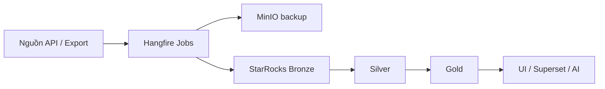

<!-- 
  Trình chiếu: VS Code extension "Marp for VS Code", hoặc marp-cli.
  Slidev: có thể copy nội dung từng slide vào slides.md tương ứng.
-->

# Amobear Nexus

## Nền tảng dữ liệu & tối ưu đa nguồn

**Mediation · Analytics · UA · IAP · AI**

---

# Vấn đề cần giải quyết

- Hàng trăm app — dữ liệu rời rạc (console, Excel, tool riêng lẻ)
- Thiếu **một nguồn sự thật** cho revenue, cost, engagement
- Thời gian phản ứng chậm; khó audit và scale

---

# Định vị sản phẩm

**Amobear Nexus** = hub tập trung:

- Thu thập tự động từ **ad networks, MMP, store, subscription**
- Chuẩn hóa **Bronze → Silver → Gold** trên **StarRocks**
- Phục vụ **Dashboard**, **Superset**, **AI Insight & Assistant**

---

# Monorepo (triển khai thực tế)

| Thư mục | Nội dung |
|---------|----------|
| `backend/` | .NET 8 — API, Hangfire jobs, EF Core |
| `frontend/` | Next.js 16, React 19, Tailwind 4, shadcn |
| `docs/` | Kiến trúc, analytics (99, 99b), tích hợp từng nguồn |

---

# Luồng dữ liệu chuẩn (E2E)

**Nguyên tắc:** `app_id` analytics = **AdMob app id** (khớp PostgreSQL `apps`).

---

# Tầng lưu trữ

| Tầng | Vai trò |
|------|---------|
| **PostgreSQL** | Master data, user, credentials (mã hóa), lịch Hangfire |
| **MinIO** | Raw immutable — phục hồi & đối chiếu nguồn |
| **StarRocks** | OLAP — Bronze / Silver / Gold |
| **Redis / RabbitMQ** | Cache, hàng đợi (theo cấu hình) |

---

# Nguồn dữ liệu (tổng quan)

- **IAA:** AdMob, AppLovin, …
- **Engagement:** Firebase (BigQuery pipeline), AppMetrica
- **UA / cost:** XMP, Meta, Adjust, **AppsFlyer** (Master + Pull tùy chọn)
- **IAP / subs:** **Qonversion** (API + crawler export đầy đủ raw)
- **Store:** **Apple** App Store Connect / StoreKit (JWT)

---

# AppsFlyer — hai kênh

- **Master API:** aggregate UA theo pid/geo, cohort — nhiều lịch sync
- **Pull API `installs_report`:** job **riêng**, bật qua config — không thay Master

Chi tiết: `docs/AppsFlyer/128_APPSFLYER_INTEGRATION.md`

---

# Qonversion & đối chiếu dữ liệu

- **Bronze:** lưu **đủ** dòng export (đối chiếu với UI Qonversion)
- **Lọc event / KPI:** Silver–Gold và báo cáo

Chi tiết: `docs/qon/126_QONVERSION_INTEGRATION_v2.md`

---

# Apple Store pipeline

- Xác thực **JWT ES256** (App Store Connect + StoreKit)
- Sales / Finance / Analytics tùy quyền & cấu hình

Chi tiết: `docs/apple-store/127_APPLE_APP_STORE_INTEGRATION.md`

---

# AI Engine (Nexus Intelligence)

- **Assistant:** RAG, multi-provider, MCP / tools
- **App Insight:** snapshot theo app từ Gold + báo cáo định kỳ
- Kiến trúc chi tiết: `docs/122_-_Nexus_AI_Engine_Architecture.md`

---

# BI & vận hành

- **Apache Superset** — dataset Silver/Gold (ví dụ P&L, revenue)
- **Hangfire:** lịch trong DB; reload lịch qua API khi cần
- **Không double-count:** tuân thủ Silver/Gold và doc **99b**

---

# Tài liệu tham chiếu

| Doc | Nội dung |
|-----|----------|
| **99** | Platform tổng thể (file này mở rộng) |
| **99b** | Ad revenue analytics, Bronze/Silver/Gold |
| **120** | Multi-mediation intelligence (roadmap nâng cao) |
| **122** | AI Engine |
| **127 / 128 / 126** | Apple, AppsFlyer, Qonversion |

---

# Kết luận

- **Một pipeline thống nhất** cho mọi nguồn
- **Raw đầy đủ + Gold tin cậy** cho quyết định & AI
- **Mở rộng** = thêm connector + Bronze + transform

**Cảm ơn.**
