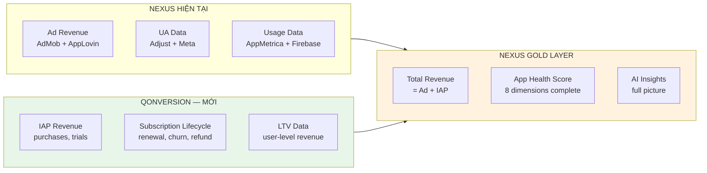
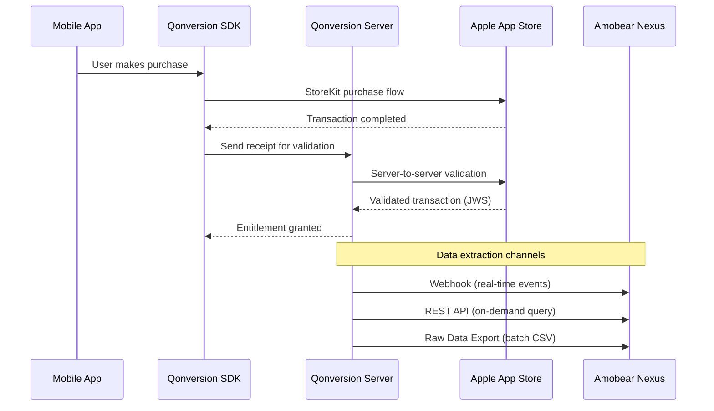
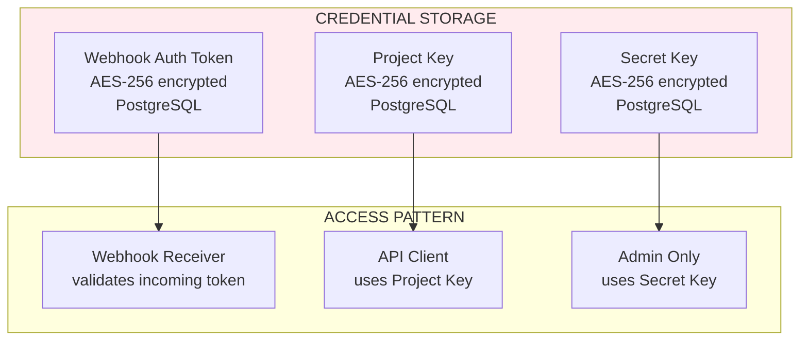
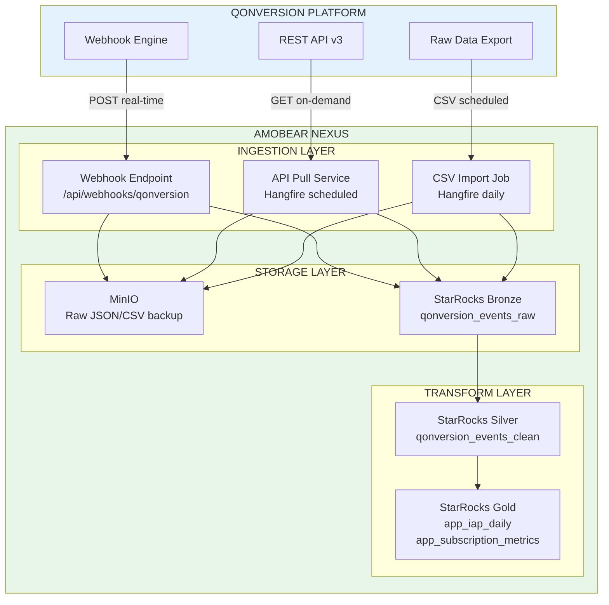
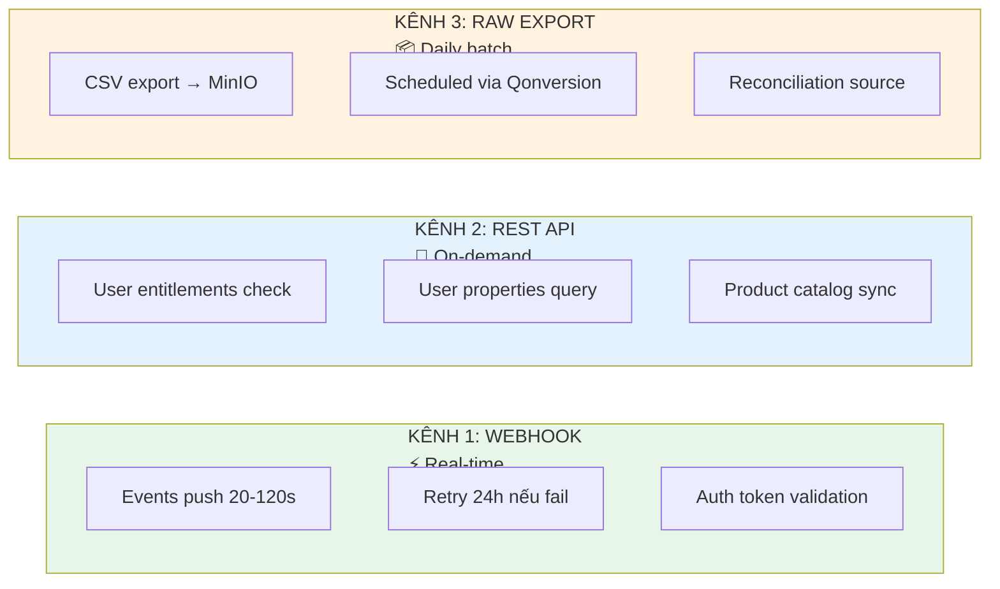
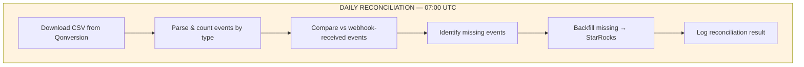
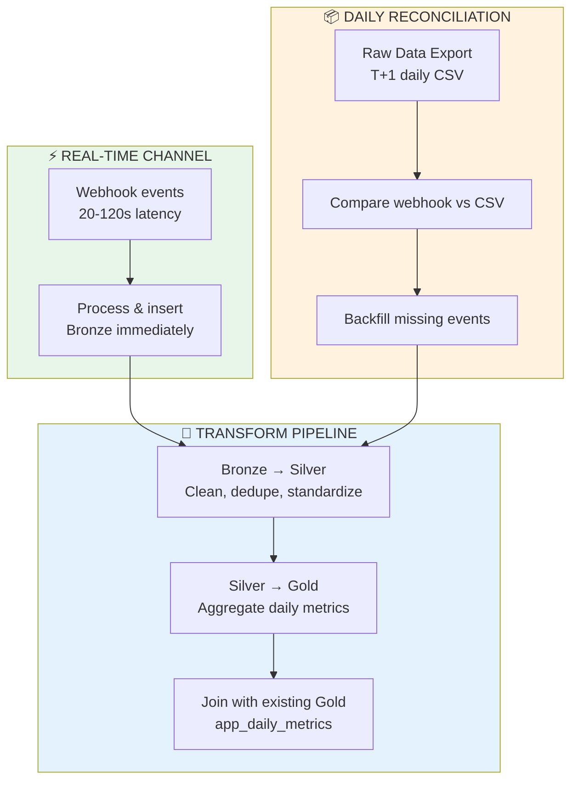
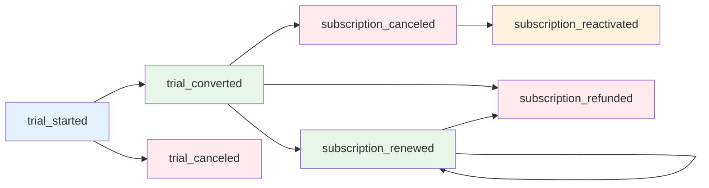
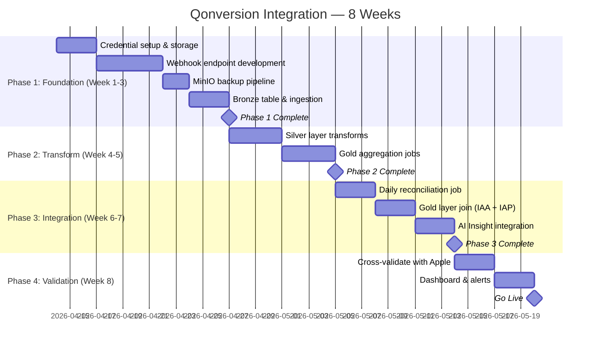

# 126 — Qonversion Integration: IAP & Subscription Data Pipeline

> **Module:** Amobear Nexus — Data Source Integration  
> **Mục tiêu:** Tích hợp Qonversion làm nguồn dữ liệu IAP/Subscription cho Nexus  
> **Stack:** .NET Core 8 + Hangfire + StarRocks + MinIO  
> **Reference:** 99 (Mediation Pro Platform), 117 (AI Insight & Alert), 122 (AI Architecture)  
> **Version:** 1.0 — 2026-04-08

---

## Mục lục

1. Tổng quan & Giá trị
2. Qonversion Platform Overview
3. Authentication & Credentials
4. Kiến trúc tích hợp
5. Data Channels — 3 kênh thu thập
6. Webhook Integration (Kênh chính — Real-time)
7. REST API Integration (Kênh bổ sung — On-demand)
8. Raw Data Export / Scheduled Reports (Kênh batch)
9. StarRocks Schema Design
10. Data Flow & Sync Strategy
11. Mapping Qonversion Events → Nexus Metrics
12. Anti-Double-Counting Strategy
13. Security & Credential Management
14. Phân kỳ triển khai
15. Rủi ro & Giảm thiểu
16. KPI/OKR

---

## 1. Tổng quan & Giá trị

### 1.1 Tại sao cần Qonversion trong Nexus?

Hiện tại Nexus có dữ liệu ad monetization (AdMob, AppLovin) nhưng **thiếu dữ liệu IAP/Subscription** — một phần quan trọng của revenue mix cho các app có mô hình hybrid monetization. Qonversion là middleware đang quản lý toàn bộ IAP infrastructure cho portfolio Amobear, cung cấp:

- **Subscription lifecycle events** (trial → paid → renewal → churn → refund)
- **Revenue data** chính xác (Apple đã validate, proceeds vs gross)
- **User-level purchase history** cross-platform
- **Cohort & retention metrics** cho subscription business

### 1.2 Dữ liệu Qonversion bổ sung gì cho Nexus?



### 1.3 Tác động lên App Health Intelligence Framework (Doc 121)

| Dimension | Trước Qonversion | Sau Qonversion |
|-----------|------------------|----------------|
| **Revenue** | Chỉ IAA (ad) | IAA + IAP = Total Revenue |
| **Unit Economics** | ARPDAU chỉ có ad | ARPDAU = ad + IAP per user |
| **Growth** | Install + DAU | + Trial conversion, subscriber growth |
| **Engagement** | Session, retention | + Subscription retention, paywall conversion |

---

## 2. Qonversion Platform Overview

### 2.1 Qonversion là gì?

Qonversion là subscription management platform cho mobile apps. Nó đóng vai trò middleware giữa app client (StoreKit/Google Billing) và Apple/Google servers:



### 2.2 Dữ liệu Qonversion cung cấp

| Loại dữ liệu | Chi tiết | Tần suất |
|---------------|----------|----------|
| **Subscription Events** | trial_started, trial_converted, subscription_renewed, subscription_canceled, subscription_refunded, etc. | Real-time (webhook 20-120s) |
| **Revenue** | Gross revenue, proceeds (net of store commission), currency, USD equivalent | Per-event |
| **User Data** | user_id, custom_user_id, advertiser_id, platform, country | Per-event |
| **Product Data** | product_id, subscription_period, offer_type | Per-event |
| **Analytics Aggregates** | MRR, ARR, trial conversion rate, churn rate, cohort retention | Dashboard + API |

### 2.3 Subscription Events Qonversion tracks

| Event | Mô tả | Có Revenue? |
|-------|--------|-------------|
| `trial_started` | User bắt đầu free trial | ❌ |
| `trial_converted` | Trial → Paid subscription | ✅ |
| `trial_canceled` | User cancel trong trial period | ❌ |
| `subscription_renewed` | Subscription tự động gia hạn | ✅ |
| `subscription_canceled` | User cancel (hết hiện cycle) | ❌ |
| `subscription_refunded` | Apple/Google hoàn tiền | ✅ (negative) |
| `subscription_upgraded` | Upgrade sang plan cao hơn | ✅ |
| `subscription_product_changed` | Đổi sang product khác | Tuỳ |
| `subscription_billing_issue` | Thanh toán thất bại | ❌ |
| `subscription_reactivated` | Re-subscribe sau cancel | ✅ |
| `non_renewing_purchase` | One-time IAP (Qonversion export) | ✅ |
| `in_app_purchase` | One-time IAP (webhook / SDK event name) | ✅ |
| `in_app_refunded` | Hoàn tiền one-time IAP | ✅ (negative) |

---

## 3. Authentication & Credentials

### 3.1 Qonversion Credentials

Qonversion sử dụng 3 loại key cho các mục đích khác nhau:

| Key | Mục đích | Dùng ở đâu | Bảo mật |
|-----|----------|------------|---------|
| **Project Key** | Standard API: users, properties, entitlements, purchases | Backend server → Qonversion API | Server-side only |
| **API Key** | SDK initialization (client-side) | Mobile app SDK | Public (in app binary) |
| **Secret Key** (`sk_` prefix) | Advanced ops: grant/revoke entitlements | Backend server only | **High security** — never expose |

### 3.2 Qonversion API Authentication

```
Authorization: Bearer <PROJECT_KEY>        # Standard endpoints
Authorization: Bearer <SECRET_KEY>         # Grant/Revoke entitlements
```

Base URL: `https://api.qonversion.io/v3`

### 3.3 Webhook Authentication

Qonversion gửi `Authorization-Token` trong request header dạng Basic auth. Nexus cần validate token này để reject requests không hợp lệ.

### 3.4 Credential Storage trong Nexus



> **Nguyên tắc:** Tuân theo pattern credential management hiện có của Nexus (doc 99 §13). Tất cả keys được encrypt AES-256 tại database level, chỉ decrypt runtime khi cần sử dụng.

---

## 4. Kiến trúc tích hợp

### 4.1 Architecture Overview



### 4.2 Nguyên tắc thiết kế

1. **Webhook-first**: Real-time events là kênh chính, API pull là backup/reconciliation
2. **Idempotent processing**: Mỗi event có unique transaction_id, deduplicate tại StarRocks
3. **Raw backup trước**: Mọi data đều lưu MinIO trước khi parse vào StarRocks (theo pattern doc 99 §11)
4. **Dual-job sync**: Webhook real-time + Daily reconciliation job (pattern hiện có)

---

## 5. Data Channels — 3 kênh thu thập



| Kênh | Latency | Completeness | Dùng cho |
|------|---------|-------------|----------|
| **Webhook** | 20-120 giây | ~99% (retry 24h) | Real-time event processing, alerts |
| **REST API** | On-demand | Point-in-time | User lookup, entitlement check, backfill |
| **Raw Export** | T+1 (daily) | 100% | Reconciliation, audit, historical backfill |

---

## 6. Webhook Integration (Kênh chính — Real-time)

### 6.1 Setup trong Qonversion Dashboard

1. Navigate to **Integrations** → **Webhooks**
2. Register Nexus webhook URL: `https://nexus.amobear.com/api/webhooks/qonversion`
3. Qonversion sẽ gửi test POST để verify → Server trả 200 OK
4. Cấu hình events cần nhận (enable all subscription events)
5. Enable **"Send sales as proceed"** toggle = true (net revenue after store commission)
6. Enable **"Send sandbox events"** toggle = false (production only)

### 6.2 Webhook Payload Structure

```json
{
  "event_name": "trial_converted",
  "user_id": "3YjIDEUDaf_5g4IdWw6zcMlLgfg_YQp2",
  "custom_user_id": "amobear_user_12345",
  "identity_id": "",
  "advertiser_id": "9FD1767D-8B48-45BD-A2F4-1C08B08E56F2",
  "time": 1600000000,
  "created_at": 1600000000,
  "product_id": "com.amobear.app.premium.monthly",
  "currency": "USD",
  "country": "US",
  "platform": "iOS",
  "environment": "production",
  "revenue": {
    "value": 6.99,
    "value_usd": 6.99,
    "currency": "USD",
    "is_proceed": 1,
    "proceeds_rate": 85
  },
  "price": {
    "value": 9.99,
    "value_usd": 9.99,
    "currency": "USD"
  },
  "transaction_id": "2000000123456789",
  "original_transaction_id": "2000000123456000",
  "purchase_date": 1600000000,
  "expiration_date": 1602592000,
  "subscription_period": "P1M",
  "offer_type": null,
  "is_family_shared": false,
  "app_id": "com.amobear.puzzlegame"
}
```

### 6.3 Webhook Receiver Implementation

```mermaid
sequenceDiagram
    participant Q as Qonversion
    participant EP as Webhook Endpoint
    participant VAL as Validator
    participant MIO as MinIO
    participant SR as StarRocks
    participant ALT as Alert Engine

    Q->>EP: POST /api/webhooks/qonversion
    EP->>VAL: Validate auth token
    
    alt Token Invalid
        VAL-->>EP: 401 Unauthorized
        EP-->>Q: 401
    end
    
    VAL-->>EP: Token valid
    EP->>EP: Parse JSON payload
    EP-->>Q: 200 OK (immediate response)
    
    Note over EP: Async processing begins
    EP->>MIO: Save raw JSON (backup)
    EP->>SR: INSERT INTO qonversion_events_raw
    EP->>SR: Check duplicate (transaction_id)
    
    alt Is refund event
        EP->>ALT: Trigger refund alert
    end
```

**Key implementation notes:**
- Trả 200 OK **ngay lập tức** trước khi xử lý async — Qonversion coi non-200 là failure và retry
- Validate Authorization-Token header trước khi xử lý
- Deduplicate bằng composite key: `(transaction_id, event_name)`
- Lưu raw JSON vào MinIO path: `qonversion/webhooks/{date}/{event_name}_{transaction_id}.json.gz`

### 6.4 Event Filtering

Qonversion cho phép toggle on/off từng event type. Nexus cần nhận **tất cả events** để có full lifecycle tracking. Tuy nhiên events dưới đây cần xử lý đặc biệt:

| Event | Xử lý |
|-------|--------|
| `subscription_refunded` | Revenue negative — trừ khỏi SUB net; Gold refund chỉ khi `transaction_id LIKE '%..%'` |
| `in_app_refunded` | Revenue negative — trừ khỏi IAP net (không cần filter `transaction_id`) |
| `in_app_purchase` | Cùng bucket IAP với `non_renewing_purchase` |
| `subscription_billing_issue` | Không có revenue, nhưng signal cho churn prediction |
| `trial_still_active` | Qonversion-generated event (not from Apple/Google) — dùng cho monitoring |

---

## 7. REST API Integration (Kênh bổ sung — On-demand)

### 7.1 Relevant API Endpoints

Base URL: `https://api.qonversion.io/v3`

| Endpoint | Method | Auth | Mục đích |
|----------|--------|------|----------|
| `/users/{id}` | GET | Project Key | Retrieve user info |
| `/users/{id}/properties` | GET | Project Key | Get user properties |
| `/users/{id}/entitlements` | GET | Project Key | Check subscription status |
| `/products` | GET | Project Key | Sync product catalog |

### 7.2 Use Cases cho API Pull

1. **User Lookup**: Khi AI Insight cần context về user's subscription status
2. **Product Catalog Sync**: Daily job sync product list từ Qonversion → Nexus metadata
3. **Backfill/Reconciliation**: Khi webhook miss events, dùng API để verify user state
4. **Entitlement Check**: Cross-validate subscription status khi có discrepancy

### 7.3 Rate Limits

Qonversion có rate limiting — cần implement exponential backoff. Exact limits check tại dashboard hoặc docs: `https://documentation.qonversion.io/docs/rate-limits`

---

## 8. Raw Data Export / Scheduled Reports (Kênh batch)

### 8.1 Setup

Qonversion hỗ trợ scheduled raw data export qua:
- **Webhook destination** (POST CSV download link)
- **Amazon S3** (direct upload)
- **Google Cloud Storage**
- **Email**

**Recommended cho Nexus:** Sử dụng Webhook destination → Nexus nhận link → Download CSV → Import vào MinIO + StarRocks.

### 8.2 Report Configuration

1. Navigate to **Export Data** → **Scheduled Reports** trong Qonversion dashboard
2. Create scheduled report:
   - **Frequency:** Daily
   - **Time:** 06:00 UTC (sau khi các pipeline khác hoàn thành)
   - **Sorting:** Event receive date (đảm bảo no late events cho period)
   - **Destination:** Webhook → Nexus endpoint `/api/webhooks/qonversion-reports`
3. File format: CSV with headers

### 8.3 Reconciliation Job



---

## 9. StarRocks Schema Design

### 9.1 Bronze Layer — `qonversion_events_raw`

```sql
CREATE TABLE IF NOT EXISTS bronze.qonversion_events_raw (
    event_date          DATE NOT NULL COMMENT 'Partition key: event date',
    event_name          VARCHAR(100) NOT NULL COMMENT 'trial_started, trial_converted, etc.',
    transaction_id      VARCHAR(100) NOT NULL COMMENT 'Apple/Google transaction ID',
    original_transaction_id VARCHAR(100) COMMENT 'Original transaction for subscription chain',
    user_id             VARCHAR(200) NOT NULL COMMENT 'Qonversion internal user ID',
    custom_user_id      VARCHAR(200) COMMENT 'Amobear custom user ID',
    app_id              VARCHAR(200) NOT NULL COMMENT 'Bundle ID / Package name',
    platform            VARCHAR(20) COMMENT 'iOS, Android',
    country             VARCHAR(10) COMMENT 'ISO country code',
    product_id          VARCHAR(200) COMMENT 'IAP product identifier',
    subscription_period VARCHAR(20) COMMENT 'P1M, P1Y, etc.',
    
    -- Revenue fields
    revenue_gross       DECIMAL(12, 4) COMMENT 'Gross revenue (before store commission)',
    revenue_proceeds    DECIMAL(12, 4) COMMENT 'Net revenue (after store commission)',
    revenue_usd_gross   DECIMAL(12, 4) COMMENT 'Gross in USD',
    revenue_usd_proceeds DECIMAL(12, 4) COMMENT 'Proceeds in USD',
    currency            VARCHAR(10) COMMENT 'Original currency',
    proceeds_rate       INT COMMENT 'Store commission rate (70 or 85)',
    
    -- Timestamps
    event_time          BIGINT COMMENT 'Unix timestamp of event',
    purchase_date       BIGINT COMMENT 'Original purchase timestamp',
    expiration_date     BIGINT COMMENT 'Subscription expiration timestamp',
    
    -- Metadata
    environment         VARCHAR(20) DEFAULT 'production',
    advertiser_id       VARCHAR(200),
    offer_type          VARCHAR(50),
    is_family_shared    BOOLEAN DEFAULT FALSE,
    raw_payload         JSON COMMENT 'Full original webhook JSON',
    
    -- Nexus metadata
    received_at         DATETIME DEFAULT CURRENT_TIMESTAMP,
    source_channel      VARCHAR(20) COMMENT 'webhook, api, csv_import',
    sync_batch_id       VARCHAR(50)
)
ENGINE = OLAP
DUPLICATE KEY(event_date, event_name, transaction_id)
PARTITION BY RANGE(event_date) (
    START ("2026-01-01") END ("2027-01-01") EVERY (INTERVAL 1 MONTH)
)
DISTRIBUTED BY HASH(app_id, transaction_id) BUCKETS 8
PROPERTIES ("replication_num" = "1");
```

### 9.2 Silver Layer — `qonversion_events_clean`

```sql
CREATE TABLE IF NOT EXISTS silver.qonversion_events_clean (
    event_date          DATE NOT NULL,
    event_name          VARCHAR(100) NOT NULL,
    transaction_id      VARCHAR(100) NOT NULL,
    original_transaction_id VARCHAR(100),
    user_id             VARCHAR(200) NOT NULL,
    custom_user_id      VARCHAR(200),
    app_id              VARCHAR(200) NOT NULL,
    platform            VARCHAR(20),
    country             VARCHAR(10),
    product_id          VARCHAR(200),
    subscription_period VARCHAR(20),
    
    -- Standardized revenue (always USD proceeds)
    revenue_usd         DECIMAL(12, 4) COMMENT 'Standardized: USD proceeds',
    revenue_gross_usd   DECIMAL(12, 4),
    original_currency   VARCHAR(10),
    
    -- Derived fields
    event_timestamp     DATETIME COMMENT 'Converted from unix',
    purchase_timestamp  DATETIME,
    expiration_timestamp DATETIME,
    is_revenue_event    BOOLEAN COMMENT 'true nếu event có revenue impact',
    revenue_sign        INT DEFAULT 1 COMMENT '-1 for refunds',
    
    -- Dedup flag
    is_duplicate        BOOLEAN DEFAULT FALSE
)
ENGINE = OLAP
DUPLICATE KEY(event_date, event_name, transaction_id)
PARTITION BY RANGE(event_date) (
    START ("2026-01-01") END ("2027-01-01") EVERY (INTERVAL 1 MONTH)
)
DISTRIBUTED BY HASH(app_id, transaction_id) BUCKETS 8;
```

**Bronze → Silver (`RunQonversionBronzeToSilverAsync`) — derived columns:**

| Cột | Logic |
|-----|--------|
| `is_revenue_event` | `1` khi `event_name` ∈ `subscription_started`, `trial_converted`, `subscription_renewed`, `subscription_upgraded`, `subscription_reactivated`, `non_renewing_purchase`, `subscription_refunded`, **`in_app_purchase`**, **`in_app_refunded`**; else `0` |
| `revenue_sign` | `-1` khi `event_name` ∈ `subscription_refunded`, **`in_app_refunded`**; else `+1` |
| `is_duplicate` | `ROW_NUMBER() OVER (PARTITION BY transaction_id, event_name ORDER BY received_at DESC) > 1` |
| `revenue_usd` | `COALESCE(revenue_usd_proceeds, revenue_usd_gross)` từ bronze |

Dedup key silver: `(transaction_id, event_name)` — giữ bản ghi `received_at` mới nhất.

**CSV export title → snake_case** (`QonversionCsvParser`): `In-App Purchase` → `in_app_purchase`, `In-App Refunded` → `in_app_refunded`, `Non-Renewing Purchase` → `non_renewing_purchase`, …

### 9.3 Gold Layer — Aggregated Tables

**`gold.app_iap_daily`** — Daily IAP metrics per app:

```sql
CREATE TABLE IF NOT EXISTS gold.app_iap_daily (
    report_date         DATE NOT NULL,
    app_id              VARCHAR(200) NOT NULL,
    platform            VARCHAR(20),
    
    -- Revenue
    iap_revenue_usd     DECIMAL(12, 4) COMMENT 'Total IAP proceeds (USD)',
    iap_refunds_usd     DECIMAL(12, 4) COMMENT 'Total refunds (positive number)',
    iap_net_revenue_usd DECIMAL(12, 4) COMMENT 'revenue - refunds',
    
    -- Volume
    total_purchases     INT,
    unique_paying_users INT,
    
    -- Subscription events
    trials_started      INT,
    trials_converted    INT,
    subscriptions_renewed INT,
    subscriptions_canceled INT,
    subscriptions_refunded INT,
    billing_issues      INT,
    
    -- Derived
    trial_conversion_rate DECIMAL(5, 4) COMMENT 'trials_converted / trials_started',
    arpu_iap            DECIMAL(12, 4) COMMENT 'iap_net_revenue / DAU (joined)',
    verified_admob_app_id TINYINT NULL COMMENT '1=app_id đã map AdMob; 0=pending dim verify',
    
    updated_at          DATETIME DEFAULT CURRENT_TIMESTAMP
)
ENGINE = OLAP
UNIQUE KEY(report_date, app_id, platform)
PARTITION BY RANGE(report_date) (
    START ("2026-01-01") END ("2027-01-01") EVERY (INTERVAL 1 MONTH)
)
DISTRIBUTED BY HASH(app_id) BUCKETS 4;
```

**Silver → Gold (`RunQonversionSilverToGoldAsync` / hourly qonversion):**

1. `DELETE` theo khoảng ngày job.
2. `INSERT` aggregate từ silver — **JOIN `silver.dim_app_identifiers`** trong SQL (admob → package → store), gộp theo AdMob `app_id`, set `verified_admob_app_id` (1 khi map được, 0 nếu không).
3. **Không** gọi `UPDATE` sau insert — StarRocks OLAP (`app_iap_daily`, `fact_hourly_app_revenue`) không hỗ trợ UPDATE.
4. Downstream chỉ đọc `verified_admob_app_id = 1` (hourly qonversion legacy NULL coi như verified qua `COALESCE` khi đọc).

**Gold IAP revenue aggregation (từ silver):**

| Metric | Logic |
|--------|--------|
| `iap_revenue_usd` | `SUM` khi `is_revenue_event = 1 AND revenue_sign = 1` |
| `iap_refunds_usd` | `subscription_refunded` + `transaction_id LIKE '%..%'` **hoặc** `in_app_refunded` |
| `iap_net_revenue_usd` | refunds (âm) + positive revenue events |

Hourly qonversion (`gold.fact_hourly_app_revenue`, `revenue_source = 'qonversion'`) dùng cùng pattern verify + `verified_admob_app_id`.

**Lưu ý DDL StarRocks:** `ALTER TABLE ADD COLUMN` không dùng `TINYINT DEFAULT 1` — dùng `TINYINT NULL` + `UPDATE` backfill. Xem `docs/STARROCKS-DDL-PITFALLS.md`.

---

## 10. Data Flow & Sync Strategy

### 10.1 Dual-channel Strategy



### 10.2 Transform Schedule (Hangfire)

| Job | Schedule | Mô tả |
|-----|----------|--------|
| `QonversionWebhookProcessor` | Event-driven | Process incoming webhooks |
| `QonversionReconciliationJob` | Daily 07:00 UTC | Download CSV, compare, backfill |
| `QonversionBronzeToSilverJob` | Hourly | Clean & dedupe bronze data |
| `QonversionSilverToGoldJob` | Daily 08:00 UTC | Aggregate daily metrics |
| `QonversionProductSyncJob` | Daily 00:00 UTC | Sync product catalog |

---

## 11. Mapping Qonversion Events → Nexus Metrics

### 11.1 Revenue Mapping

| Qonversion Field | Nexus Gold Metric | Logic |
|------------------|-------------------|-------|
| Revenue events (`is_revenue_event=1`, `revenue_sign=1`) | `iap_revenue_usd` | Sum `ABS(revenue_usd)` per app/day (bao gồm `in_app_purchase`, subscription revenue events, …) |
| `subscription_refunded` (`transaction_id LIKE '%..%'`) | `iap_refunds_usd` | Absolute value |
| `in_app_refunded` | `iap_refunds_usd` | Absolute value |
| `revenue.value_usd` (refund) | net | Trừ qua `iap_net_revenue_usd` |
| `price.value_usd` | For reference only | Gross price before commission |

### 11.2 Subscription Funnel Mapping



### 11.3 Integration với App Health Score (Doc 121)

Qonversion data feeds vào 4/8 dimensions:

| Health Dimension | Qonversion Contribution |
|-----------------|------------------------|
| **Revenue** | `iap_net_revenue_usd` → Tổng revenue = IAA + IAP |
| **Unit Economics** | ARPDAU_iap = iap_revenue / DAU |
| **Growth** | Trial starts as leading indicator |
| **Engagement** | Subscription retention = renewal_rate |

---

## 12. Anti-Double-Counting Strategy

> ⚠️ **CRITICAL** — Áp dụng nguyên tắc từ doc 99 §8.3 về double-counting

### 12.1 Rủi ro Double-counting

| Nguồn | Risk | Giải pháp |
|-------|------|-----------|
| Qonversion webhook + Qonversion CSV | Cùng event gửi qua 2 kênh | Dedupe bằng `transaction_id + event_name` |
| Qonversion + Adjust ad_revenue | Adjust có thể track IAP revenue | **KHÔNG** import Adjust IAP data vào Gold revenue |
| Qonversion + AppMetrica revenue | AppMetrica có thể track IAP | **KHÔNG** aggregate AppMetrica IAP vào Gold |
| Qonversion + Apple direct (Doc 127) | Cùng transaction từ 2 nguồn | Apple = source of truth cho reconciliation, Qonversion = operational |

### 12.2 Revenue Hierarchy Rule

```
Gold.total_revenue = Gold.iaa_revenue (AdMob + AppLovin)
                   + Gold.iap_revenue (Qonversion ONLY)
                   
⛔ NEVER add:
  - Adjust ad_revenue IAP component
  - AppMetrica IAP revenue
  - Apple direct API revenue (dùng cho cross-validation only)
```

---

## 13. Security & Credential Management

### 13.1 Credential Inventory

| Credential | Storage | Rotation | Access |
|-----------|---------|----------|--------|
| Qonversion Project Key | PostgreSQL (AES-256) | Manual, qua Qonversion dashboard | API Pull Service |
| Qonversion Secret Key | PostgreSQL (AES-256) | Manual, qua Qonversion dashboard | Admin operations only |
| Webhook Auth Token | PostgreSQL (AES-256) | On setup / manual rotate | Webhook endpoint validation |

### 13.2 Network Security

- Webhook endpoint: HTTPS only, validate Qonversion auth token
- Outbound API calls: HTTPS to `api.qonversion.io`
- MinIO: Internal network, no external exposure

---

## 14. Phân kỳ triển khai

### 14.1 Roadmap 30-60-90



### 14.2 Checklist

- [ ] Qonversion Project Key & Secret Key secured trong PostgreSQL
- [ ] Webhook endpoint deployed & responding 200
- [ ] Qonversion webhook integration activated trong dashboard
- [ ] MinIO backup path configured: `qonversion/webhooks/`
- [ ] Bronze table created & receiving events
- [ ] Silver transform job running hourly
- [ ] Gold aggregation job running daily
- [ ] Daily reconciliation vs CSV export
- [ ] Anti-double-counting validated
- [ ] Gold `app_daily_metrics` joined with IAP data
- [ ] AI Insight template updated (doc 117) with IAP metrics
- [ ] Alert rules for refund spikes, billing issues
- [ ] Postman collection created (15+ requests)

---

## 15. Rủi ro & Giảm thiểu

| # | Rủi ro | Impact | Probability | Giảm thiểu |
|---|--------|--------|-------------|-------------|
| 1 | Webhook downtime → miss events | High | Low | Daily CSV reconciliation backfills |
| 2 | Double-counting IAP revenue | Critical | Medium | Strict hierarchy rule + automated checks |
| 3 | Qonversion rate limit exceeded | Medium | Low | Exponential backoff + caching |
| 4 | Late events (>5 days) not sent | Low | Medium | Monthly full reconciliation vs Apple |
| 5 | Currency conversion discrepancy | Low | Medium | Always use `value_usd` from Qonversion |
| 6 | Qonversion pricing changes | Medium | Low | Abstract via adapter pattern |

---

## 16. KPI/OKR

### OKR: Tích hợp Qonversion hoàn chỉnh trong 8 tuần

| KR | Target | Measurement |
|----|--------|-------------|
| Webhook event processing latency | < 5 giây (từ nhận → Bronze) | P99 latency metric |
| Event capture completeness | > 99.5% (vs CSV reconciliation) | Daily reconciliation report |
| Zero double-counting incidents | 0 sau go-live | Automated daily check |
| Gold layer data freshness | T-1 available by 08:00 UTC | Monitoring alert |
| AI Insight accuracy improvement | +15% relevance (IAP context) | User feedback score |

---

*Document maintained by: Amobear Nexus Team*  
*Last updated: 2026-04-08*
