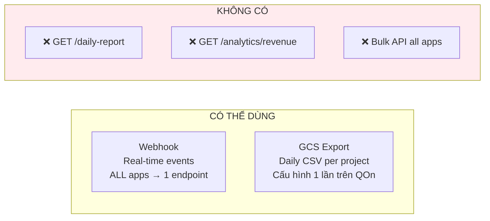
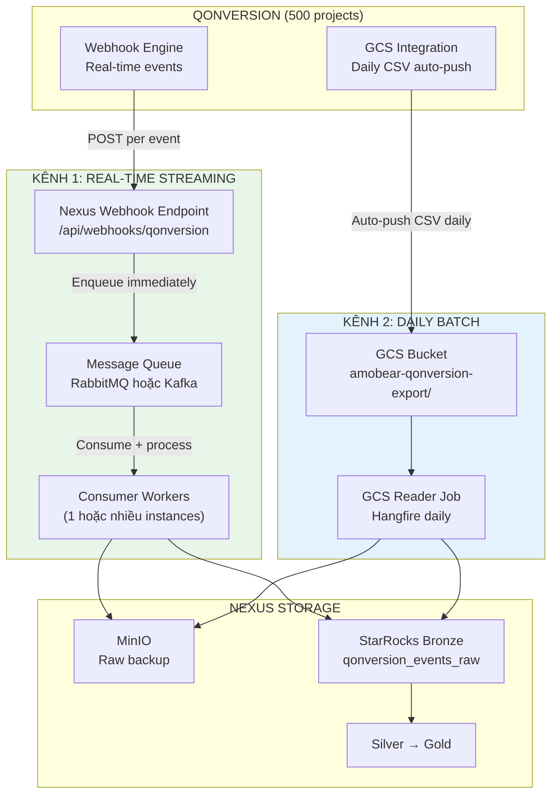
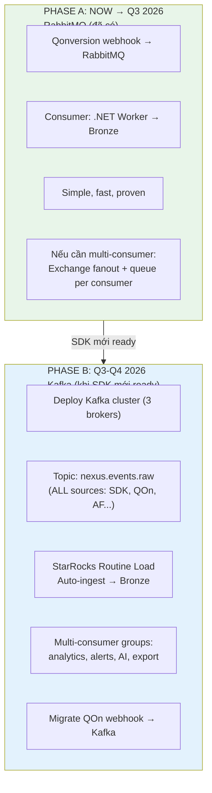
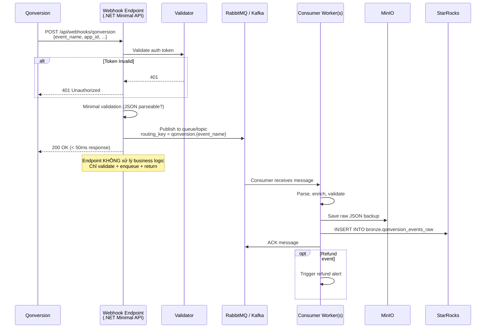
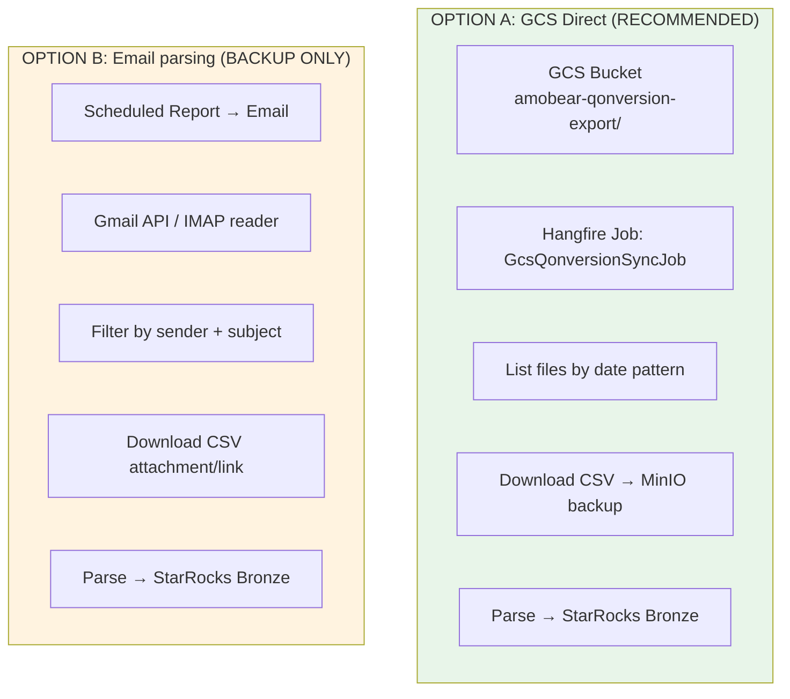
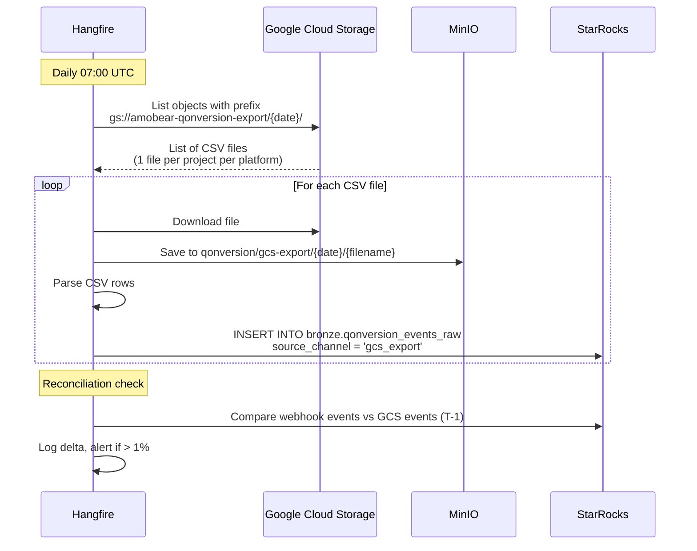
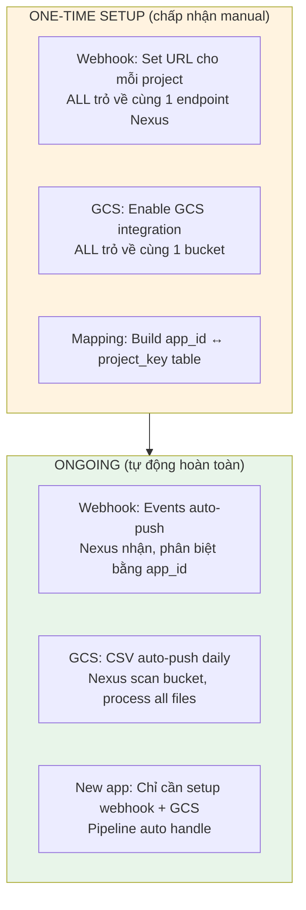
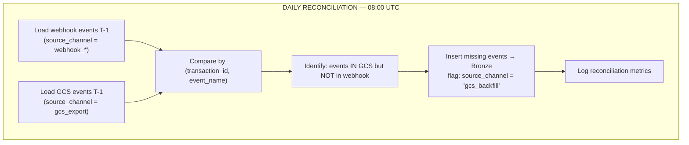
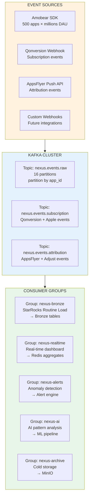
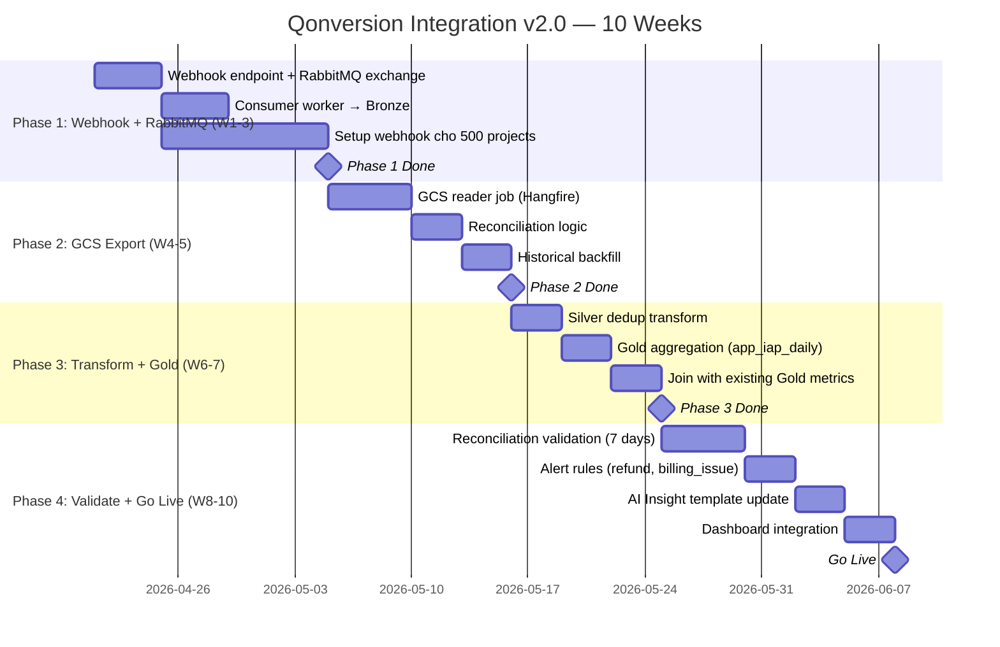

# 126 — Qonversion Integration: IAP & Subscription Data Pipeline (v2.0)

> **Module:** Amobear Nexus — Data Source Integration  
> **Mục tiêu:** Tích hợp Qonversion làm nguồn dữ liệu IAP/Subscription cho Nexus  
> **Stack:** .NET Core 8 + Hangfire + RabbitMQ/Kafka + StarRocks + MinIO  
> **Reference:** 99 (Platform), 117 (AI Insight & Alert), 122 (AI Architecture)  
> **Version:** 2.0 — 2026-04-09  
> **Changelog:** v2.0 — Rewrite hoàn toàn: đánh giá Kafka vs RabbitMQ, GCS export thay scheduled reports, kiến trúc multi-app 500+ apps, tách rõ webhook streaming vs batch reconciliation

---

## Mục lục

1. Tổng quan & Giá trị
2. Thực tế API Capabilities của Qonversion
3. Kiến trúc 2 kênh: Webhook Streaming + GCS Batch
4. **Đánh giá Message Queue: RabbitMQ vs Kafka**
5. **Kênh 1: Webhook → Queue → Bronze (Real-time)**
6. **Kênh 2: GCS Export → MinIO → Bronze (Daily Reconciliation)**
7. Xử lý 500+ Apps — Multi-Project Strategy
8. StarRocks Schema Design
9. Transform Pipeline
10. Anti-Double-Counting Strategy
11. **Vision: Unified Event Bus cho Amobear SDK**
12. Security & Credential Management
13. Phân kỳ triển khai
14. Rủi ro & Giảm thiểu
15. KPI/OKR

---

## 1. Tổng quan & Giá trị

*(Giữ nguyên từ v1.0 — xem doc gốc)*

---

## 2. Thực tế API Capabilities của Qonversion

### 2.1 Điều Qonversion KHÔNG có

> ⚠️ **Critical insight:** Qonversion không phải data platform — nó là subscription management middleware. API design của họ phản ánh điều này.

| Capability | AdMob | Adjust | AppsFlyer | **Qonversion** |
|-----------|-------|--------|-----------|----------------|
| Pull API — daily aggregate by date | ✅ networkReport | ✅ Report Service | ✅ Pull API | ❌ **Không có** |
| Pull API — bulk all apps 1 call | ✅ account-level | ✅ per-token | ✅ Master API | ❌ **Per-project only** |
| REST API — user-level query | N/A | N/A | N/A | ✅ Users/Entitlements |
| Webhook — event streaming | ❌ | ✅ Callbacks | ✅ Push API | ✅ **Đây là kênh chính** |
| Scheduled export — CSV/S3/GCS | ❌ | ❌ | ✅ Data Locker | ✅ **GCS/S3 + email** |
| Analytics API — MRR/ARR/cohort | N/A | N/A | N/A | ❌ Dashboard only, no API |

### 2.2 Hai kênh khả dụng cho data pipeline



### 2.3 REST API v3 — Chỉ dùng ad-hoc

REST API chỉ phục vụ **per-user lookup**, không phải data pipeline:
- `GET /users/{id}` — Lookup 1 user
- `GET /users/{id}/entitlements` — Check subscription status
- `GET /products` — Sync product catalog
- `POST /users/{id}/entitlements` — Grant access (admin tool)

→ **KHÔNG dùng cho daily data sync.** Chỉ dùng cho AI Insight context lookup và admin operations.

---

## 3. Kiến trúc 2 kênh: Webhook Streaming + GCS Batch

### 3.1 Architecture Overview



### 3.2 Phân vai rõ ràng

| Aspect | Kênh 1: Webhook → Queue | Kênh 2: GCS Export |
|--------|--------------------------|---------------------|
| **Vai trò** | Primary — real-time operational data | Reconciliation — đảm bảo completeness |
| **Latency** | 20-120 giây | T+1 (next day) |
| **Completeness** | ~99% (miss nếu endpoint down) | 100% (Qonversion đảm bảo) |
| **Dùng cho** | Real-time alerts, streaming analytics | Daily Gold aggregation, backfill lịch sử |
| **Scale concern** | Queue handles backpressure | File size manageable |

---

## 4. Đánh giá Message Queue: RabbitMQ vs Kafka

### 4.1 Context hiện tại

Từ doc 99 §8.1: Nexus stack hiện có **RabbitMQ 3** trong Data Layer. Roadmap (§24) đặt **Kafka + StarRocks Routine Load** ở Q4 2026 / 2027.

### 4.2 So sánh chi tiết cho use case Nexus

| Dimension | RabbitMQ (đang có) | Kafka (cần deploy mới) |
|-----------|-------------------|----------------------|
| **Deployment** | ✅ Đã có, đang chạy | ❌ Cần 3 broker nodes (ZK hoặc KRaft) |
| **Ops complexity** | Thấp — web UI, familiar | Cao — partition management, retention tuning |
| **Message model** | Push to consumer, ACK-based | Pull from consumer, offset-based |
| **Throughput** | ~50K msg/s (đủ cho 500 apps × events) | ~1M msg/s (overkill cho Qonversion alone) |
| **Message replay** | ❌ Consumed = gone (trừ DLX) | ✅ Replay bất kỳ offset → perfect cho backfill |
| **Multi-consumer** | Cần exchange fanout, mỗi consumer cần queue riêng | ✅ Native — consumer groups, mỗi group đọc independent |
| **StarRocks integration** | Không có native connector | ✅ **Routine Load** — StarRocks consume trực tiếp từ Kafka topic |
| **Ordering** | Per-queue FIFO | Per-partition ordering (partition by app_id = per-app order) |
| **Retention** | Thường xóa sau consume | Configurable retention (7d, 30d, forever) |
| **RAM usage** | ~512MB cho workload này | ~2-4GB per broker × 3 = 6-12GB |
| **Team familiarity** | ✅ Đang dùng | ❌ Cần học |

### 4.3 Đánh giá theo 3 góc nhìn

**Góc nhìn 1: Chỉ cho Qonversion webhook (ngắn hạn)**

→ **RabbitMQ thắng.** Đã có sẵn, đủ throughput, deploy ngay. Qonversion webhook volume ~500 apps × ~100 events/ngày/app = ~50K events/ngày — RabbitMQ xử lý dư sức.

**Góc nhìn 2: Unified Event Bus cho Amobear SDK (trung hạn — bạn đang plan)**

→ **Kafka thắng rõ.** Khi bắn toàn bộ events từ SDK mới (session_start, screen_view, in_app_purchase, ad_impression...) cho 500 apps × hàng triệu DAU:
- Volume: **10M-100M events/ngày** → RabbitMQ sẽ chật
- Multi-consumer bắt buộc: Real-time analytics + AI anomaly detection + Bronze ingestion + Future ML pipeline — tất cả cần đọc cùng stream
- StarRocks Routine Load: native Kafka consumer, zero-code ingestion vào Bronze — khỏi viết consumer code
- Replay: SDK events cần replay khi schema change hoặc backfill → Kafka retention 7-30 ngày

**Góc nhìn 3: Migration path (thực tế)**

→ **Phased: RabbitMQ now → Kafka khi SDK ready.** Lý do:
- Deploy Kafka cluster cần 3 nodes, ops expertise, monitoring setup (Kafka Exporter + Grafana)
- Nếu chưa có SDK mới, Kafka chạy idle — waste resources
- RabbitMQ cho Qonversion webhook chạy tốt trong 3-6 tháng đầu
- Khi SDK mới ready (dự kiến Q3-Q4 2026?) → deploy Kafka → migrate Qonversion webhook sang Kafka topic cùng lúc

### 4.4 Recommendation: 2-Phase Approach



### 4.5 Phase A: RabbitMQ Configuration

```
Exchange: nexus.events (type: topic)
  ├── Routing key: qonversion.* → Queue: nexus.qonversion.bronze
  ├── Routing key: qonversion.refund → Queue: nexus.alerts.refund (priority)
  └── Routing key: *.* → Queue: nexus.events.archive (optional, MinIO backup)

Queue: nexus.qonversion.bronze
  ├── Consumer: QonversionBronzeWorker (1-3 instances)
  ├── Prefetch: 100
  ├── Auto-ACK: false (manual ACK after StarRocks insert)
  └── DLX: nexus.events.dead-letter (failed messages)
```

### 4.6 Phase B: Kafka Topic Design (Preview)

```
Topic: nexus.events.raw
  ├── Partitions: 16 (partition by app_id hash → per-app ordering)
  ├── Retention: 7 days (replay window)
  ├── Replication: 3
  └── Consumers:
       ├── Group: nexus-bronze (StarRocks Routine Load)
       ├── Group: nexus-alerts (real-time alert engine)
       ├── Group: nexus-ai (anomaly detection)
       └── Group: nexus-archive (MinIO cold storage)
```

### 4.7 Kafka + StarRocks Routine Load (Phase B detail)

```sql
-- StarRocks native Kafka consumer — ZERO application code needed
CREATE ROUTINE LOAD nexus.qonversion_events_load
ON bronze.qonversion_events_raw
COLUMNS (
    event_date, event_name, transaction_id, user_id, 
    app_id, platform, country, product_id,
    revenue_usd_proceeds, revenue_usd_gross, currency,
    event_time, raw_payload
)
PROPERTIES (
    "desired_concurrent_number" = "3",
    "max_batch_interval" = "10",
    "max_batch_rows" = "200000",
    "strict_mode" = "false",
    "format" = "json",
    "jsonpaths" = "[\"$.event_date\",\"$.event_name\",...]"
)
FROM KAFKA (
    "kafka_broker_list" = "kafka1:9092,kafka2:9092,kafka3:9092",
    "kafka_topic" = "nexus.events.raw",
    "kafka_partitions" = "0,1,2,3,4,5,6,7,8,9,10,11,12,13,14,15",
    "property.group.id" = "nexus-bronze"
);
```

> **Giá trị Routine Load:** Eliminate hoàn toàn consumer code .NET cho Bronze ingestion. StarRocks tự consume, tự insert, tự manage offset. Team chỉ cần define mapping.

---

## 5. Kênh 1: Webhook → Queue → Bronze (Real-time)

### 5.1 Webhook Endpoint Design



**Key design principle:** Webhook endpoint phải **cực kỳ lightweight** — validate token, enqueue, return 200. Tất cả processing nằm ở consumer. Điều này đảm bảo:
- Response time < 50ms (Qonversion coi > 5s là timeout)
- Endpoint không bao giờ chết vì StarRocks slow
- Queue absorbs burst (500 apps gửi events đồng thời)

### 5.2 Consumer Worker Design

```csharp
// Pseudo-code cho consumer
public class QonversionBronzeConsumer : BackgroundService
{
    // Prefetch 100 messages, process in batches
    // Manual ACK after successful StarRocks insert
    // Dead-letter failed messages after 3 retries
    // Deduplicate by (transaction_id, event_name)
}
```

Consumer có thể scale horizontal: 1 instance cho low volume, 3 instances cho high volume. RabbitMQ distribute messages round-robin. Kafka distribute by partition.

### 5.3 Webhook Payload Structure

*(Giữ nguyên từ v1.0 — xem section 6.2 doc gốc)*

---

## 6. Kênh 2: GCS Export → MinIO → Bronze (Daily Reconciliation)

### 6.1 Hiện trạng

Bạn đã cấu hình **GCS Integration** trên Qonversion cho từng project. Qonversion auto-push raw data CSV vào GCS bucket. Tuy nhiên **Scheduled Reports** hiện chỉ gửi qua email (không có Webhook destination cho reports).

### 6.2 Hai phương án lấy file



### 6.3 Recommendation: Option A — GCS Direct

| Criteria | Option A: GCS | Option B: Email |
|----------|---------------|-----------------|
| **Reliability** | ✅ File-based, idempotent | ❌ Email delivery unreliable |
| **Automation** | ✅ GCS SDK, well-supported | ❌ IMAP parsing fragile |
| **Latency** | GCS available immediately | Email delay variable |
| **File discovery** | ✅ `gs://bucket/date_pattern/` | ❌ Subject/body parsing |
| **500 apps** | ✅ All files in 1 bucket | ❌ 500 emails/day? |
| **Ops burden** | Low — GCS client proven | High — email filter maintenance |

**Option B chỉ dùng khi:** GCS integration unavailable hoặc billing issue. Không nên đầu tư engineering effort vào email parsing.

### 6.4 GCS Sync Job Detail



### 6.5 GCS File Naming Convention

Qonversion push files theo pattern:
```
[date_YYYY_MM_DD]_[report_name]_[project_name]_[platform]_[uid].csv
```

Ví dụ: `2026_04_08_DailyExport_AR_Drawing_Trace_iOS_oldvgdvj.csv`

→ Nexus parse `project_name` + `platform` để map về internal `app_id`.

### 6.6 Historical Backfill Strategy

Cho dữ liệu cũ (trước khi setup pipeline):

| Method | Date Range | Effort |
|--------|-----------|--------|
| **GCS files** (nếu đã enable integration trước đó) | Tất cả files trong bucket | Auto — GCS reader scan all dates |
| **Manual Raw Data Export** | Dashboard → Export Data → chọn date range | Per-project, phải click manual |
| **Request Qonversion support** | Bulk historical export | Contact support, they may batch export |

### 6.7 Kênh 3 (tạm thời): Web Crawler — Dashboard Export API

> **Cảnh báo:** Đây **không** phải API công khai của Qonversion. Endpoint `dash.qonversion.io/api/v1/exports` dùng cookie session người dùng đã đăng nhập web. Qonversion có thể đổi bất cứ lúc nào — ưu tiên **GCS** + **webhook** làm kênh chính; crawler chỉ là giải pháp tạm khi chưa có GCS hoặc cần đối soát.

**Luồng tự động trong Nexus:**

1. `POST .../api/v1/exports?project={qon_project_key}&account={dashboard_account_uid}` — body JSON `from_timestamp`, `to_timestamp`, `platform` (`iOS` / `Android`), `date_limiter_type: happened_at`.
2. `GET .../api/v1/exports/{uuid}?project=...&account=...` — poll ~5s tới khi `status_name = Done`, lấy `file_url`.
3. Tải file (thường gzip), parse CSV schema như `docs/qon/sample.csv`, filter IAP (`Qonversion:WebCrawler:IapEventNames` trong `appsettings`), ghi `bronze.qonversion_events_raw` với `source_channel = web_crawler`, backup MinIO `raw/qonversion/web-crawler/{date}/`.

**Cấu hình:**

- PostgreSQL `qonversion_accounts`: `dashboard_cookie`, `dashboard_account_uid` (cập nhật qua API admin, không commit cookie vào repo).
- StarRocks `config.qonversion_project_mapping`: cột `crawler_enabled` — chỉ project `crawler_enabled = true` mới được job Hangfire `QonversionWebCrawlerJob` crawl (cron mặc định `30 7 * * *` UTC, sau GCS 07:00).
- Jobs test: `POST /api/v1/jobs-test/qonversion-web-crawler` (T-1) hoặc `.../qonversion-web-crawler/date-range?startDate=&endDate=`.

**Dedup:** Silver vẫn dedupe theo `(transaction_id, event_name)` như webhook/GCS.

---

## 7. Xử lý 500+ Apps — Multi-Project Strategy

### 7.1 Thực tế Qonversion: 1 Project = 1 App

Qonversion tổ chức theo **Project**. Mỗi project có:
- Project Key riêng
- Settings riêng
- Webhook config riêng
- GCS export config riêng

→ 500 apps = 500 projects = 500 lần setup.

### 7.2 Setup Strategy



### 7.3 Giảm effort setup 500 projects

| Approach | Effort | Feasibility |
|----------|--------|-------------|
| **Manual click per project** | ~2 min/project × 500 = ~17 giờ | ✅ Feasible, boring |
| **Intern/team member batch** | Chia 5 người, mỗi người 100 projects | ✅ 1-2 ngày xong |
| **Qonversion support request** | Nhờ họ bulk-enable webhook + GCS | ⚠️ Phụ thuộc response |
| **Qonversion API** (nếu có) | Automate via API | ❌ Không có config API |

**Practical recommendation:** Chia team 3-5 người, mỗi người setup 100-170 projects trong 1-2 ngày. Chuẩn bị checklist: (1) vào project → (2) Integrations → Webhooks → set URL → (3) verify 200 OK → next. Sau đó tương tự cho GCS.

### 7.4 Nexus App Mapping Table

```sql
CREATE TABLE IF NOT EXISTS config.qonversion_project_mapping (
    nexus_app_id        VARCHAR(200) PRIMARY KEY COMMENT 'Nexus internal: bundle_id',
    qon_project_key     VARCHAR(200) NOT NULL COMMENT 'Qonversion Project Key',
    qon_project_name    VARCHAR(500),
    qon_app_store_id    VARCHAR(100),
    platform            VARCHAR(20),
    webhook_enabled     BOOLEAN DEFAULT FALSE,
    gcs_export_enabled  BOOLEAN DEFAULT FALSE,
    crawler_enabled     BOOLEAN DEFAULT FALSE,
    setup_date          DATE,
    is_active           BOOLEAN DEFAULT TRUE
);
```

---

## 8. StarRocks Schema Design

*(Giữ nguyên từ v1.0 — Bronze/Silver/Gold schema không thay đổi)*

**Bổ sung field `source_channel`:**

| Value | Mô tả |
|-------|--------|
| `webhook_rabbitmq` | Event nhận qua webhook, processed qua RabbitMQ |
| `webhook_kafka` | Event nhận qua webhook, processed qua Kafka (Phase B) |
| `gcs_export` | Event từ GCS daily CSV |
| `web_crawler` | Event từ export dashboard (CSV raw, cookie session) — tạm thời |
| `manual_import` | Backfill thủ công |

---

## 9. Transform Pipeline

### 9.1 Reconciliation Logic (cập nhật)



### 9.2 Deduplication Strategy

GCS export + Webhook sẽ có overlap (cùng event xuất hiện ở cả 2 kênh). Deduplicate tại **Silver layer**:

```sql
-- Silver: deduplicate by taking earliest received record
INSERT INTO silver.qonversion_events_clean
SELECT * FROM (
    SELECT *, ROW_NUMBER() OVER (
        PARTITION BY transaction_id, event_name 
        ORDER BY received_at ASC
    ) as rn
    FROM bronze.qonversion_events_raw
    WHERE event_date = '2026-04-08'
) t WHERE rn = 1;
```

---

## 10. Anti-Double-Counting Strategy

*(Giữ nguyên từ v1.0)*

---

## 11. Vision: Unified Event Bus cho Amobear SDK

### 11.1 Bối cảnh

Firebase và AppMetrica đều có **độ trễ 4-24 giờ** cho raw events. Nếu Amobear xây SDK riêng (hoặc wrapper SDK) bắn events trực tiếp về Nexus, sẽ có real-time analytics thực sự.

### 11.2 Unified Event Bus Architecture (Kafka Phase B)



### 11.3 Tại sao vision này cần Kafka (không RabbitMQ)

| Requirement | RabbitMQ | Kafka |
|------------|----------|-------|
| 100M events/day throughput | ❌ Struggle | ✅ Native |
| 5 consumer groups đọc cùng data | ❌ 5 queue copies, 5× RAM | ✅ 1 topic, 5 groups |
| Replay 7 ngày để backfill | ❌ Messages gone after consume | ✅ Configurable retention |
| StarRocks direct consume | ❌ Cần middleware | ✅ Routine Load native |
| Partition by app_id | ❌ Routing workaround | ✅ Native partition key |
| Back-pressure handling | ⚠️ Queue depth grows, memory risk | ✅ Consumers control pace |

### 11.4 SDK Event Volume Estimation

| Metric | Estimate |
|--------|----------|
| Apps | 500 |
| Average DAU per app | 10,000 (range: 100 - 500K) |
| Total DAU | ~5M |
| Events per user per day | ~20 (session, screens, actions) |
| **Total events/day** | **~100M** |
| Events/second (peak) | ~5,000 (burst to 20,000) |
| Message size (avg) | ~500 bytes |
| **Daily data volume** | **~50 GB** |

→ RabbitMQ max ~50K msg/s sustained, Kafka handles 500K+ msg/s easily. At 100M events/day scale, Kafka is the only option.

### 11.5 Kafka Infrastructure Requirements

| Component | Spec | Count |
|-----------|------|-------|
| Kafka Broker | 8 CPU, 16GB RAM, 500GB SSD | 3 |
| Schema Registry | 2 CPU, 4GB RAM | 1 (colocate with broker) |
| Kafka Exporter | Prometheus metrics | 1 (colocate) |
| **Total additional infra** | **~26 CPU, 52GB RAM, 1.5TB SSD** | |

→ Phù hợp khi server hiện tại còn headroom (doc 99 §8.2: 65% CPU, 362GB RAM còn lại).

---

## 12. Security & Credential Management

| Credential | Storage | Dùng cho |
|-----------|---------|----------|
| Qonversion Project Key (per-project) | PostgreSQL AES-256 | REST API ad-hoc |
| Qonversion Secret Key (per-project) | PostgreSQL AES-256 | Admin grant/revoke only |
| Webhook Auth Token | PostgreSQL AES-256 | Validate incoming webhook |
| GCS Service Account Key | PostgreSQL AES-256 | GCS bucket access |
| RabbitMQ connection string | appsettings (encrypted) | Queue publish/consume |
| Kafka bootstrap servers | appsettings | Future Phase B |

---

## 13. Phân kỳ triển khai

### 13.1 Updated Roadmap



### 13.2 Checklist (Updated)

**Infrastructure:**
- [ ] RabbitMQ exchange `nexus.events` created (type: topic)
- [ ] Queue `nexus.qonversion.bronze` bound with routing key `qonversion.*`
- [ ] DLX queue `nexus.events.dead-letter` configured
- [ ] GCS Service Account Key stored in PostgreSQL

**Webhook Pipeline:**
- [ ] Endpoint `/api/webhooks/qonversion` deployed
- [ ] Auth token validation working
- [ ] Publish to RabbitMQ < 50ms
- [ ] Consumer worker(s) running, manual ACK
- [ ] MinIO backup from consumer
- [ ] StarRocks Bronze insert from consumer

**GCS Pipeline:**
- [ ] `GcsQonversionSyncJob` running daily 07:00 UTC
- [ ] File listing by date pattern working
- [ ] CSV parsing → Bronze insert
- [ ] Reconciliation job comparing webhook vs GCS

**Multi-app:**
- [ ] Webhook enabled for all 500 projects (tracked in mapping table)
- [ ] GCS export enabled for all 500 projects
- [ ] `config.qonversion_project_mapping` populated

**Transforms:**
- [ ] Silver dedup by (transaction_id, event_name)
- [ ] Gold `app_iap_daily` aggregation
- [ ] Anti-double-counting validated

---

## 14. Rủi ro & Giảm thiểu

| # | Rủi ro | Impact | Mitigate |
|---|--------|--------|----------|
| 1 | Setup 500 projects manual = tedious | Medium | Batch team 3-5 người, 1-2 ngày |
| 2 | Webhook endpoint down → miss events | High | RabbitMQ DLX + GCS reconciliation next day |
| 3 | RabbitMQ full → reject messages | High | Alert on queue depth > 10K; scale consumers |
| 4 | GCS bucket access denied | Medium | Service account với minimal permissions |
| 5 | Double-counting webhook + GCS | Critical | Silver layer dedup on (txn_id, event_name) |
| 6 | Future Kafka migration disruption | Medium | Abstract queue interface: IEventPublisher, IEventConsumer |
| 7 | Qonversion change webhook format | Medium | Versioned parser, raw_payload backup |

---

## 15. KPI/OKR

| KR | Target | Measurement |
|----|--------|-------------|
| Webhook → Bronze latency | < 5 giây P99 | Prometheus histogram |
| Queue backlog | < 1000 messages sustained | RabbitMQ monitoring |
| GCS reconciliation delta | < 1% vs webhook | Daily automated check |
| Zero double-counting | 0 incidents post go-live | Automated dedup verification |
| Multi-app coverage | 500/500 projects setup | Mapping table count |
| Historical backfill | > 90 ngày available | MinIO + Bronze date range check |

---

*Document maintained by: Amobear Nexus Team*  
*Last updated: 2026-04-09*
