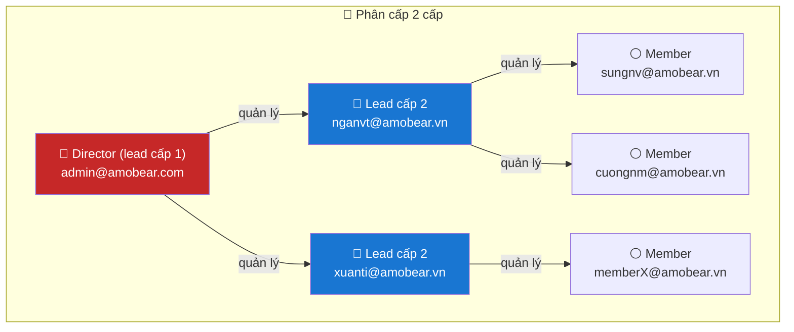

# 📊 MKT Performance Dashboards — SQL & Hướng dẫn xây dựng

> **Mục tiêu:** Dashboard báo cáo doanh thu, chi phí, lợi nhuận cho Marketing theo **từng user** (Dashboard 1) và **từng team lead** (Dashboard 2), có phân quyền theo vai trò (Member / Lead / Director / Admin).  
> **Hệ thống:** StarRocks (data) + Apache Superset (BI) + PostgreSQL (Superset metadata)  
> **Phiên bản:** 2.0 | **Ngày:** 20/04/2026  
> **Liên quan:** [USER-APP-PERMISSION-TABLES](./USER-APP-PERMISSION-TABLES.md), [99b - Ad Revenue Analytics](../99b%20-%20Ad%20Revenue%20Analytics.md)

---

## 1. Tổng quan phân quyền

### 1.1 Cấu trúc phân cấp 3 vai trò



### 1.2 Rules phân quyền

**Dashboard 1 — Doanh thu theo từng member:**

| Rule | Mô tả |
|------|--------|
| **1.1** | **Member** chỉ nhìn thấy doanh thu của mình, tính theo app được phân quyền (`ab_user_app_mapping`) |
| **1.2.1** | **Lead** (Director hoặc Lead cấp 2) nếu được phân quyền app → tính như 1 member (rule 1.1) |
| **1.2.2** | **Lead** nhìn thấy doanh thu từng member mình quản lý. Lead cấp 2 thấy member trực tiếp. Director thấy lead cấp 2 + member gián tiếp |
| **1.3** | **Admin** (Jinja `is_admin()`) nhìn thấy tất cả |

**Dashboard 2 — Doanh thu theo lead:**

| Rule | Mô tả |
|------|--------|
| **2.1** | **Lead cấp 2**: Tổng = doanh thu app mình (rule 1.2.1) + doanh thu member mình quản lý (rule 1.1) |
| **2.2** | **Director**: Hiển thị từng lead cấp 2 (mỗi lead = 1 dòng, rule 2.1). Tổng = app mình + tất cả lead cấp 2 |
| **2.3** | **Admin**: Nhìn thấy tất cả lead cấp 2 (rule 2.1) và director (rule 2.2) |

### 1.3 Bảng dữ liệu liên quan

| Bảng | Vai trò | Cột thời gian |
|------|---------|---------------|
| `gold.ab_user_app_mapping` | User ↔ App (phân quyền app) | `start_date`, `end_date` → giới hạn **phạm vi dữ liệu** |
| `gold.ab_user_team` | Lead ↔ Member (phân cấp quản lý) | `start_date`, `end_date` → giới hạn **thời gian quan hệ quản lý** |
| `gold.fact_daily_app_metrics` | Revenue, cost, impressions theo app/ngày | `date` |
| `silver.dim_app_identifiers` | Tên hiển thị app | — |

> [!IMPORTANT]
> **Khác biệt `start_date`/`end_date` giữa 2 bảng:**
> - `ab_user_app_mapping`: Giới hạn **phạm vi dữ liệu** user được xem (lọc `g.date` trong `[start_date, end_date]`)
> - `ab_user_team`: Giới hạn **khoảng thời gian quản lý**. Lead chỉ thấy data member cho `g.date` trong `[team.start_date, team.end_date]`. Khi chuyển member sang lead mới, lead cũ vẫn thấy data trong khoảng quản lý cũ.

---

## 2. Dataset SQL — `ds_mkt_unified`

> [!NOTE]
> **1 dataset duy nhất** phục vụ cả 2 dashboards. Sử dụng 2 cột lead:
> - `lead_username`: ai quản lý user này → dùng cho **Dashboard 1** display
> - `scope_lead`: user thuộc team nào → dùng cho **Dashboard 2** aggregation

### 2.1 Giải thích 2 cột lead

| User | Vai trò | `lead_username` | `scope_lead` |
|------|---------|-----------------|-------------|
| admin | Director | admin (self, top-level) | admin (self) |
| nganvt | Lead cấp 2 | **admin** (direct lead) | **nganvt** (IS lead → self) |
| sungnv | Member | nganvt (direct lead) | nganvt (direct lead) |

- `lead_username = COALESCE(direct_lead, self)` — ai quản lý user
- `scope_lead = COALESCE(is_lead, direct_lead, self)` — team nào "sở hữu" user

### 2.2 `team_flat` CTE — mang theo khoảng thời gian quản lý

> [!IMPORTANT]
> **Thay đổi quan trọng:** `team_flat` KHÔNG filter theo `CURRENT_DATE()`. Thay vào đó, mang theo `team_start`/`team_end` để so sánh với `g.date` ở main query.
>
> **Kịch bản chuyển member:** sungnv thuộc Lead_A (01/01–31/03), sau đó chuyển sang Lead_B (01/04–).
> - Lead_A vẫn thấy data sungnv cho `g.date` trong 01/01–31/03
> - Lead_B thấy data sungnv cho `g.date` từ 01/04 trở đi

```sql
WITH team_flat AS (
    -- Cấp 1: TẤT CẢ quan hệ (bao gồm đã hết hạn), kèm date range
    SELECT lead_username, member_username,
        COALESCE(CAST(start_date AS DATE), '1970-01-01') AS team_start,
        COALESCE(CAST(end_date AS DATE), '2099-12-31')   AS team_end
    FROM gold.ab_user_team

    UNION

    -- Cấp 2: Director → Lead's member
    -- Effective range = giao của 2 quan hệ (GREATEST start, LEAST end)
    SELECT t1.lead_username, t2.member_username,
        GREATEST(
            COALESCE(CAST(t1.start_date AS DATE), '1970-01-01'),
            COALESCE(CAST(t2.start_date AS DATE), '1970-01-01')
        ) AS team_start,
        LEAST(
            COALESCE(CAST(t1.end_date AS DATE), '2099-12-31'),
            COALESCE(CAST(t2.end_date AS DATE), '2099-12-31')
        ) AS team_end
    FROM gold.ab_user_team t1
    INNER JOIN gold.ab_user_team t2
        ON t2.lead_username = t1.member_username
)
```

### 2.3 SQL đầy đủ — Copy & Paste vào SQL Lab

```sql
-- =====================================================================
-- ds_mkt_unified — 1 DATASET cho 2 Dashboards
-- =====================================================================
-- Dashboard 1 (Doanh thu theo member):  GROUP BY username
-- Dashboard 2 (Doanh thu theo lead):    GROUP BY scope_lead
-- Filters chung: report_month, report_quarter, username
-- =====================================================================
--
-- PHÂN QUYỀN (3 cấp):
--   Director (lead cấp 1) → Lead (lead cấp 2) → Member marketing
--
--   Member:   chỉ thấy mình
--   Lead:     thấy mình + các member mình quản lý
--   Director: thấy mình + lead cấp 2 + member của lead cấp 2
--   Admin:    thấy tất cả (Jinja is_admin)
--
-- 2 CỘT LEAD:
--   lead_username: ai quản lý user này (Dashboard 1 display)
--     admin → admin, nganvt → admin, sungnv → nganvt
--
--   scope_lead: user thuộc team nào (Dashboard 2 aggregation)
--     admin → admin, nganvt → nganvt, sungnv → nganvt
--     (nganvt IS lead nên scope_lead = chính mình,
--      sungnv chỉ là member nên scope_lead = direct lead)
-- =====================================================================
-- NOTE: StarRocks không hỗ trợ non-equality (>=, <=) trong EXISTS
--      → Dùng CTE user_scope + INNER JOIN thay thế
-- =====================================================================
-- LOGIC THỜI GIAN TEAM:
--   team_flat mang theo (team_start, team_end) — KHÔNG filter CURRENT_DATE
--   Permission check: g.date phải nằm trong khoảng team relationship
--   → Lead cũ vẫn thấy data member trong khoảng quản lý cũ
--   → Lead mới thấy data từ ngày nhận quản lý
-- =====================================================================

-- =====================================================================
-- ds_mkt_unified — 1 DATASET cho 2 Dashboards (v3 - fix StarRocks)
-- =====================================================================
-- Dashboard 1 (Doanh thu theo member):  GROUP BY username
-- Dashboard 2 (Doanh thu theo lead):    GROUP BY scope_lead
-- Filters chung: report_month, report_quarter, username
-- =====================================================================

WITH team_flat AS (
    -- Cấp 1: TẤT CẢ quan hệ lead→member (bao gồm đã hết hạn)
    SELECT lead_username, member_username,
        COALESCE(CAST(start_date AS DATE), '1970-01-01') AS team_start,
        COALESCE(CAST(end_date AS DATE), '2099-12-31')   AS team_end
    FROM gold.ab_user_team

    UNION

    -- Cấp 2: Director → Lead's member
    -- Effective range = giao của 2 quan hệ
    SELECT t1.lead_username, t2.member_username,
        GREATEST(
            COALESCE(CAST(t1.start_date AS DATE), '1970-01-01'),
            COALESCE(CAST(t2.start_date AS DATE), '1970-01-01')
        ) AS team_start,
        LEAST(
            COALESCE(CAST(t1.end_date AS DATE), '2099-12-31'),
            COALESCE(CAST(t2.end_date AS DATE), '2099-12-31')
        ) AS team_end
    FROM gold.ab_user_team t1
    INNER JOIN gold.ab_user_team t2
        ON t2.lead_username = t1.member_username
)


-- === PHÂN QUYỀN: CTE xác định scope user hiện tại ===
-- Dùng INNER JOIN thay vì EXISTS vì StarRocks không hỗ trợ
-- non-equality correlated subquery (>=, <= trong EXISTS)
, user_scope AS (
    -- Self: luôn thấy data của mình, mọi thời gian
    SELECT
        '{{ get_username() }}' AS member_username,
        CAST('1970-01-01' AS DATE) AS scope_start,
        CAST('2099-12-31' AS DATE) AS scope_end

    UNION ALL

    -- Subordinates: chỉ thấy trong khoảng thời gian quản lý
    SELECT member_username, team_start, team_end
    FROM team_flat
    WHERE lead_username = '{{ get_username() }}'
)


SELECT
    -- ====== LEAD COLUMNS ======

    -- [Dashboard 1] lead_username: ai quản lý user này TẠI THỜI ĐIỂM g.date?
    -- Nếu member chuyển team: Jan-Mar → Lead_A, Apr+ → Lead_B
    COALESCE(direct_lead.lead_username, m.username) AS lead_username,

    -- [Dashboard 2] scope_lead: user thuộc team nào?
    -- IS lead (đã/đang quản lý ai) → chính mình
    -- Chỉ là member → direct lead tại thời điểm g.date
    COALESCE(is_lead.lead_username, direct_lead.lead_username, m.username) AS scope_lead,

    m.username,
    DATE_FORMAT(g.date, '%m-%Y') AS report_month,
    CONCAT(YEAR(g.date), ' Q', QUARTER(g.date)) AS report_quarter,
    g.date,
    g.app_id,
    COALESCE(NULLIF(TRIM(d.display_name), ''), d.package_name, g.app_id) AS app_display_name,
    CONCAT(
        COALESCE(NULLIF(TRIM(d.display_name), ''), d.package_name, g.app_id),
        ' (', g.app_id, ')'
    ) AS app_label,
    LOWER(g.platform) AS platform,
    g.total_revenue AS revenue,
    g.total_impressions AS impressions,
    CASE WHEN g.account_id = 'AppLovin' THEN 0 ELSE COALESCE(g.ua_cost, 0) END AS cost,
    g.total_revenue - (CASE WHEN g.account_id = 'AppLovin' THEN 0 ELSE COALESCE(g.ua_cost, 0) END) AS profit,
    CASE
        WHEN g.account_id = 'AppLovin' THEN NULL
        WHEN g.ua_cost IS NOT NULL AND g.ua_cost > 0 THEN g.roi * 100
        ELSE NULL
    END AS roas_percent,
    CASE WHEN g.account_id = 'AppLovin' THEN 'AppLovin' ELSE 'AdMob' END AS source

FROM gold.ab_user_app_mapping m

-- === DATA: join metrics (lọc theo app mapping date range) ===
INNER JOIN gold.fact_daily_app_metrics g
    ON g.app_id = m.app_id
    AND g.date >= COALESCE(CAST(m.start_date AS DATE), '1970-01-01')
    AND g.date <= COALESCE(CAST(m.end_date AS DATE), '2099-12-31')


-- === PHÂN QUYỀN: chỉ lấy data thuộc scope user hiện tại ===
-- Self: scope [1970, 2099] → luôn match mọi g.date
-- Subordinates: scope [team_start, team_end] → chỉ match trong khoảng quản lý
INNER JOIN user_scope us
    ON us.member_username = m.username
    AND g.date >= us.scope_start
    AND g.date <= us.scope_end


-- === APP NAME ===
LEFT JOIN silver.dim_app_identifiers d
    ON d.admob_app_id = g.app_id

-- === Direct lead TẠI THỜI ĐIỂM g.date ===
-- Ví dụ: sungnv thuộc nganvt (Jan-Mar), thuộc xuanti (Apr+)
-- → data Jan-Mar: lead_username = nganvt
-- → data Apr+:    lead_username = xuanti
LEFT JOIN gold.ab_user_team direct_lead
    ON direct_lead.member_username = m.username
    AND g.date >= COALESCE(CAST(direct_lead.start_date AS DATE), '1970-01-01')
    AND g.date <= COALESCE(CAST(direct_lead.end_date AS DATE), '2099-12-31')

-- === Is lead: user này đã/đang quản lý ai không? ===
-- Không filter theo date → nếu từng là lead thì scope_lead = chính mình
LEFT JOIN (
    SELECT DISTINCT lead_username
    FROM gold.ab_user_team
) is_lead
    ON is_lead.lead_username = m.username

WHERE
    -- App mapping còn hiệu lực
    (m.end_date IS NULL OR CAST(m.end_date AS DATE) >= CURRENT_DATE())
    -- Loại bỏ tài khoản hệ thống
    AND m.username NOT IN (
        'da@amobear.vn',
        'app1@amobear.vn',
        'app2@amobear.vn',
        'app3@amobear.vn',
        'app4@amobear.vn',
        'app5@amobear.vn'
    )

ORDER BY scope_lead, username, g.date DESC

```

---

## 3. Cách dùng 1 dataset cho 2 dashboards

### 3.1 Dashboard 1: Doanh thu theo member → `GROUP BY username`

**Charts:**

| # | Chart | Type | Metrics | Dimensions | Sort |
|---|-------|------|---------|------------|------|
| 1 | MKT Performance and Commission | Table | `SUM(profit)` | `report_month`, `username` | profit DESC |
| 2 | Ranking Profit | Table | `SUM(profit)`, `COUNT(DISTINCT app_id)` | `report_month`, `username` | profit DESC |
| 3 | Ranking Cost | Table | `SUM(cost)`, `COUNT(DISTINCT app_id)` | `report_month`, `username` | cost DESC |
| 4 | Ranking Revenue | Table | `SUM(revenue)`, `COUNT(DISTINCT app_id)` | `report_month`, `username` | revenue DESC |

**Phân quyền Dashboard 1:**

| Ai đăng nhập | Thấy gì |
|---|---|
| `sungnv` (member) | Chỉ dòng sungnv |
| `nganvt` (lead cấp 2) | nganvt + sungnv + cuongnm |
| `admin` (director) | admin + nganvt + sungnv + cuongnm + xuanti + ... |
| Admin Superset | Tất cả |

### 3.2 Dashboard 2: Doanh thu theo lead → `GROUP BY scope_lead`

**Charts:**

| # | Chart | Type | Metrics | Dimensions | Sort |
|---|-------|------|---------|------------|------|
| 5 | MKT Performance by Lead | Table | `SUM(profit)`, `SUM(revenue)`, `SUM(cost)`, `AVG(roas_percent)` | `report_month`, `scope_lead` | profit DESC |

**Phân quyền Dashboard 2:**

| Ai đăng nhập | `scope_lead` rows | Ý nghĩa |
|---|---|---|
| `nganvt` (lead cấp 2) | `nganvt` (1 dòng) | Tổng team = nganvt + sungnv + cuongnm (rule 2.1) |
| `admin` (director) | `admin`, `nganvt`, `xuanti` | Mỗi lead cấp 2 = 1 dòng + admin's own. Summary = tổng (rule 2.2) |
| Admin Superset | Tất cả scope_leads | Toàn bộ tổ chức (rule 2.3) |

---

## 4. Dashboard Layout

```
┌──────────────────────────────────────────────────────────────────────────────┐
│  Dashboard: [Hub 1] MKT Performance & Commission                            │
│  Filters: [Tháng ▼] [Quý ▼] [MKT ▼ (username)]            [Apply] [Clear] │
├──────────────────────────────────────────────────────────────────────────────┤
│                                                                              │
│  [Hub 1 - P] MKT Performance and Commission                                 │
│  ┌───────────────────────────────────────────────────────────────────────┐   │
│  │ report_month │ username              │ SUM(profit)                    │   │
│  │ 04-2026      │ nganvt@amobear.vn     │ 32,539.64                     │   │
│  │ 04-2026      │ sungnv@amobear.vn     │ 15,203.85                     │   │
│  │ Summary      │                       │ 105,979.15                     │   │
│  └───────────────────────────────────────────────────────────────────────┘   │
│                                                                              │
├──────────┬──────────────────────────┬───────────────────────────────────────┤
│ Ranking  │ Ranking Cost             │ Ranking Revenue                       │
│ Profit   │ by Marketer              │ by Marketer                           │
│ (Table)  │ (Table)                  │ (Table)                               │
├──────────┴──────────────────────────┴───────────────────────────────────────┤
│                                                                              │
│  [Hub 1 - P] MKT Performance by Lead  (GROUP BY scope_lead)                 │
│  ┌───────────────────────────────────────────────────────────────────────┐   │
│  │ report_month │ scope_lead             │ profit    │ revenue │ cost    │   │
│  │ 04-2026      │ nganvt@amobear.vn      │ 14,131    │ 91,899  │ 77,767  │   │
│  │ 04-2026      │ admin@amobear.com      │ 51,629    │ 571,744 │ 520,114 │   │
│  │ 04-2026      │ xuanti@amobear.vn      │ 38,803    │ 321,263 │ 202,460 │   │
│  └───────────────────────────────────────────────────────────────────────┘   │
│                                                                              │
└──────────────────────────────────────────────────────────────────────────────┘
```

---

## 5. Cấu hình Filters trên Superset

| Filter | Target Column | Type | Scope |
|--------|--------------|------|-------|
| **Tháng** | `report_month` | Select | All charts |
| **Quý** | `report_quarter` | Select | All charts |
| **MKT** | `username` | Select / Multi-value | Charts 1–4 (Dashboard 1) |

**Cascading:** Quý → Tháng (đặt Quý là parent filter của Tháng).

---

## 6. Giải thích logic tính toán

### 6.1 Cost = 0 cho AppLovin

```sql
CASE WHEN g.account_id = 'AppLovin' THEN 0 ELSE COALESCE(g.ua_cost, 0) END AS cost
```

- **AppLovin**: Revenue từ MAX mediation, **không có** UA cost trong XMP → cost = 0
- **AdMob**: Có ua_cost từ XMP (Facebook, Google, TikTok campaigns)
- **ROAS %**: Chỉ tính khi ua_cost > 0; AppLovin = NULL

### 6.2 Thời gian hiệu lực team (`ab_user_team`)

**Kịch bản chuyển member giữa 2 lead:**

```
ab_user_team:
│ id │ lead     │ member  │ start_date │ end_date   │
│  1 │ nganvt   │ sungnv  │ 2026-01-01 │ 2026-03-31 │  ← chuyển đi
│  2 │ xuanti   │ sungnv  │ 2026-04-01 │ NULL       │  ← nhận mới
```

**Kết quả trên dashboard:**

| g.date | nganvt thấy sungnv? | xuanti thấy sungnv? | lead_username | scope_lead |
|--------|:---:|:---:|---|---|
| 2026-02-15 | ✅ (trong [01/01, 31/03]) | ❌ | nganvt | nganvt |
| 2026-04-10 | ❌ (ngoài khoảng) | ✅ (trong [01/04, ∞]) | xuanti | xuanti |

> [!NOTE]
> **Lead cũ vẫn thấy data lịch sử** của member trong khoảng họ quản lý. Lead mới chỉ thấy từ ngày nhận quản lý. Không cần admin can thiệp — hệ thống tự xử lý dựa trên `g.date` và team date range.

---

## 7. Hướng dẫn triển khai

### Bước 1: Cấu hình Superset

```python
# superset_config.py
FEATURE_FLAGS = {
    "ENABLE_TEMPLATE_PROCESSING": True,
}
```

### Bước 2: Tạo Dataset

1. **SQL Lab** → chọn database **StarRocks**
2. Dán SQL từ mục **2.3** → Run → **Save as Dataset** → đặt tên `ds_mkt_unified`

### Bước 3: Tạo Dashboard

1. **Dashboards** → **+ Dashboard** → tên: `[Hub 1] MKT Performance & Commission`
2. Tạo 5 charts theo bảng **3.1** và **3.2**
3. Thêm Filters: Tháng, Quý, MKT
4. Sắp xếp layout theo mục **4**
5. **Save & Publish**

### Bước 4: Verify phân quyền

| Test Case | Login as | Dashboard 1 (username) | Dashboard 2 (scope_lead) |
|-----------|----------|----------------------|--------------------------|
| Member | `sungnv` | Chỉ sungnv | scope_lead = nganvt (1 dòng, team total) |
| Lead cấp 2 | `nganvt` | nganvt + sungnv + cuongnm | scope_lead = nganvt (1 dòng) |
| Director | `admin` | admin + nganvt + sungnv + ... | admin, nganvt, xuanti (mỗi lead 1 dòng) |
| Admin | `admin (is_admin)` | Tất cả | Tất cả scope_leads |

---

## 8. Tài khoản loại trừ

Các tài khoản hệ thống không hiển thị trên dashboard:

```sql
AND m.username NOT IN (
    'da@amobear.vn',
    'app1@amobear.vn', 'app2@amobear.vn',
    'app3@amobear.vn', 'app4@amobear.vn', 'app5@amobear.vn'
)
```
