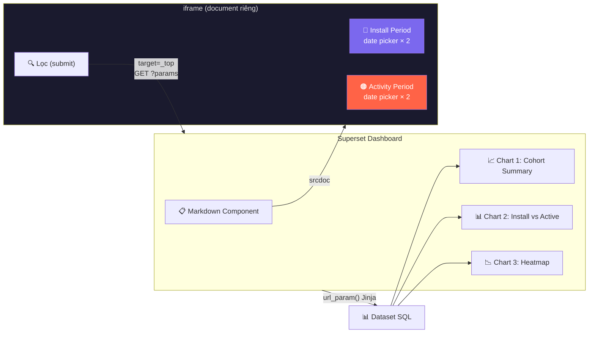

# Superset 6.0.1 — Dual Time Filter cho Cohort Analysis

> **Bài toán:** Chọn user cài đặt app trong **khoảng thời gian A** (Install Window), rồi kiểm tra xem user đó có mở app trong **khoảng thời gian B** (Activity Window) hay không.
>
> **Database:** StarRocks · **Bảng:** `bronze.fb_*` · **Superset:** 6.0.1
> **Phương pháp:** Jinja `url_param()` + Markdown `<iframe srcdoc>`

---

## Kiến trúc tổng quan



### Luồng hoạt động

1. User mở Dashboard → Markdown render `<iframe srcdoc>` chứa form với 4 date inputs
2. User chọn ngày bằng calendar popup (hoạt động bình thường vì iframe tách khỏi React)
3. User click **🔍 Lọc** → form submit `GET` với `target="_top"` → redirect Dashboard URL kèm params
4. Dashboard reload → Jinja `url_param()` nhận giá trị → SQL query chạy với khoảng thời gian được chọn
5. Charts cập nhật dữ liệu theo filter

---

## Bước 1: Cấu hình Superset

### 1.1 Bật Jinja Templates + Tắt HTML Sanitization

Trong file `superset_config.py`:

```python
# Bật Jinja template processing cho SQL datasets
FEATURE_FLAGS = {
    "ENABLE_TEMPLATE_PROCESSING": True,
}

# Tắt HTML sanitization để cho phép <iframe srcdoc> trong Markdown
HTML_SANITIZATION = False

# Hoặc nếu muốn whitelist thay vì tắt hoàn toàn:
# HTML_SANITIZATION_SCHEMA_EXTENSIONS = {
#     "tagNames": ["iframe", "form", "input", "button", "label"],
#     "attributes": {
#         "iframe": ["srcdoc", "style", "width", "height"],
#         "form": ["action", "method", "target", "style"],
#         "input": ["type", "name", "value", "style"],
#         "button": ["type", "style"],
#     },
# }
```

Restart Superset sau khi thay đổi config.

---

## Bước 2: Tạo Dataset SQL

Chạy trong **SQL Lab** → **Save as Dataset** (đặt tên: `ds_cohort_install_activity`).

Thay `bronze.fb_lovia_ai` bằng tên bảng app thực tế.

```sql
-- ═══════════════════════════════════════════════════════════════
-- Dataset: ds_cohort_install_activity
-- Mục đích: Lấy user cài đặt trong Install Window,
--           check active trong Activity Window
-- Filter: url_param() nhận giá trị từ URL params
-- ═══════════════════════════════════════════════════════════════

WITH install_cohort AS (
    -- Lấy danh sách user cài đặt trong Install Window
    SELECT DISTINCT
        user_pseudo_id,
        install_date,
        UPPER(get_json_string(device_json, '$.operating_system')) AS platform,
        COALESCE(get_json_string(geo_json, '$.country'), 'Unknown') AS country,
        app_version
    FROM bronze.fb_lovia_ai
    WHERE event_name = 'first_open'
      AND install_date >= '{{ url_param("install_start", "2026-01-01") }}'
      AND install_date <= '{{ url_param("install_end", "2026-01-31") }}'
),

activity_check AS (
    -- Kiểm tra user đó có active trong Activity Window không
    SELECT DISTINCT
        user_pseudo_id,
        event_date AS activity_date
    FROM bronze.fb_lovia_ai
    WHERE event_name IN ('session_start', 'user_engagement')
      AND event_date >= '{{ url_param("activity_start", "2026-02-01") }}'
      AND event_date <= '{{ url_param("activity_end", "2026-02-28") }}'
)

SELECT
    ic.install_date,
    ic.user_pseudo_id,
    ic.platform,
    ic.country,
    ic.app_version,
    CASE WHEN ac.user_pseudo_id IS NOT NULL THEN 1 ELSE 0 END AS is_active,
    ac.activity_date,
    DATEDIFF(ac.activity_date, ic.install_date) AS days_since_install
FROM install_cohort ic
LEFT JOIN activity_check ac
    ON ic.user_pseudo_id = ac.user_pseudo_id;
```

### Giải thích Jinja `url_param()`

| Jinja Expression | Ý nghĩa |
|---|---|
| `url_param("install_start", "2026-01-01")` | Lấy giá trị `install_start` từ URL, default = `2026-01-01` |
| `url_param("install_end", "2026-01-31")` | Lấy giá trị `install_end` từ URL, default = `2026-01-31` |
| `url_param("activity_start", "2026-02-01")` | Lấy giá trị `activity_start` từ URL, default = `2026-02-01` |
| `url_param("activity_end", "2026-02-28")` | Lấy giá trị `activity_end` từ URL, default = `2026-02-28` |

> [!NOTE]
> **Không giới hạn thời gian cứng** — khoảng thời gian hoàn toàn do user chọn từ filter. Default values chỉ dùng khi URL không có params.

### Test trong SQL Lab

Trước khi tạo dashboard, test query trong SQL Lab bằng cách thêm params vào URL:

```
http://your-superset/sqllab/?install_start=2026-03-01&install_end=2026-03-31&activity_start=2026-04-01&activity_end=2026-04-15
```

Hoặc thay default values trực tiếp trong SQL để test nhanh.

---

## Bước 3: Tạo Markdown Filter (iframe srcdoc)

### Vì sao `<iframe srcdoc>` là giải pháp duy nhất

| Phương pháp | Vấn đề | Kết quả |
|---|---|---|
| HTML trực tiếp trong Markdown | React `dangerouslySetInnerHTML` → re-render reset input values | ❌ Calendar chọn ngày không nhận |
| `<input type="text">` | React chặn focus/input events trên innerHTML | ❌ Không gõ được |
| `<button onclick="...">` | React error #231: onClick phải là function, nhận string | ❌ Lỗi React |
| **`<iframe srcdoc>`** | **Document context riêng, tách hoàn toàn khỏi React** | **✅ Hoạt động hoàn hảo** |

### Code Markdown

Trên Dashboard → kéo thả **Markdown component** vào layout → paste code sau:

> [!IMPORTANT]
> **Thay `YOUR_DASHBOARD_SLUG`** bằng slug hoặc ID thật của dashboard (lấy từ URL, ví dụ: `cohort-analysis` hoặc `123`).

```html
<iframe srcdoc='
<!DOCTYPE html>
<html>
<body style="margin:0;padding:0;background:transparent;font-family:Inter,Arial,sans-serif;">
<form action="/superset/dashboard/YOUR_DASHBOARD_SLUG/" method="GET" target="_top"
      style="display:flex;gap:20px;padding:14px 16px;background:#1a1a2e;border-radius:10px;align-items:end;flex-wrap:wrap;">
  <div>
    <div style="color:#7B68EE;font-weight:700;font-size:12px;margin-bottom:6px;">📅 Install Period</div>
    <div style="display:flex;align-items:center;gap:6px;">
      <input type="date" name="install_start" value="2026-01-01"
             style="padding:6px 10px;border-radius:6px;border:1px solid #555;background:#2d2d44;color:#e0e0e0;font-size:13px;outline:none;" />
      <span style="color:#666;">→</span>
      <input type="date" name="install_end" value="2026-01-31"
             style="padding:6px 10px;border-radius:6px;border:1px solid #555;background:#2d2d44;color:#e0e0e0;font-size:13px;outline:none;" />
    </div>
  </div>
  <div>
    <div style="color:#FF6347;font-weight:700;font-size:12px;margin-bottom:6px;">📅 Activity Period</div>
    <div style="display:flex;align-items:center;gap:6px;">
      <input type="date" name="activity_start" value="2026-02-01"
             style="padding:6px 10px;border-radius:6px;border:1px solid #555;background:#2d2d44;color:#e0e0e0;font-size:13px;outline:none;" />
      <span style="color:#666;">→</span>
      <input type="date" name="activity_end" value="2026-02-28"
             style="padding:6px 10px;border-radius:6px;border:1px solid #555;background:#2d2d44;color:#e0e0e0;font-size:13px;outline:none;" />
    </div>
  </div>
  <button type="submit"
          style="padding:8px 24px;background:linear-gradient(135deg,#7B68EE,#6C5CE7);color:white;border:none;border-radius:8px;cursor:pointer;font-weight:700;font-size:14px;box-shadow:0 2px 8px rgba(123,104,238,0.3);">
    🔍 Lọc
  </button>
</form>
</body>
</html>
' style="width:100%;height:75px;border:none;background:transparent;"></iframe>
```

> [!TIP]
> Nếu chiều cao bị cắt, tăng `height:75px` lên `85px` hoặc `100px`. Nếu trên mobile/màn hình nhỏ bị wrap, tăng lên `120px`.

---

## Bước 4: Tạo Charts

Tất cả charts dùng dataset `ds_cohort_install_activity`.

### Chart 1: Cohort Summary (Big Number × 3)

Tạo **3 Big Number** charts:

| Big Number | Metric (Custom SQL) | Subheader |
|---|---|---|
| **Total Installs** | `COUNT(DISTINCT user_pseudo_id)` | Users installed |
| **Active Users** | `COUNT(DISTINCT CASE WHEN is_active = 1 THEN user_pseudo_id END)` | Users returned |
| **Active Rate** | `ROUND(COUNT(DISTINCT CASE WHEN is_active = 1 THEN user_pseudo_id END) * 100.0 / NULLIF(COUNT(DISTINCT user_pseudo_id), 0), 1)` | % active |

### Chart 2: Install vs Active by Date (Mixed Chart)

| Setting | Giá trị |
|---|---|
| **Chart type** | Mixed Chart (Bar + Line) |
| **X-axis** | `install_date` |
| **Metric 1 (Bar)** | `COUNT_DISTINCT(user_pseudo_id)` — label: "Installs" |
| **Metric 2 (Line)** | Custom SQL: `COUNT(DISTINCT CASE WHEN is_active = 1 THEN user_pseudo_id END)` — label: "Active" |
| **Color** | Bar: #7B68EE, Line: #FF6347 |

### Chart 3: Active Rate by Country (Table)

| Setting | Giá trị |
|---|---|
| **Chart type** | Table |
| **Group By** | `country` |
| **Metrics** | `COUNT_DISTINCT(user_pseudo_id)` AS installs |
| | Custom: `COUNT(DISTINCT CASE WHEN is_active=1 THEN user_pseudo_id END)` AS active |
| | Custom: `ROUND(... * 100.0 / NULLIF(...), 1)` AS active_rate |
| **Sort** | installs DESC |

### Chart 4: Retention Heatmap (Pivot Table)

| Setting | Giá trị |
|---|---|
| **Chart type** | Pivot Table hoặc Heatmap |
| **Rows** | `install_date` |
| **Columns** | `days_since_install` |
| **Metric** | Custom SQL: active_rate (xem trên) |

---

## Bước 5: Dashboard Layout

```
┌──────────────────────────────────────────────────────┐
│ [Markdown — iframe srcdoc]                            │
│ 📅 Install Period: [____] → [____]                   │
│ 📅 Activity Period: [____] → [____]  [🔍 Lọc]       │
├──────────┬──────────┬────────────────────────────────┤
│ [Big #]  │ [Big #]  │ [Big #]                         │
│ Installs │ Active   │ Active Rate %                   │
├──────────┴──────────┴────────────────────────────────┤
│ [Mixed Chart] Install vs Active by Date               │
├─────────────────────┬────────────────────────────────┤
│ [Table]             │ [Heatmap / Pivot]               │
│ Active Rate by      │ Retention by Install Date ×     │
│ Country             │ Days Since Install              │
└─────────────────────┴────────────────────────────────┘
```

---

## URL trực tiếp (Share / Bookmark)

Có thể share dashboard với filter sẵn bằng URL:

```
http://your-superset/superset/dashboard/YOUR_DASHBOARD_SLUG/?install_start=2026-03-01&install_end=2026-03-31&activity_start=2026-04-01&activity_end=2026-04-15
```

Người nhận mở link → dashboard tự động load với khoảng thời gian đã chọn.

---

## Troubleshooting

### Markdown không hiện iframe

**Nguyên nhân:** HTML sanitization đang bật.
**Fix:** Thêm `HTML_SANITIZATION = False` vào `superset_config.py` và restart.

### Calendar không chọn được ngày

**Nguyên nhân:** Không dùng `<iframe srcdoc>`, đặt `<input type="date">` trực tiếp trong Markdown.
**Fix:** Bắt buộc dùng `<iframe srcdoc>` — đây là cách duy nhất tách calendar khỏi React event system.

### Query báo lỗi `default_value`

**Nguyên nhân:** Dùng sai syntax `filter_values("x", default_value="y")`.
**Fix:** Nếu dùng `url_param()` thì syntax đúng là `url_param("x", "y")` (tham số thứ 2 là default).

### Form submit không redirect

**Nguyên nhân:** Thiếu `target="_top"` trong thẻ `<form>`.
**Fix:** Đảm bảo `<form ... target="_top">` — thuộc tính này khiến form submit redirect trang cha (Superset) thay vì chỉ trong iframe.

### Dashboard slug sai

**Cách lấy slug:** Mở dashboard → nhìn URL:
- `http://superset/superset/dashboard/my-cohort/` → slug = `my-cohort`
- `http://superset/superset/dashboard/45/` → slug = `45`

Thay vào `action="/superset/dashboard/YOUR_DASHBOARD_SLUG/"` trong iframe srcdoc.

---

## Bộ lọc bổ sung (Optional)

Nếu muốn thêm filter Platform, Country, App Version, thêm params vào form:

```html
<!-- Thêm vào trong <form> của iframe srcdoc -->
<div>
  <div style="color:#2ECC71;font-weight:700;font-size:12px;margin-bottom:6px;">📱 Platform</div>
  <select name="platform" style="padding:6px;border-radius:6px;border:1px solid #555;background:#2d2d44;color:#e0e0e0;">
    <option value="">All</option>
    <option value="IOS">iOS</option>
    <option value="ANDROID">Android</option>
  </select>
</div>
```

Và trong SQL dataset thêm:

```sql

  AND UPPER(get_json_string(device_json, '$.operating_system')) = '{{ url_param("platform") }}'

```
