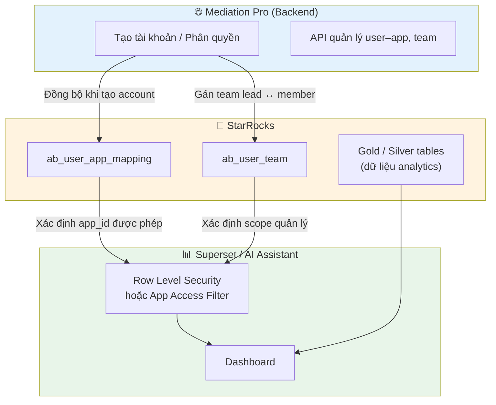
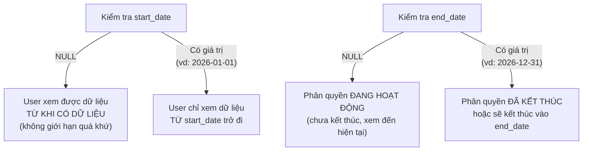
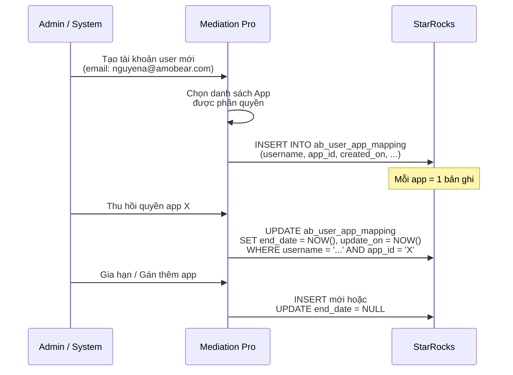
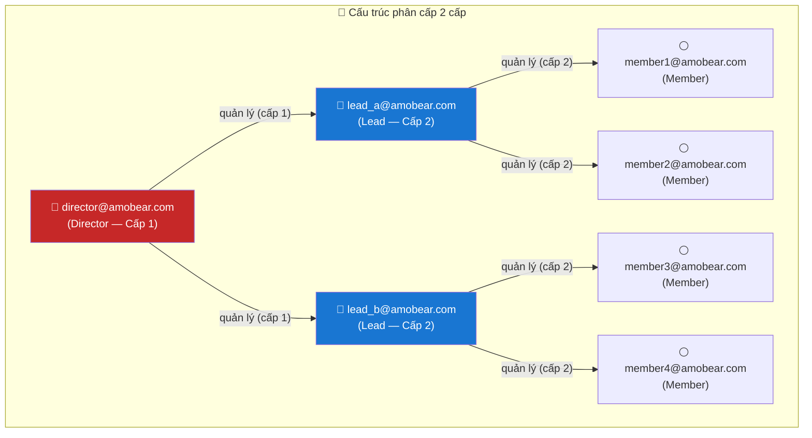
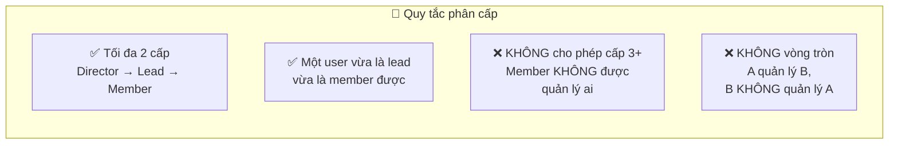
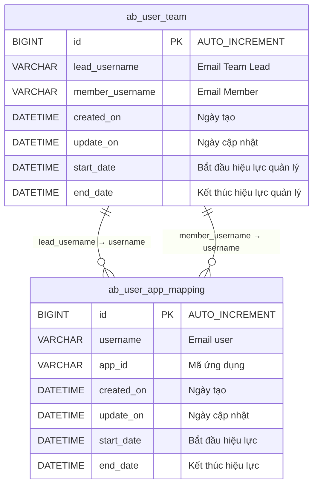
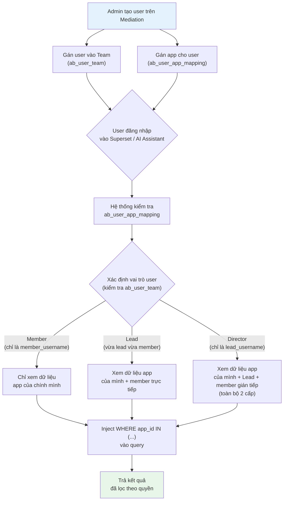

# Tài liệu Phân tích Nghiệp vụ: Phân quyền User–App & Quản lý Team

> **Module:** Mediation Pro — User Access Control & Team Management  
> **Database:** StarRocks (OLAP Engine)  
> **Phiên bản:** 1.2 | **Ngày:** 20/04/2026  
> **Tác giả:** BA Team  
> **Liên quan:** [114d - DATA ACCESS POLICY](../114d%20-%20DATA%20ACCESS%20POLICY.md), [99b - Ad Revenue Analytics §11.4–11.5](../99b%20-%20Ad%20Revenue%20Analytics.md)

---

## 1. Bối cảnh & Mục tiêu

Hệ thống Mediation Pro cần kiểm soát **ai được xem dữ liệu của app nào** và **ai quản lý ai** trong tổ chức. Hai bảng StarRocks dưới đây phục vụ hai mục tiêu:

| Bảng | Mục tiêu chính |
|------|---------------|
| `ab_user_app_mapping` | Phân quyền: User X được truy cập dữ liệu của App Y trong khoảng thời gian nào |
| `ab_user_team` | Tổ chức: Quản lý cấu trúc phân cấp 2 cấp (Director → Lead → Member), **có hiệu lực theo thời gian** |

### 1.1 Vị trí trong kiến trúc tổng thể



---

## 2. Bảng `ab_user_app_mapping` — Phân quyền App cho User

### 2.1 Mục đích

Lưu trữ mối quan hệ **User ↔ App** có hiệu lực theo thời gian (time-bounded). Khi một user được tạo tài khoản trên trang Mediation, hệ thống đồng bộ bản ghi vào bảng này để xác định user đó được truy cập dữ liệu của những app nào.

### 2.2 DDL (Data Definition Language)

```sql
CREATE TABLE ab_user_app_mapping (
    id           BIGINT       NOT NULL AUTO_INCREMENT    COMMENT 'Khóa chính tự tăng',
    username     VARCHAR(100)                             COMMENT 'Email đăng nhập của user',
    app_id       VARCHAR(100)                             COMMENT 'Mã ứng dụng (AdMob App ID hoặc package name)',
    created_on   DATETIME     DEFAULT CURRENT_TIMESTAMP  COMMENT 'Ngày giờ tạo bản ghi phân quyền',
    update_on    DATETIME     DEFAULT CURRENT_TIMESTAMP  COMMENT 'Ngày giờ cập nhật lần cuối',
    start_date   DATETIME     NULL                       COMMENT 'Ngày bắt đầu hiệu lực (NULL = từ khi có dữ liệu)',
    end_date     DATETIME     NULL                       COMMENT 'Ngày kết thúc hiệu lực (NULL = chưa kết thúc)'
) 
ENGINE = OLAP
PRIMARY KEY(id)
DISTRIBUTED BY HASH(id) 
PROPERTIES (
    "replication_num" = "1"
);
```

### 2.3 Mô tả chi tiết các trường

| # | Trường | Kiểu | Nullable | Default | Mô tả | Quy tắc nghiệp vụ |
|---|--------|------|----------|---------|-------|-------------------|
| 1 | `id` | BIGINT | NOT NULL | AUTO_INCREMENT | Khóa chính, tự động tăng | Duy nhất, không sửa |
| 2 | `username` | VARCHAR(100) | YES | — | **Email** đăng nhập của user | Đồng bộ từ hệ thống tạo tài khoản Mediation. Giá trị phải là email hợp lệ (vd: `nguyena@amobear.com`) |
| 3 | `app_id` | VARCHAR(100) | YES | — | Mã định danh ứng dụng | Có thể là **AdMob App ID** (dạng `ca-app-pub-xxx~yyy`) hoặc **package name** tùy context. Nên thống nhất với `app_id` trong Silver/Gold tables |
| 4 | `created_on` | DATETIME | YES | CURRENT_TIMESTAMP | Thời điểm bản ghi được tạo | Tự động gán = ngày giờ hiện tại khi INSERT |
| 5 | `update_on` | DATETIME | YES | CURRENT_TIMESTAMP | Thời điểm cập nhật lần cuối | Cần cập nhật thủ công (hoặc qua trigger/application logic) khi sửa bản ghi |
| 6 | `start_date` | DATETIME | YES (NULL) | NULL | Ngày bắt đầu hiệu lực phân quyền | Xem **§2.4 Quy tắc thời gian** |
| 7 | `end_date` | DATETIME | YES (NULL) | NULL | Ngày kết thúc hiệu lực phân quyền | Xem **§2.4 Quy tắc thời gian** |

### 2.4 Quy tắc thời gian hiệu lực (start_date / end_date)

Hai trường `start_date` và `end_date` xác định **khoảng thời gian** mà user được phép truy cập dữ liệu của app. Quy tắc như sau:



| start_date | end_date | Ý nghĩa | Dữ liệu user được xem |
|-----------|----------|---------|----------------------|
| `NULL` | `NULL` | Phân quyền vô thời hạn, từ đầu đến hiện tại | Toàn bộ dữ liệu lịch sử đến hiện tại |
| `2026-01-15` | `NULL` | Phân quyền bắt đầu từ 15/01/2026, chưa kết thúc | Dữ liệu từ 15/01/2026 đến hiện tại |
| `NULL` | `2026-06-30` | Phân quyền từ đầu, kết thúc 30/06/2026 | Toàn bộ dữ liệu lịch sử đến 30/06/2026 |
| `2026-01-15` | `2026-06-30` | Phân quyền có thời hạn | Dữ liệu từ 15/01/2026 đến 30/06/2026 |

> [!IMPORTANT]
> **Quy tắc kiểm tra quyền truy cập (pseudo-code):**
> ```
> user_has_access = 
>     EXISTS bản ghi (username, app_id) 
>     AND (end_date IS NULL OR end_date >= NOW())
>     AND (start_date IS NULL OR start_date <= data_date)
> ```

### 2.5 Luồng nghiệp vụ



### 2.6 Ví dụ dữ liệu mẫu

| id | username | app_id | created_on | update_on | start_date | end_date |
|----|----------|--------|------------|-----------|------------|----------|
| 1 | nguyena@amobear.com | ca-app-pub-123~456 | 2026-01-10 09:00:00 | 2026-01-10 09:00:00 | NULL | NULL |
| 2 | nguyena@amobear.com | ca-app-pub-789~012 | 2026-01-10 09:00:00 | 2026-03-15 14:30:00 | 2026-02-01 00:00:00 | 2026-06-30 23:59:59 |
| 3 | tranb@amobear.com | ca-app-pub-123~456 | 2026-02-20 10:00:00 | 2026-04-01 08:00:00 | NULL | 2026-04-01 08:00:00 |
| 4 | lec@amobear.com | ca-app-pub-345~678 | 2026-03-01 08:30:00 | 2026-03-01 08:30:00 | 2026-03-01 00:00:00 | NULL |

**Giải thích:**
- **Dòng 1:** Nguyễn A được truy cập app `ca-app-pub-123~456` vô thời hạn, xem toàn bộ dữ liệu từ khi có.
- **Dòng 2:** Nguyễn A được truy cập app `ca-app-pub-789~012` từ 01/02 đến 30/06/2026 (có thời hạn).
- **Dòng 3:** Trần B **đã bị thu hồi** quyền app `ca-app-pub-123~456` vào 01/04/2026 (end_date != NULL).
- **Dòng 4:** Lê C được truy cập app `ca-app-pub-345~678` từ 01/03/2026, chưa kết thúc.

### 2.7 Query mẫu

#### Lấy danh sách app đang hoạt động của một user

```sql
SELECT app_id
FROM ab_user_app_mapping
WHERE username = 'nguyena@amobear.com'
  AND (end_date IS NULL OR end_date >= NOW());
```

#### Kiểm tra user có quyền truy cập một app cụ thể không

```sql
SELECT COUNT(*) > 0 AS has_access
FROM ab_user_app_mapping
WHERE username = 'nguyena@amobear.com'
  AND app_id = 'ca-app-pub-123~456'
  AND (end_date IS NULL OR end_date >= NOW());
```

#### Lấy danh sách user đang có quyền truy cập một app

```sql
SELECT username, start_date, end_date
FROM ab_user_app_mapping
WHERE app_id = 'ca-app-pub-123~456'
  AND (end_date IS NULL OR end_date >= NOW())
ORDER BY created_on;
```

#### Inject filter cho Superset / AI Assistant (WHERE clause)

```sql
-- Dùng trong RLS clause hoặc Jinja template
-- Giả sử biến {{ current_user.username }} có sẵn
app_id IN (
    SELECT app_id 
    FROM ab_user_app_mapping 
    WHERE username = '{{ current_user.username }}'
      AND (end_date IS NULL OR end_date >= NOW())
)
```

---

## 3. Bảng `ab_user_team` — Quản lý phân cấp 2 cấp (Director → Lead → Member)

### 3.1 Mục đích

Lưu trữ mối quan hệ **quản lý phân cấp 2 cấp** trong tổ chức, **có hiệu lực theo thời gian** (time-bounded). Bảng này cho phép:

- Xác định ai quản lý ai với **chuỗi phân cấp tối đa 2 cấp**: Director → Lead → Member
- Một user có thể **đồng thời là lead (quản lý cấp dưới) và là member (bị quản lý bởi cấp trên)**
- Cấp trên có thể xem dữ liệu tổng hợp của **tất cả cấp dưới** (trực tiếp và gián tiếp)
- **Quan hệ quản lý có thời hạn** — hỗ trợ gán tạm thời, chuyển team, và lưu lịch sử quản lý
- Hỗ trợ tính năng "phạm vi quản lý" — khi đăng nhập, hệ thống tự động mở rộng quyền bao gồm tất cả app của cấp dưới **đang hoạt động**

> [!IMPORTANT]
> **Nguyên tắc cốt lõi — Phân cấp 2 cấp:**
> Bảng `ab_user_team` hỗ trợ chuỗi quản lý **tối đa 2 cấp**. Ví dụ: User A (Director) quản lý User B (Lead), User B quản lý User C (Member). Khi đó:
> - **User A** xem được dữ liệu của User B **và** User C (cả trực tiếp lẫn gián tiếp)
> - **User B** xem được dữ liệu của User C (trực tiếp)
> - **User C** chỉ xem dữ liệu của chính mình

### 3.2 DDL (Data Definition Language)

```sql
CREATE TABLE ab_user_team (
    id               BIGINT       NOT NULL AUTO_INCREMENT    COMMENT 'Khóa chính tự tăng',
    lead_username    VARCHAR(100)                             COMMENT 'Team lead / quản lý (email)',
    member_username  VARCHAR(100)                             COMMENT 'Thành viên được quản lý (email)',
    created_on       DATETIME     DEFAULT CURRENT_TIMESTAMP  COMMENT 'Ngày giờ tạo quan hệ team',
    update_on        DATETIME     DEFAULT CURRENT_TIMESTAMP  COMMENT 'Ngày giờ cập nhật lần cuối',
    start_date       DATETIME     NULL                       COMMENT 'Ngày bắt đầu hiệu lực quản lý (NULL = từ khi tạo bản ghi)',
    end_date         DATETIME     NULL                       COMMENT 'Ngày kết thúc hiệu lực quản lý (NULL = chưa kết thúc)'
) 
ENGINE = OLAP
PRIMARY KEY(id)
DISTRIBUTED BY HASH(id) 
PROPERTIES (
    "replication_num" = "1"
);
```

> [!WARNING]
> **Nếu bảng đã tồn tại**, StarRocks PRIMARY KEY table **không hỗ trợ ALTER TABLE ADD COLUMN**. Cần **tạo bảng mới → copy dữ liệu → swap tên**:
>
> ```sql
> -- Bước 1: Tạo bảng mới với đầy đủ cột
> CREATE TABLE ab_user_team_new (
>     id               BIGINT       NOT NULL AUTO_INCREMENT,
>     lead_username    VARCHAR(100),
>     member_username  VARCHAR(100),
>     created_on       DATETIME     DEFAULT CURRENT_TIMESTAMP,
>     update_on        DATETIME     DEFAULT CURRENT_TIMESTAMP,
>     start_date       DATETIME     NULL,
>     end_date         DATETIME     NULL
> ) 
> ENGINE = OLAP
> PRIMARY KEY(id)
> DISTRIBUTED BY HASH(id) 
> PROPERTIES ("replication_num" = "1");
>
> -- Bước 2: Copy dữ liệu (start_date, end_date mặc định NULL)
> INSERT INTO ab_user_team_new (id, lead_username, member_username, created_on, update_on)
> SELECT id, lead_username, member_username, created_on, update_on
> FROM ab_user_team;
>
> -- Bước 3: Swap tên bảng
> ALTER TABLE ab_user_team RENAME ab_user_team_backup;
> ALTER TABLE ab_user_team_new RENAME ab_user_team;
>
> -- Bước 4: Xác nhận dữ liệu, sau đó xóa bảng backup
> -- DROP TABLE ab_user_team_backup;
> ```

### 3.3 Mô tả chi tiết các trường

| # | Trường | Kiểu | Nullable | Default | Mô tả | Quy tắc nghiệp vụ |
|---|--------|------|----------|---------|-------|-------------------|
| 1 | `id` | BIGINT | NOT NULL | AUTO_INCREMENT | Khóa chính, tự động tăng | Duy nhất, không sửa |
| 2 | `lead_username` | VARCHAR(100) | YES | — | **Email** của người quản lý (cấp trên) | Phải tồn tại trong hệ thống user. Một lead có thể quản lý nhiều member. **Có thể đồng thời là member_username trong bản ghi khác** (cấp trên quản lý mình) |
| 3 | `member_username` | VARCHAR(100) | YES | — | **Email** của thành viên được quản lý (cấp dưới) | Phải tồn tại trong hệ thống user. Một member **chỉ nên thuộc một lead trực tiếp** (tránh xung đột scope). **Có thể đồng thời là lead_username trong bản ghi khác** (mình quản lý cấp dưới nữa) |
| 4 | `created_on` | DATETIME | YES | CURRENT_TIMESTAMP | Thời điểm bản ghi được tạo | Tự động gán = ngày giờ hiện tại khi INSERT |
| 5 | `update_on` | DATETIME | YES | CURRENT_TIMESTAMP | Thời điểm cập nhật lần cuối | Cần cập nhật khi sửa bản ghi |
| 6 | `start_date` | DATETIME | YES (NULL) | NULL | Ngày bắt đầu hiệu lực quan hệ quản lý | Xem **§3.4a Quy tắc thời gian** |
| 7 | `end_date` | DATETIME | YES (NULL) | NULL | Ngày kết thúc hiệu lực quan hệ quản lý | Xem **§3.4a Quy tắc thời gian** |

### 3.4a Quy tắc thời gian hiệu lực quan hệ quản lý (start_date / end_date)

Tương tự bảng `ab_user_app_mapping`, hai trường `start_date` và `end_date` trong `ab_user_team` xác định **khoảng thời gian** mà quan hệ quản lý (lead → member) có hiệu lực:

| start_date | end_date | Ý nghĩa | Ảnh hưởng quyền |
|-----------|----------|---------|----------------|
| `NULL` | `NULL` | Quan hệ quản lý vô thời hạn | Lead luôn xem được dữ liệu member |
| `2026-03-01` | `NULL` | Bắt đầu quản lý từ 01/03/2026, chưa kết thúc | Lead xem dữ liệu member từ 01/03/2026 đến hiện tại |
| `NULL` | `2026-06-30` | Quản lý từ đầu, kết thúc 30/06/2026 | Sau 30/06 → lead **không còn** xem dữ liệu member |
| `2026-03-01` | `2026-06-30` | Quản lý có thời hạn (tạm thời) | Lead chỉ xem dữ liệu member trong khoảng 01/03–30/06 |

> [!IMPORTANT]
> **Quy tắc kiểm tra quan hệ quản lý đang hoạt động (pseudo-code):**
> ```
> relationship_active =
>     EXISTS bản ghi (lead_username, member_username)
>     AND (end_date IS NULL OR end_date >= NOW())
>     AND (start_date IS NULL OR start_date <= NOW())
> ```
>
> **Khác biệt với `ab_user_app_mapping`:** Ở bảng user–app, `start_date` giới hạn **phạm vi dữ liệu** user được xem (data_date). Ở bảng team, `start_date`/`end_date` giới hạn **thời gian quan hệ quản lý có hiệu lực** — tức lead có quyền xem dữ liệu member hay không tại thời điểm hiện tại.

### 3.4 Mô hình phân cấp 2 cấp



**Giải thích chuỗi phân cấp:**

| Bản ghi | lead_username | member_username | Ý nghĩa |
|---------|--------------|----------------|----------|
| ① | director@amobear.com | lead_a@amobear.com | Director quản lý Lead A |
| ② | director@amobear.com | lead_b@amobear.com | Director quản lý Lead B |
| ③ | lead_a@amobear.com | member1@amobear.com | Lead A quản lý Member 1 |
| ④ | lead_a@amobear.com | member2@amobear.com | Lead A quản lý Member 2 |
| ⑤ | lead_b@amobear.com | member3@amobear.com | Lead B quản lý Member 3 |
| ⑥ | lead_b@amobear.com | member4@amobear.com | Lead B quản lý Member 4 |

> [!NOTE]
> **User `lead_a@amobear.com` xuất hiện ở CẢ HAI vai trò:**
> - Là **member_username** trong bản ghi ① (bị Director quản lý)
> - Là **lead_username** trong bản ghi ③, ④ (quản lý Member 1, 2)
>
> Đây là cơ chế tạo chuỗi phân cấp 2 cấp.

### 3.5 Quy tắc phân cấp



| Quy tắc | Mô tả | Ví dụ |
|---------|-------|-------|
| **Tối đa 2 cấp** | Chuỗi quản lý dài nhất: Director → Lead → Member. Không cho phép cấp 3 trở lên | ✅ A→B→C, ❌ A→B→C→D |
| **Dual role** | Một user có thể đồng thời là `lead_username` (quản lý cấp dưới) và `member_username` (bị cấp trên quản lý) | Lead A vừa bị Director quản lý, vừa quản lý Member 1 |
| **Single parent** | Một member chỉ nên thuộc **một** lead trực tiếp | Member 1 chỉ thuộc Lead A, không đồng thời thuộc Lead B |
| **Không vòng tròn** | Không cho phép quan hệ vòng tròn (circular reference) | A→B→A là **không hợp lệ** |
| **Leaf member** | Member ở cấp cuối (cấp 2) **không được** là `lead_username` của ai | Nếu C đã là member của B (cấp 2), C không được quản lý D |

> [!WARNING]
> **Validation ở Application Layer:** StarRocks OLAP không hỗ trợ CHECK constraint hay trigger. Application (Mediation Pro Backend) **phải validate** các quy tắc trên trước khi INSERT:
> 1. Kiểm tra `member_username` chưa là member_username ở bản ghi nào mà lead_username cũng là member_username của ai (tức đã ở cấp 2 → không thể tạo cấp 3)
> 2. Kiểm tra không tạo vòng tròn
> 3. Kiểm tra member chỉ có 1 lead trực tiếp

### 3.6 Ví dụ dữ liệu mẫu

| id | lead_username | member_username | created_on | update_on | start_date | end_date | Ghi chú |
|----|--------------|----------------|------------|-----------|------------|----------|--------|
| 1 | director@amobear.com | lead_a@amobear.com | 2026-01-10 09:00:00 | 2026-01-10 09:00:00 | NULL | NULL | Vô thời hạn |
| 2 | director@amobear.com | lead_b@amobear.com | 2026-01-10 09:00:00 | 2026-01-10 09:00:00 | 2026-01-10 | NULL | Từ 10/01, chưa kết thúc |
| 3 | lead_a@amobear.com | member1@amobear.com | 2026-01-15 09:00:00 | 2026-01-15 09:00:00 | NULL | NULL | Vô thời hạn |
| 4 | lead_a@amobear.com | member2@amobear.com | 2026-01-15 09:00:00 | 2026-04-01 10:00:00 | 2026-01-15 | 2026-06-30 | Tạm thời (01/15–06/30) |
| 5 | lead_b@amobear.com | member3@amobear.com | 2026-02-01 08:00:00 | 2026-02-01 08:00:00 | NULL | NULL | Vô thời hạn |
| 6 | lead_b@amobear.com | member4@amobear.com | 2026-02-01 08:00:00 | 2026-03-15 09:00:00 | NULL | 2026-03-15 | **Đã kết thúc** 15/03 |

**Giải thích:**
- **Dòng 4:** Member 2 được gán tạm thời cho Lead A từ 15/01 đến 30/06/2026. Sau 30/06, Lead A không còn xem được dữ liệu Member 2.
- **Dòng 6:** Member 4 **đã bị thu hồi** khỏi team Lead B vào 15/03/2026 (end_date = quá khứ → quan hệ không còn hiệu lực).

**Phân tích vai trò từng user (tại thời điểm hiện tại):**

| User | Xuất hiện là lead_username | Xuất hiện là member_username | Vai trò thực tế |
|------|:-------------------------:|:---------------------------:|----------------|
| director@amobear.com | ✅ (dòng 1, 2) | ❌ | **Director** (cấp cao nhất, không bị ai quản lý) |
| lead_a@amobear.com | ✅ (dòng 3, 4) | ✅ (dòng 1) | **Lead** (vừa quản lý member, vừa bị Director quản lý) |
| lead_b@amobear.com | ✅ (dòng 5) | ✅ (dòng 2) | **Lead** (chỉ còn quản lý member3; member4 đã hết hiệu lực) |
| member1@amobear.com | ❌ | ✅ (dòng 3) | **Member** (cấp cuối, chỉ bị quản lý) |
| member2@amobear.com | ❌ | ✅ (dòng 4) | **Member** (tạm thời, sẽ hết hạn 30/06) |
| member3@amobear.com | ❌ | ✅ (dòng 5) | **Member** (cấp cuối) |
| member4@amobear.com | ❌ | ✅ (dòng 6) | **Không thuộc team nào** (end_date đã qua, quan hệ hết hiệu lực) |

### 3.7 Query mẫu

#### Lấy danh sách member trực tiếp **đang hoạt động** (cấp dưới 1 bậc)

```sql
SELECT member_username, start_date, end_date
FROM ab_user_team
WHERE lead_username = 'lead_a@amobear.com'
  AND (end_date IS NULL OR end_date >= NOW())
  AND (start_date IS NULL OR start_date <= NOW())
ORDER BY created_on;
-- Kết quả: member1 (vô thời hạn), member2 (tạm thời đến 30/06)
```

#### Lấy TOÀN BỘ cấp dưới **đang hoạt động** (2 cấp — trực tiếp + gián tiếp)

```sql
-- Director muốn xem tất cả người dưới quyền (Lead + Member của Lead)
-- Chỉ lấy quan hệ đang hoạt động (chưa hết hạn)
SELECT member_username AS subordinate, 'Cấp 1 (trực tiếp)' AS level
FROM ab_user_team
WHERE lead_username = 'director@amobear.com'
  AND (end_date IS NULL OR end_date >= NOW())
  AND (start_date IS NULL OR start_date <= NOW())

UNION ALL

SELECT t2.member_username AS subordinate, 'Cấp 2 (gián tiếp)' AS level
FROM ab_user_team t1
JOIN ab_user_team t2 ON t2.lead_username = t1.member_username
WHERE t1.lead_username = 'director@amobear.com'
  AND (t1.end_date IS NULL OR t1.end_date >= NOW())
  AND (t1.start_date IS NULL OR t1.start_date <= NOW())
  AND (t2.end_date IS NULL OR t2.end_date >= NOW())
  AND (t2.start_date IS NULL OR t2.start_date <= NOW());

-- Kết quả (giả sử ngày hiện tại = 20/04/2026):
-- lead_a@amobear.com   | Cấp 1 (trực tiếp)
-- lead_b@amobear.com   | Cấp 1 (trực tiếp)
-- member1@amobear.com  | Cấp 2 (gián tiếp)
-- member2@amobear.com  | Cấp 2 (gián tiếp)   ← tạm thời, sẽ hết 30/06
-- member3@amobear.com  | Cấp 2 (gián tiếp)
-- ❌ member4 KHÔNG xuất hiện (end_date = 15/03 đã qua)
```

#### Tìm cấp trên của một user (lên 2 cấp)

```sql
-- Từ member1, tìm Lead trực tiếp và Director (nếu có)
SELECT t1.lead_username AS direct_lead,
       t2.lead_username AS director
FROM ab_user_team t1
LEFT JOIN ab_user_team t2 ON t2.member_username = t1.lead_username
WHERE t1.member_username = 'member1@amobear.com';
-- Kết quả: direct_lead = lead_a, director = director
```

#### Xác định vai trò thực tế của một user

```sql
SELECT 
    CASE 
        WHEN EXISTS (SELECT 1 FROM ab_user_team WHERE lead_username = u.email)
         AND NOT EXISTS (SELECT 1 FROM ab_user_team WHERE member_username = u.email)
        THEN 'Director'
        WHEN EXISTS (SELECT 1 FROM ab_user_team WHERE lead_username = u.email)
         AND EXISTS (SELECT 1 FROM ab_user_team WHERE member_username = u.email)
        THEN 'Lead'
        WHEN EXISTS (SELECT 1 FROM ab_user_team WHERE member_username = u.email)
        THEN 'Member'
        ELSE 'Standalone'
    END AS role
FROM (SELECT 'lead_a@amobear.com' AS email) u;
-- Kết quả: Lead (vì xuất hiện ở cả 2 cột)
```

#### User xem tất cả app thuộc scope quản lý (2 cấp, có kiểm tra thời gian)

```sql
-- Lấy danh sách app từ: chính mình + cấp dưới trực tiếp + cấp dưới gián tiếp
-- Chỉ tính quan hệ team ĐANG HOẠT ĐỘNG + app mapping ĐANG HOẠT ĐỘNG
SELECT DISTINCT m.app_id
FROM ab_user_app_mapping m
WHERE m.username IN (
    -- Chính user
    SELECT 'director@amobear.com'
    
    UNION
    
    -- Cấp dưới trực tiếp (cấp 1) — đang hoạt động
    SELECT member_username 
    FROM ab_user_team 
    WHERE lead_username = 'director@amobear.com'
      AND (end_date IS NULL OR end_date >= NOW())
      AND (start_date IS NULL OR start_date <= NOW())
    
    UNION
    
    -- Cấp dưới gián tiếp (cấp 2) — cả 2 quan hệ đều đang hoạt động
    SELECT t2.member_username
    FROM ab_user_team t1
    JOIN ab_user_team t2 ON t2.lead_username = t1.member_username
    WHERE t1.lead_username = 'director@amobear.com'
      AND (t1.end_date IS NULL OR t1.end_date >= NOW())
      AND (t1.start_date IS NULL OR t1.start_date <= NOW())
      AND (t2.end_date IS NULL OR t2.end_date >= NOW())
      AND (t2.start_date IS NULL OR t2.start_date <= NOW())
)
AND (m.end_date IS NULL OR m.end_date >= NOW());
```

---

## 4. Quan hệ giữa hai bảng

### 4.1 Entity Relationship Diagram



### 4.2 Luồng phân quyền end-to-end (2 cấp)



### 4.3 Ma trận quyền theo vai trò (3 cấp)

| Vai trò | Xem app của mình | Xem app cấp dưới trực tiếp | Xem app cấp dưới gián tiếp | Quản lý phân quyền |
|---------|:----------------:|:--------------------------:|:--------------------------:|:------------------:|
| **Admin** | ✅ Tất cả app | ✅ Tất cả | ✅ Tất cả | ✅ |
| **Director** (cấp 1) | ✅ App được gán | ✅ App của Lead | ✅ App của Member (qua Lead) | ❌ |
| **Lead** (cấp 2) | ✅ App được gán | ✅ App của Member trực tiếp | — (không có cấp dưới nữa) | ❌ |
| **Member** (cấp cuối) | ✅ App được gán | ❌ | ❌ | ❌ |

**Ví dụ cụ thể — scope dữ liệu thực tế:**

| User | Vai trò | App của mình | App nhìn thấy thêm |
|------|---------|-------------|--------------------|
| director@amobear.com | Director | App A | App B, C (của Lead A) + App D, E (của Lead B) + App F, G, H (của Member 1–4) |
| lead_a@amobear.com | Lead | App B, C | App F, G (của Member 1, 2) |
| member1@amobear.com | Member | App F | Không có |

---

## 5. Cơ chế đồng bộ từ Mediation Pro

### 5.1 Thời điểm đồng bộ

| Sự kiện | Hành động trên StarRocks |
|---------|-------------------------|
| Tạo tài khoản user mới | `INSERT` vào `ab_user_app_mapping` (mỗi app 1 bản ghi) |
| Gán thêm app cho user | `INSERT` bản ghi mới vào `ab_user_app_mapping` |
| Thu hồi quyền app | `UPDATE SET end_date = NOW()` trên bản ghi tương ứng |
| Gán Team Lead cho member | `INSERT` vào `ab_user_team` (start_date = NOW() hoặc NULL) |
| Thu hồi member khỏi team | `UPDATE SET end_date = NOW(), update_on = NOW()` trên bản ghi tương ứng trong `ab_user_team` |
| Chuyển member sang team khác | `UPDATE SET end_date = NOW()` bản ghi cũ + `INSERT` bản ghi mới trong `ab_user_team` |
| Gán member tạm thời | `INSERT` vào `ab_user_team` với `start_date` và `end_date` xác định |
| Xóa tài khoản user | `UPDATE SET end_date = NOW()` tất cả bản ghi trong `ab_user_app_mapping` **và** `ab_user_team` |

### 5.2 Tích hợp với Superset RLS (hỗ trợ 2 cấp)

Bảng `ab_user_app_mapping` kết hợp với `ab_user_team` (2 cấp) để inject filter:

```sql
-- Jinja macro cho Superset dataset — hỗ trợ phân cấp 2 cấp + kiểm tra thời gian


WHERE app_id IN (
    SELECT DISTINCT uam.app_id
    FROM ab_user_app_mapping uam
    WHERE uam.username IN (
        -- 1. Chính user
        SELECT '{{ user_email }}'
        
        UNION
        
        -- 2. Cấp dưới trực tiếp (quan hệ team đang hoạt động)
        SELECT member_username 
        FROM ab_user_team 
        WHERE lead_username = '{{ user_email }}'
          AND (end_date IS NULL OR end_date >= NOW())
          AND (start_date IS NULL OR start_date <= NOW())
        
        UNION
        
        -- 3. Cấp dưới gián tiếp (cả 2 quan hệ đều đang hoạt động)
        SELECT t2.member_username
        FROM ab_user_team t1
        JOIN ab_user_team t2 ON t2.lead_username = t1.member_username
        WHERE t1.lead_username = '{{ user_email }}'
          AND (t1.end_date IS NULL OR t1.end_date >= NOW())
          AND (t1.start_date IS NULL OR t1.start_date <= NOW())
          AND (t2.end_date IS NULL OR t2.end_date >= NOW())
          AND (t2.start_date IS NULL OR t2.start_date <= NOW())
    )
    AND (uam.end_date IS NULL OR uam.end_date >= NOW())
    AND (uam.start_date IS NULL OR uam.start_date <= __time_col)
)
```

---

## 6. Lưu ý & Khuyến nghị

### 6.1 Về thiết kế bảng

> [!TIP]
> - **Unique constraint:** Xem xét thêm điều kiện unique trên cặp `(username, app_id)` trong `ab_user_app_mapping` (ở application layer vì StarRocks OLAP không hỗ trợ UNIQUE constraint truyền thống) để tránh trùng lặp.
> - **Index:** StarRocks OLAP engine tự tối ưu theo PRIMARY KEY. Nếu query thường theo `username`, có thể xem xét đổi `DISTRIBUTED BY HASH(username)` thay vì `HASH(id)` để tối ưu query pattern.
> - **Soft delete qua end_date:** Bảng `ab_user_team` nay sử dụng `end_date` thay cho DELETE vật lý — cho phép lưu lịch sử team mà không mất dữ liệu. Chỉ DELETE khi cần dọn dữ liệu cũ.

### 6.2 Về vận hành

> [!WARNING]
> - **`update_on` không tự động cập nhật:** StarRocks không hỗ trợ trigger `ON UPDATE CURRENT_TIMESTAMP` như MySQL/PostgreSQL. Application (Mediation Pro Backend) **phải tự gán** `update_on = NOW()` khi UPDATE bản ghi.
> - **Replication = 1:** Cả hai bảng đều cấu hình `replication_num = 1`. Trong môi trường production nhiều BE node, nên tăng lên `3` để đảm bảo dữ liệu không mất khi node lỗi.

### 6.3 Về bảo mật

> [!CAUTION]
> - Trường `username` chứa **email** — là thông tin cá nhân (PII). Cần kiểm soát quyền truy cập đọc hai bảng này (chỉ Admin/System account được SELECT).
> - Query join hai bảng để mở rộng quyền cho Team Lead cần được **cache** hoặc **materialize** ở application layer để tránh query phức tạp mỗi request.

---

## 7. Phụ lục

### 7.1 Glossary

| Thuật ngữ | Định nghĩa |
|-----------|-----------|
| **username** | Địa chỉ email đăng nhập trên hệ thống Mediation Pro |
| **app_id** | Mã định danh ứng dụng, thường là AdMob App ID (dạng `ca-app-pub-xxx~yyy`) hoặc package name |
| **Director** | Người quản lý cấp cao nhất trong chuỗi phân cấp; chỉ xuất hiện ở `lead_username`, không xuất hiện ở `member_username`; xem được dữ liệu của tất cả Lead + Member bên dưới |
| **Lead** | Người quản lý cấp trung; xuất hiện **cả ở `lead_username`** (quản lý member) **và `member_username`** (bị Director quản lý); xem được dữ liệu member trực tiếp |
| **Member** | Thành viên cấp cuối; chỉ xuất hiện ở `member_username`, không xuất hiện ở `lead_username`; chỉ xem dữ liệu app được phân quyền cho mình |
| **Phân cấp 2 cấp** | Chuỗi quản lý tối đa: Director → Lead → Member. Không cho phép cấp 3+ |
| **RLS** | Row Level Security — cơ chế lọc dữ liệu theo hàng dựa trên quyền user |
| **start_date** | Mốc thời gian bắt đầu hiệu lực phân quyền; NULL = tính từ khi có dữ liệu |
| **end_date** | Mốc thời gian kết thúc hiệu lực phân quyền; NULL = chưa kết thúc (đang hoạt động) |

### 7.2 Tham chiếu tài liệu liên quan

| Tài liệu | Nội dung liên quan |
|-----------|-------------------|
| [114d - DATA ACCESS POLICY](../114d%20-%20DATA%20ACCESS%20POLICY.md) | Kiến trúc phân quyền Hybrid (Column Security + App Filter) |
| [99b - Ad Revenue Analytics §11.4](../99b%20-%20Ad%20Revenue%20Analytics.md) | Superset RLS theo app, đồng bộ user từ Mediation |
| [99b - Ad Revenue Analytics §11.5](../99b%20-%20Ad%20Revenue%20Analytics.md) | Đồng bộ người dùng từ hệ thống Mediation |

---

> 📄 **User–App Permission Tables v1.2**: Tài liệu nghiệp vụ mô tả cấu trúc, quy tắc, và luồng sử dụng hai bảng `ab_user_app_mapping` và `ab_user_team` trên StarRocks. Hỗ trợ **phân cấp 2 cấp** (Director → Lead → Member) với **hiệu lực theo thời gian** (start_date / end_date) cho cả hai bảng.
