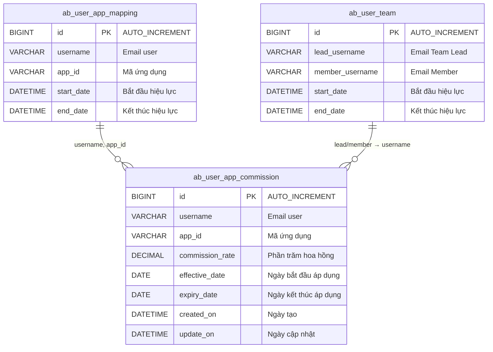
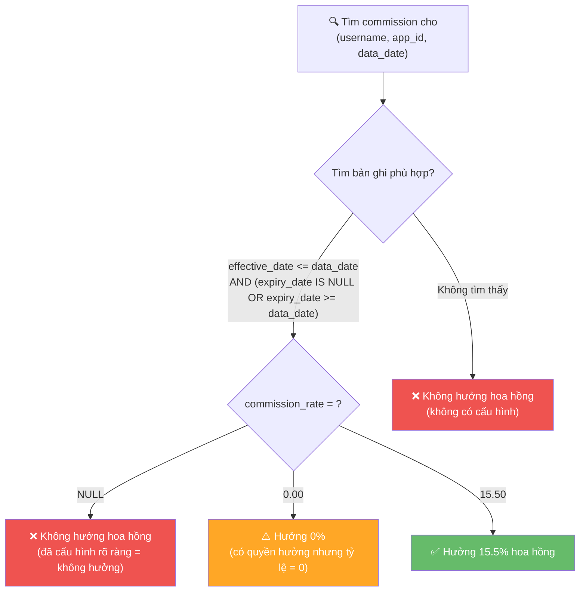
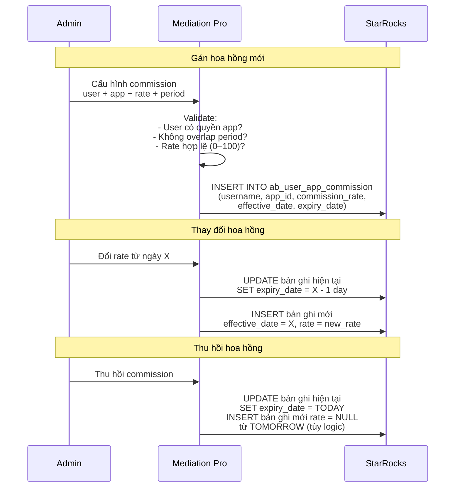
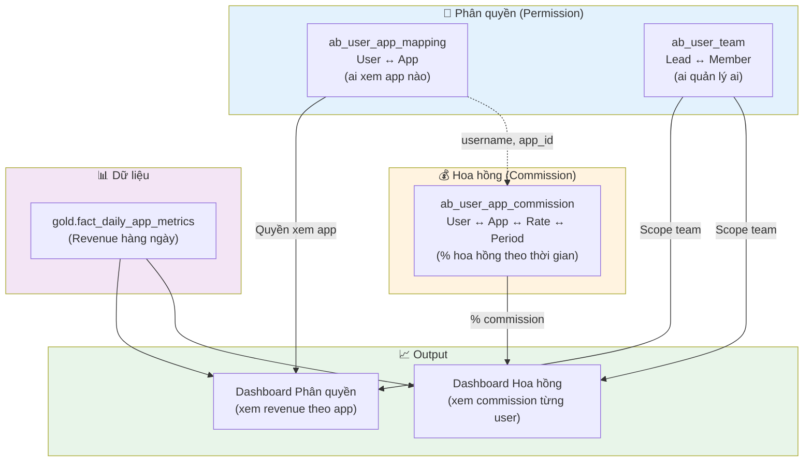

# Thiết kế Database: Quản lý % Hoa hồng (Commission Rate) theo User–App

> **Module:** Mediation Pro — Commission Management  
> **Database:** StarRocks (OLAP Engine)  
> **Ngày:** 22/04/2026  
> **Liên quan:** [USER-APP-PERMISSION-TABLES.md](file:///d:/Data/Antigravity/Amobear/Mediation/Amobear.Mediation.Tools/docs/superset/USER-APP-PERMISSION-TABLES.md)

---

## 1. Phân tích yêu cầu

| # | Yêu cầu | Chi tiết |
|---|---------|----------|
| 1 | Cấu hình % hoa hồng **theo từng user** | Mỗi user có thể có tỷ lệ hoa hồng khác nhau |
| 2 | Cấu hình % hoa hồng **theo từng app** | Cùng 1 user, mỗi app có thể có tỷ lệ khác nhau |
| 3 | **Thay đổi theo thời gian** | Mỗi app trong 1 khoảng thời gian khác nhau có thể có hoa hồng khác nhau |
| 4 | Hoa hồng **NULL = không được hưởng** | Phân biệt rõ: `NULL` → không hưởng, `0` → hưởng 0%, `15.5` → hưởng 15.5% |

### 1.1 Ví dụ nghiệp vụ thực tế

```
User nguyena@amobear.com, App "Game ABC":
  - Tháng 01–03/2026: hoa hồng 10%
  - Tháng 04–06/2026: hoa hồng 15% (tăng do KPI tốt)
  - Tháng 07 trở đi:   hoa hồng 12%

User tranb@amobear.com, App "Game ABC":
  - Tháng 01–06/2026: hoa hồng 8%
  - Tháng 07 trở đi:   KHÔNG hưởng hoa hồng (NULL)
```

---

## 2. Hai phương án thiết kế

### So sánh tổng quan

| Tiêu chí | Option A: Bảng riêng `ab_user_app_commission` | Option B: Thêm cột vào `ab_user_app_mapping` |
|-----------|:---:|:---:|
| Tách biệt quan tâm (Separation of Concerns) | ✅ Tốt | ❌ Trộn lẫn phân quyền & hoa hồng |
| Hỗ trợ nhiều khoảng thời gian khác nhau cho cùng 1 cặp (user, app) | ✅ Tự nhiên — mỗi row = 1 period | ⚠️ Phải tạo nhiều row → xung đột với logic phân quyền |
| Không ảnh hưởng logic RLS/Superset hiện có | ✅ Không đụng gì | ❌ Thay đổi schema → phải test lại RLS |
| Đơn giản hóa quản trị | ⚠️ Thêm 1 bảng | ✅ Ít bảng hơn |
| Linh hoạt mở rộng (thêm trường bonus, tier,...) | ✅ Dễ mở rộng | ❌ Phình bảng phân quyền |

> [!IMPORTANT]
> **Khuyến nghị: Option A — Tạo bảng riêng `ab_user_app_commission`**
> 
> Lý do:
> 1. **Phân quyền ≠ Hoa hồng** — đây là 2 domain nghiệp vụ khác nhau. Một user có thể có quyền xem app nhưng không hưởng hoa hồng (và ngược lại theo thời gian).
> 2. Bảng `ab_user_app_mapping` hiện đang được dùng trong RLS/Jinja — thay đổi schema có rủi ro phá vỡ logic hiện tại.
> 3. Một cặp (user, app) cần **nhiều khoảng thời gian hoa hồng khác nhau** — nếu gộp vào `ab_user_app_mapping` sẽ tạo ra nhiều bản ghi trùng cặp (username, app_id), gây nhầm lẫn logic phân quyền.

---

## 3. Thiết kế chi tiết — Option A: Bảng `ab_user_app_commission`

### 3.1 Entity Relationship Diagram



### 3.2 DDL (Data Definition Language)

```sql
CREATE TABLE ab_user_app_commission (
    id                BIGINT        NOT NULL AUTO_INCREMENT    COMMENT 'Khóa chính tự tăng',
    username          VARCHAR(100)  NOT NULL                   COMMENT 'Email đăng nhập của user',
    app_id            VARCHAR(100)  NOT NULL                   COMMENT 'Mã ứng dụng (AdMob App ID hoặc package name)',
    commission_rate   DECIMAL(5,2)  NULL                       COMMENT 'Phần trăm hoa hồng (0.00–100.00). NULL = không hưởng',
    effective_date    DATE          NOT NULL                   COMMENT 'Ngày bắt đầu áp dụng tỷ lệ hoa hồng này',
    expiry_date       DATE          NULL                       COMMENT 'Ngày kết thúc áp dụng (NULL = áp dụng vô thời hạn)',
    created_on        DATETIME      DEFAULT CURRENT_TIMESTAMP  COMMENT 'Ngày giờ tạo bản ghi',
    update_on         DATETIME      DEFAULT CURRENT_TIMESTAMP  COMMENT 'Ngày giờ cập nhật lần cuối'
) 
ENGINE = OLAP
PRIMARY KEY(id)
DISTRIBUTED BY HASH(id) 
PROPERTIES (
    "replication_num" = "1"
);
```

### 3.3 Mô tả chi tiết các trường

| # | Trường | Kiểu | Nullable | Mô tả | Quy tắc nghiệp vụ |
|---|--------|------|----------|-------|-------------------|
| 1 | `id` | BIGINT | NOT NULL | Khóa chính tự tăng | Duy nhất, không sửa |
| 2 | `username` | VARCHAR(100) | NOT NULL | Email đăng nhập | Phải tồn tại trong hệ thống user. **Nên matching với `ab_user_app_mapping.username`** |
| 3 | `app_id` | VARCHAR(100) | NOT NULL | Mã ứng dụng | Phải matching với `ab_user_app_mapping.app_id` |
| 4 | `commission_rate` | DECIMAL(5,2) | **YES (NULL)** | % hoa hồng | **NULL = không hưởng hoa hồng**. Giá trị hợp lệ: `0.00` – `100.00`. Ví dụ: `15.50` = 15.5% |
| 5 | `effective_date` | DATE | NOT NULL | Ngày bắt đầu áp dụng | Dùng kiểu `DATE` (không cần giờ) để khớp với dữ liệu revenue daily |
| 6 | `expiry_date` | DATE | YES (NULL) | Ngày kết thúc áp dụng | **NULL = vô thời hạn**. Khi cần thay đổi rate, SET `expiry_date` cho bản ghi cũ rồi INSERT bản ghi mới |
| 7 | `created_on` | DATETIME | YES | Thời điểm tạo | Tự động gán |
| 8 | `update_on` | DATETIME | YES | Thời điểm cập nhật | Application phải cập nhật khi UPDATE |

### 3.4 Quy tắc kinh doanh quan trọng



> [!IMPORTANT]
> **Phân biệt 3 trường hợp "không hưởng hoa hồng":**
> 
> | Trường hợp | Ý nghĩa | Cách xử lý |
> |-----------|---------|------------|
> | **Không có bản ghi** cho (user, app, date) | User chưa được cấu hình commission cho app/ngày này | Mặc định = không hưởng |
> | `commission_rate = NULL` | Admin đã **chủ động set** user không hưởng | Rõ ràng = không hưởng |
> | `commission_rate = 0.00` | User được hưởng hoa hồng nhưng tỷ lệ = 0 | Khác biệt nghiệp vụ — có thể dùng để track "đã kích hoạt" |

### 3.5 Quy tắc không chồng lấn thời gian

> [!WARNING]
> **Application layer PHẢI validate:** Cho cùng một cặp `(username, app_id)`, các khoảng `[effective_date, expiry_date]` **KHÔNG được chồng lấn** (overlap). Nếu chồng lấn sẽ không biết áp dụng tỷ lệ nào.
> 
> ```
> ✅ Hợp lệ:
>   Period 1: [2026-01-01, 2026-03-31] → 10%
>   Period 2: [2026-04-01, 2026-06-30] → 15%
>   Period 3: [2026-07-01, NULL]       → 12%
> 
> ❌ Không hợp lệ (chồng lấn):
>   Period 1: [2026-01-01, 2026-04-15] → 10%
>   Period 2: [2026-04-01, 2026-06-30] → 15%
>   (01/04–15/04 thuộc cả 2 period → xung đột!)
> ```

---

## 4. Dữ liệu mẫu

### 4.1 INSERT mẫu

```sql
-- Nguyễn A: Game ABC
-- Q1/2026: 10%, Q2/2026: 15%, Q3+ : 12%
INSERT INTO ab_user_app_commission (username, app_id, commission_rate, effective_date, expiry_date, created_on, update_on)
VALUES 
('nguyena@amobear.com', 'ca-app-pub-123~456', 10.00, '2026-01-01', '2026-03-31', NOW(), NOW()),
('nguyena@amobear.com', 'ca-app-pub-123~456', 15.00, '2026-04-01', '2026-06-30', NOW(), NOW()),
('nguyena@amobear.com', 'ca-app-pub-123~456', 12.00, '2026-07-01', NULL,         NOW(), NOW());

-- Nguyễn A: App XYZ — hoa hồng cố định 8%
INSERT INTO ab_user_app_commission (username, app_id, commission_rate, effective_date, expiry_date, created_on, update_on)
VALUES 
('nguyena@amobear.com', 'ca-app-pub-789~012', 8.00, '2026-02-01', NULL, NOW(), NOW());

-- Trần B: Game ABC
-- Nửa đầu năm: 8%, nửa sau: KHÔNG hưởng (NULL)
INSERT INTO ab_user_app_commission (username, app_id, commission_rate, effective_date, expiry_date, created_on, update_on)
VALUES 
('tranb@amobear.com', 'ca-app-pub-123~456', 8.00,  '2026-01-01', '2026-06-30', NOW(), NOW()),
('tranb@amobear.com', 'ca-app-pub-123~456', NULL,   '2026-07-01', NULL,         NOW(), NOW());

-- Lê C: App mới — chưa quyết commission → NULL (không hưởng)
INSERT INTO ab_user_app_commission (username, app_id, commission_rate, effective_date, expiry_date, created_on, update_on)
VALUES 
('lec@amobear.com', 'ca-app-pub-345~678', NULL, '2026-03-01', NULL, NOW(), NOW());
```

### 4.2 Bảng dữ liệu mẫu

| id | username | app_id | commission_rate | effective_date | expiry_date | Ghi chú |
|----|----------|--------|:-:|:-:|:-:|---------|
| 1 | nguyena@amobear.com | ca-app-pub-123~456 | **10.00** | 2026-01-01 | 2026-03-31 | Q1: 10% |
| 2 | nguyena@amobear.com | ca-app-pub-123~456 | **15.00** | 2026-04-01 | 2026-06-30 | Q2: 15% |
| 3 | nguyena@amobear.com | ca-app-pub-123~456 | **12.00** | 2026-07-01 | NULL | Q3+: 12% |
| 4 | nguyena@amobear.com | ca-app-pub-789~012 | **8.00** | 2026-02-01 | NULL | App XYZ: 8% cố định |
| 5 | tranb@amobear.com | ca-app-pub-123~456 | **8.00** | 2026-01-01 | 2026-06-30 | Nửa đầu năm: 8% |
| 6 | tranb@amobear.com | ca-app-pub-123~456 | **NULL** | 2026-07-01 | NULL | Nửa sau: ❌ không hưởng |
| 7 | lec@amobear.com | ca-app-pub-345~678 | **NULL** | 2026-03-01 | NULL | Chưa kích hoạt hoa hồng |

---

## 5. Query mẫu

### 5.1 Lấy % hoa hồng hiện tại của 1 user cho 1 app

```sql
SELECT commission_rate
FROM ab_user_app_commission
WHERE username = 'nguyena@amobear.com'
  AND app_id = 'ca-app-pub-123~456'
  AND effective_date <= CURDATE()
  AND (expiry_date IS NULL OR expiry_date >= CURDATE())
LIMIT 1;
-- Kết quả (nếu hôm nay 22/04/2026): 15.00 (đang trong Q2)
```

### 5.2 Lấy tất cả commission đang hoạt động của 1 user

```sql
SELECT app_id, commission_rate, effective_date, expiry_date
FROM ab_user_app_commission
WHERE username = 'nguyena@amobear.com'
  AND effective_date <= CURDATE()
  AND (expiry_date IS NULL OR expiry_date >= CURDATE())
ORDER BY app_id, effective_date;
```

### 5.3 Tính hoa hồng thực tế — JOIN với dữ liệu revenue

```sql
-- Tính hoa hồng từng ngày cho từng user/app
SELECT 
    r.report_date,
    r.app_id,
    c.username,
    r.revenue,
    c.commission_rate,
    CASE 
        WHEN c.commission_rate IS NOT NULL 
        THEN r.revenue * c.commission_rate / 100.0
        ELSE 0  -- NULL commission = không hưởng
    END AS commission_amount
FROM gold.fact_daily_app_metrics r
JOIN ab_user_app_commission c
    ON c.app_id = r.app_id
    AND c.effective_date <= r.report_date
    AND (c.expiry_date IS NULL OR c.expiry_date >= r.report_date)
WHERE r.report_date BETWEEN '2026-04-01' AND '2026-04-30'
ORDER BY r.report_date, c.username, r.app_id;
```

### 5.4 Báo cáo tổng hợp hoa hồng theo tháng

```sql
SELECT 
    c.username,
    c.app_id,
    DATE_FORMAT(r.report_date, '%Y-%m') AS month,
    SUM(r.revenue) AS total_revenue,
    c.commission_rate,
    CASE 
        WHEN c.commission_rate IS NOT NULL 
        THEN SUM(r.revenue) * c.commission_rate / 100.0
        ELSE 0
    END AS total_commission
FROM gold.fact_daily_app_metrics r
JOIN ab_user_app_commission c
    ON c.app_id = r.app_id
    AND c.effective_date <= r.report_date
    AND (c.expiry_date IS NULL OR c.expiry_date >= r.report_date)
WHERE r.report_date BETWEEN '2026-01-01' AND '2026-06-30'
GROUP BY c.username, c.app_id, DATE_FORMAT(r.report_date, '%Y-%m'), c.commission_rate
ORDER BY c.username, c.app_id, month;
```

### 5.5 Lịch sử thay đổi hoa hồng của 1 user 1 app

```sql
SELECT commission_rate, effective_date, expiry_date, created_on
FROM ab_user_app_commission
WHERE username = 'nguyena@amobear.com'
  AND app_id = 'ca-app-pub-123~456'
ORDER BY effective_date;
-- Kết quả:
-- 10.00 | 2026-01-01 | 2026-03-31 | ...
-- 15.00 | 2026-04-01 | 2026-06-30 | ...
-- 12.00 | 2026-07-01 | NULL       | ...
```

---

## 6. Tích hợp Superset

### 6.1 Dataset cho Dashboard Hoa hồng

```sql
-- Superset Virtual Dataset: ds_user_commission
-- Dùng Jinja để lọc theo user đang đăng nhập



SELECT 
    r.report_date,
    r.app_id,
    r.app_name,
    r.revenue AS total_revenue,
    c.commission_rate,
    CASE 
        WHEN c.commission_rate IS NOT NULL 
        THEN r.revenue * c.commission_rate / 100.0
        ELSE 0
    END AS commission_amount,
    CASE
        WHEN c.commission_rate IS NULL THEN 'Không hưởng'
        WHEN c.commission_rate = 0 THEN 'Đã kích hoạt (0%)'
        ELSE CONCAT(CAST(c.commission_rate AS VARCHAR), '%')
    END AS commission_status
FROM gold.fact_daily_app_metrics r
LEFT JOIN ab_user_app_commission c
    ON c.username = '{{ user_email }}'
    AND c.app_id = r.app_id
    AND c.effective_date <= r.report_date
    AND (c.expiry_date IS NULL OR c.expiry_date >= r.report_date)
WHERE r.app_id IN (
    -- RLS: chỉ app user được phép xem
    SELECT app_id 
    FROM ab_user_app_mapping 
    WHERE username = '{{ user_email }}'
      AND (end_date IS NULL OR end_date >= NOW())
)
```

### 6.2 Dashboard cho Team Lead / Director

```sql
-- Lead/Director xem hoa hồng tổng hợp của team


SELECT 
    c.username AS member_email,
    r.report_date,
    r.app_id,
    r.revenue,
    c.commission_rate,
    CASE 
        WHEN c.commission_rate IS NOT NULL 
        THEN r.revenue * c.commission_rate / 100.0
        ELSE 0
    END AS commission_amount
FROM gold.fact_daily_app_metrics r
JOIN ab_user_app_commission c
    ON c.app_id = r.app_id
    AND c.effective_date <= r.report_date
    AND (c.expiry_date IS NULL OR c.expiry_date >= r.report_date)
WHERE c.username IN (
    -- Chính user
    SELECT '{{ user_email }}'
    UNION
    -- Cấp dưới trực tiếp
    SELECT member_username 
    FROM ab_user_team 
    WHERE lead_username = '{{ user_email }}'
      AND (end_date IS NULL OR end_date >= NOW())
      AND (start_date IS NULL OR start_date <= NOW())
    UNION
    -- Cấp dưới gián tiếp (2 cấp)
    SELECT t2.member_username
    FROM ab_user_team t1
    JOIN ab_user_team t2 ON t2.lead_username = t1.member_username
    WHERE t1.lead_username = '{{ user_email }}'
      AND (t1.end_date IS NULL OR t1.end_date >= NOW())
      AND (t1.start_date IS NULL OR t1.start_date <= NOW())
      AND (t2.end_date IS NULL OR t2.end_date >= NOW())
      AND (t2.start_date IS NULL OR t2.start_date <= NOW())
)
AND r.app_id IN (
    SELECT app_id FROM ab_user_app_mapping
    WHERE username = c.username
      AND (end_date IS NULL OR end_date >= NOW())
)
```

---

## 7. Luồng nghiệp vụ quản trị Commission

### 7.1 Sequence Diagram



### 7.2 Bảng sự kiện quản trị

| Sự kiện | Hành động trên StarRocks |
|---------|-------------------------|
| Gán hoa hồng mới | `INSERT` bản ghi với `commission_rate`, `effective_date`, `expiry_date` |
| Thay đổi tỷ lệ từ ngày X | `UPDATE SET expiry_date = X-1` cho bản ghi cũ + `INSERT` bản ghi mới từ ngày X |
| Thu hồi hoa hồng | `UPDATE SET expiry_date = TODAY` (hoặc INSERT bản ghi `commission_rate = NULL`) |
| Xem lịch sử | `SELECT * WHERE username = ? AND app_id = ? ORDER BY effective_date` |

---

## 8. Validation Rules (Application Layer)

> [!WARNING]
> StarRocks OLAP **không hỗ trợ** CHECK constraint, UNIQUE constraint, hay trigger. **Tất cả validation phải ở Application Layer (Mediation Pro Backend):**

| Rule | Mô tả | Pseudo-check |
|------|-------|-------------|
| **No overlap** | Cùng (username, app_id), các period KHÔNG chồng lấn | `SELECT COUNT(*) FROM ab_user_app_commission WHERE username=? AND app_id=? AND effective_date <= ? AND (expiry_date IS NULL OR expiry_date >= ?)` → phải = 0 |
| **Rate range** | `commission_rate` phải `NULL` hoặc trong `[0.00, 100.00]` | `rate IS NULL OR (rate >= 0 AND rate <= 100)` |
| **User has app access** | User phải có bản ghi active trong `ab_user_app_mapping` | `EXISTS (SELECT 1 FROM ab_user_app_mapping WHERE username=? AND app_id=? AND (end_date IS NULL OR end_date >= NOW()))` |
| **effective_date required** | `effective_date` KHÔNG được NULL | NOT NULL constraint |
| **Date logic** | Nếu `expiry_date` != NULL thì `expiry_date >= effective_date` | Application validate |

---

## 9. Quan hệ tổng thể 3 bảng



---

## 10. Lưu ý & Khuyến nghị

> [!TIP]
> - **DISTRIBUTED BY:** Nếu query chủ yếu theo `username`, có thể dùng `DISTRIBUTED BY HASH(username)` thay vì `HASH(id)` để tối ưu.
> - **Kiểu DATE vs DATETIME:** Dùng `DATE` cho `effective_date`/`expiry_date` vì hoa hồng thường tính theo ngày, khớp với `report_date` trong bảng revenue.
> - **DECIMAL(5,2):** Cho phép giá trị từ -999.99 đến 999.99. Tuy nhiên nghiệp vụ chỉ cần 0–100, nên validate ở Application Layer.
> - **Replication:** Production nên tăng `replication_num = 3` (giống khuyến nghị cho 2 bảng hiện tại).

> [!CAUTION]
> - **Khi thu hồi quyền app** (`ab_user_app_mapping.end_date = NOW()`), cần **đồng thời xử lý commission**: set `expiry_date` cho bản ghi commission tương ứng, hoặc để Application Layer handle logic "user không có quyền app → không tính commission" khi query.
> - **Commission data là dữ liệu nhạy cảm** — chỉ Admin và user liên quan mới được xem. Cần RLS trên dataset commission trong Superset.
