# Giải pháp tối ưu hệ thống Job cho Amobear Nexus

> Tài liệu đề xuất kiến trúc hai-tầng (two-tier) cho hệ thống điều phối job: **Hangfire** cho job đơn giản — **Apache Airflow** (đề xuất chính) cho pipeline phức tạp, có liên kết và cho phép admin tự xây dựng DAG động qua UI mà không cần đụng vào code.

---

## 1. Bối cảnh & Vấn đề hiện tại

Hệ thống hiện đang chạy **78 job Hangfire** (theo `hangfire_job_schedules_202605211339.csv`), trong đó có thể phân loại như sau:

| Nhóm | Số lượng | Ví dụ |
|---|---|---|
| Job vận hành đơn giản, không phụ thuộc | ~15 | `token-refresh-job`, `structure-sync-job`, `tiktok-token-validation-job`, `adunit-mapping-delta-sync-job` |
| Job ETL/sync đứng độc lập theo lịch | ~25 | `applovin-sync-job`, `meta-campaign-sync-job`, `xmp-sync-job-today` |
| Pipeline có phụ thuộc (đang chạy "rời" bằng cron) | ~38 | Toàn bộ chuỗi AppsFlyer / AppMetrica / Apple Store / Qonversion / Performance-AdMob / Dashboard Cache / Digest |

### Các vấn đề cốt lõi

1. **Phụ thuộc ngầm bằng cron** — ví dụ `silver-gold-transform-job` (35 * * * *) phải chạy *sau* các job sync bronze, nhưng chỉ "hy vọng đúng giờ". Khi job upstream chậm/fail thì downstream vẫn chạy với dữ liệu cũ.
2. **Không có DAG view** — không biết khi `daily-app-insight-job` lỗi thì những digest nào (`ua-daily-digest-job`, `mediation-daily-digest-job`, `po-daily-digest-job`, `bod-daily-digest-job`…) bị ảnh hưởng.
3. **Backfill thủ công** — `appmetrica-logs-backfill-t1/t2/t3` phải tách thành 3 job riêng vì Hangfire không có khái niệm "chạy lại 1 partition ngày".
4. **Mọi thay đổi đều phải sửa code C#** — admin/DA/PO không thể tự thêm 1 pipeline mới (ví dụ: sync 1 nguồn dữ liệu mới hoặc tinh chỉnh thứ tự bước).
5. **Quan sát hạn chế** — Hangfire dashboard chỉ thấy job-level, không thấy lineage / SLA / data-quality gates.
6. **Retry/recovery thô sơ** — không có exponential backoff per-task, không có catchup, không có data interval semantics.

---

## 2. Nguyên tắc phân loại job

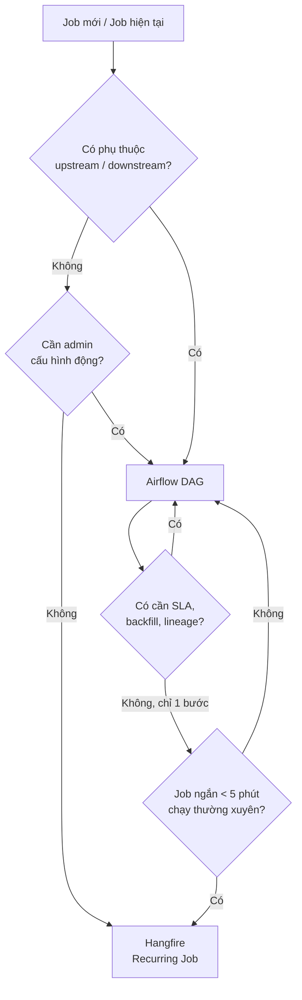

### Quy tắc đơn giản

| Tiêu chí | Hangfire | Airflow |
|---|---|---|
| Job độc lập, idempotent, < 5–10 phút | ✅ | |
| Heartbeat / housekeeping (token refresh, cache warm) | ✅ | |
| 1 job kích hoạt nhiều job khác | | ✅ |
| Cần backfill theo khoảng ngày | | ✅ |
| Cần data-quality gate giữa các bước | | ✅ |
| Admin/DA cần tự tạo / sửa pipeline qua UI | | ✅ (qua DAG Factory + UI form) |
| Cần SLA + lineage + alert per-task | | ✅ |

---

## 3. Kiến trúc tổng thể đề xuất

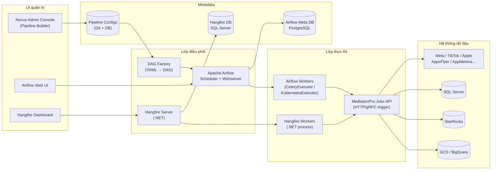

### Ý tưởng then chốt

- **Giữ nguyên codebase `MediationPro.Jobs`** — không viết lại logic nghiệp vụ. Chỉ tách "điểm gọi" thành **HTTP/gRPC endpoint** (vd: `POST /internal/jobs/{jobKey}/run?date=2026-05-20`). Cả Hangfire và Airflow đều gọi cùng API này.
- **DAG Factory** đọc cấu hình YAML/JSON từ Git hoặc DB → sinh DAG động. Admin chỉ cần submit cấu hình qua UI, không cần Python.
- **Tách metadata DB** của Airflow (PostgreSQL) khỏi DB nghiệp vụ.

---

## 4. So sánh & lý do chọn Airflow

| Tiêu chí | **Airflow** | Dagster | Prefect | Temporal |
|---|---|---|---|---|
| Mức trưởng thành | ⭐⭐⭐⭐⭐ | ⭐⭐⭐⭐ | ⭐⭐⭐⭐ | ⭐⭐⭐⭐ |
| Cộng đồng VN/khả năng tuyển | Cao | Trung | Trung | Thấp |
| UI DAG / Gantt / SLA | Rất tốt | Rất tốt | Tốt | Yếu (cho data-pipeline) |
| Backfill theo data interval | ✅ Native | ✅ | ✅ | Cần tự xây |
| Tạo DAG động qua YAML/UI | ✅ (gusty / dag-factory) | ⚙️ | ⚙️ | ❌ |
| Tích hợp .NET (HTTP/gRPC) | ✅ | ✅ | ✅ | ✅ SDK .NET |
| Phù hợp data engineering | ✅ | ✅ | ✅ | ❌ (hợp workflow giao dịch) |

➡️ **Chọn Apache Airflow** (đề xuất bản 2.9+ với TaskFlow + Datasets). Lý do: mature, có sẵn DAG Factory pattern, dễ tuyển nhân sự, UI cho admin trực quan.

> Nếu sau này muốn nâng cấp DX cho DA/DE, có thể bổ sung **Dagster** ở giai đoạn 3.

---

## 5. Phân loại 78 job hiện tại

### 5.1 Giữ ở Hangfire (job đơn giản, độc lập)

| Job | Cron | Lý do |
|---|---|---|
| `token-refresh-job` | `*/30 * * * *` | Heartbeat OAuth, không có downstream |
| `structure-sync-job` | `0 0 * * *` | Sync cấu trúc account, độc lập |
| `adunit-mapping-delta-sync-job` | `0 1 * * *` | Sync delta, không có chain |
| `tiktok-token-validation-job` | `0 23 * * *` | Validate token |
| `meta-app-mapping-discovery-job` | `0/45 * * * *` | Discovery độc lập |
| `applovin-sync-job` | `10 * * * *` | Sync 1 nguồn, độc lập |
| `xmp-sync-job-today` / `xmp-sync-job-last7days` | (giữ tạm) | Hiện đứng riêng |
| `dashboard-cache-today/7/14/30` | `*/4 * * *` | (xem xét đưa sang Airflow giai đoạn 2 vì phụ thuộc Silver/Gold) |

### 5.2 Chuyển sang Airflow (pipeline có liên kết)

Nhóm theo 7 DAG chính:

#### DAG 1 — `appmetrica_pipeline`

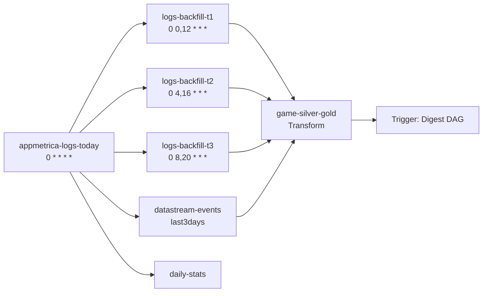

#### DAG 2 — `appsflyer_pipeline`

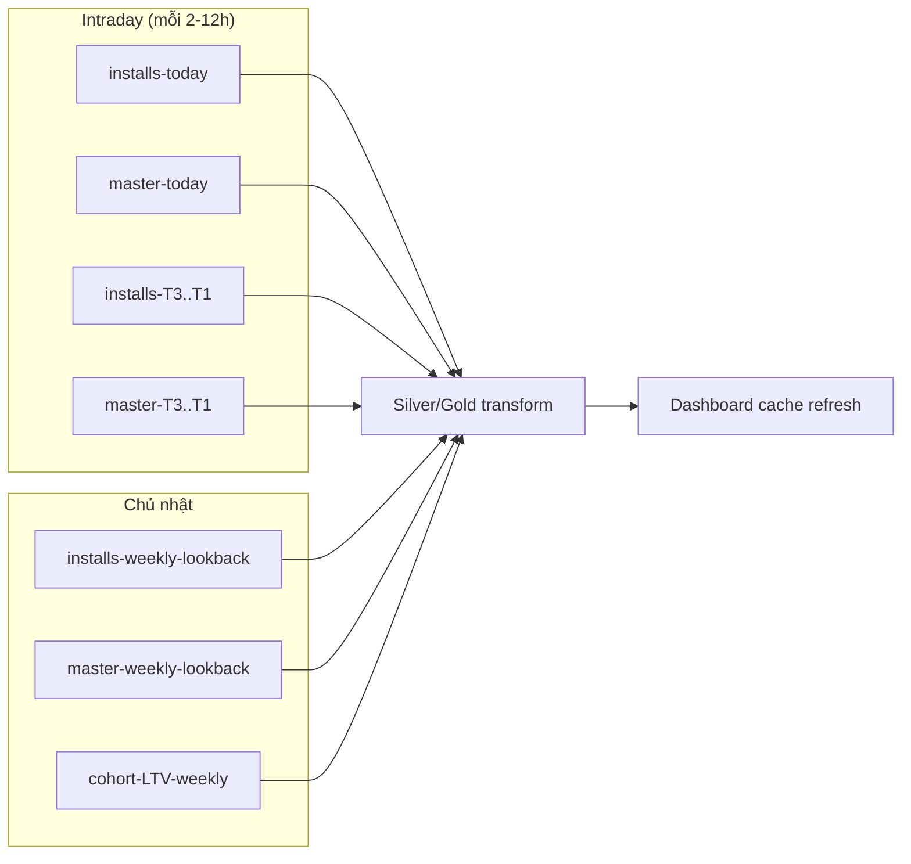

#### DAG 3 — `apple_store_pipeline`

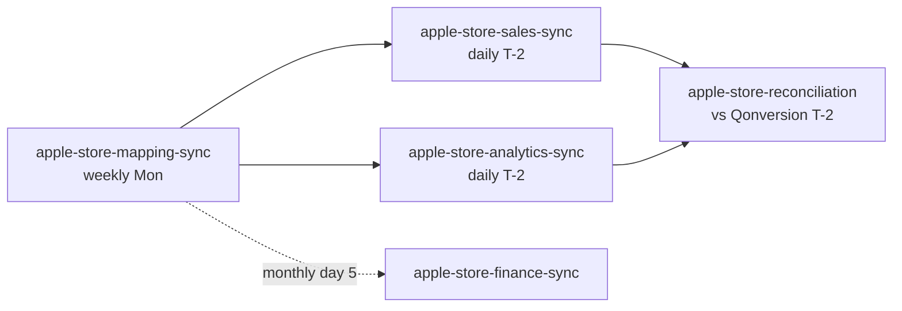

#### DAG 4 — `qonversion_pipeline`

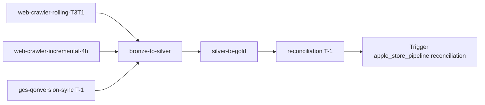

#### DAG 5 — `meta_tiktok_pipeline`

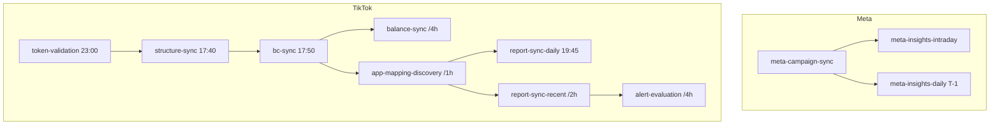

#### DAG 6 — `performance_admob_pipeline` (lõi doanh thu)

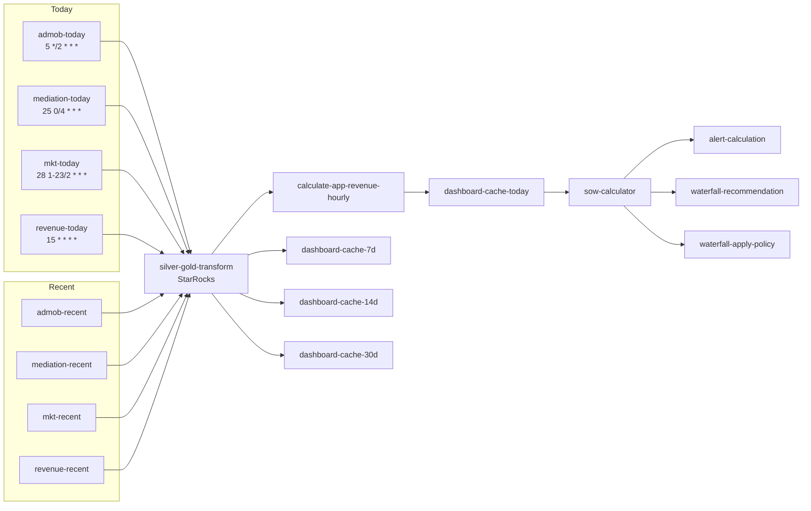

#### DAG 7 — `daily_digest_pipeline` (chạy buổi sáng)

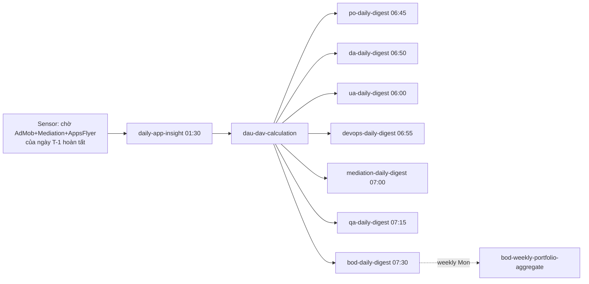

#### DAG 8 — `firebase_pipeline`

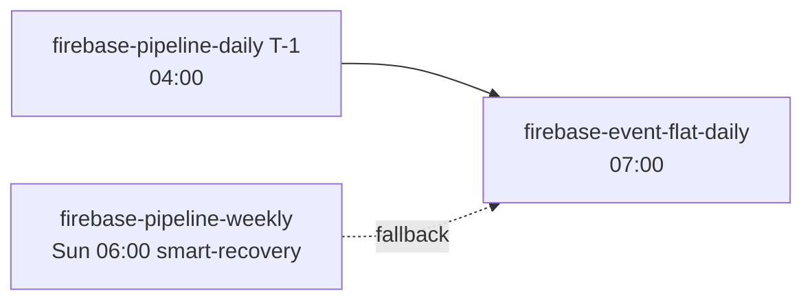

---

## 6. Mô hình "DAG động" cho Admin (Pipeline Builder)

Đây là yêu cầu cốt lõi — **admin tự xây dựng job mới không cần dev**.

```mermaid
flowchart TB
    A[Admin mở Nexus Admin Console] --> B[Chọn template:<br/>'External API → Bronze → Silver → Gold']
    B --> C[Form điền:<br/>- Tên DAG<br/>- Cron<br/>- Nguồn dữ liệu<br/>- Tham số API<br/>- Bảng đích<br/>- SLA / Alert]
    C --> D[Validate + Preview YAML]
    D --> E{Save}
    E --> F[Lưu YAML vào<br/>Git repo + DB cấu hình]
    F --> G[CI bot push lên<br/>Airflow dags/ folder<br/>(hoặc Airflow đọc trực tiếp từ DB qua DAG Factory)]
    G --> H[Airflow scheduler<br/>re-parse và sinh DAG]
    H --> I[DAG xuất hiện trong<br/>Airflow UI + Nexus UI]
```

### Ví dụ file YAML do admin tạo

```yaml
dag_id: tiktok_creative_sync
description: Sync TikTok creative performance hàng giờ
schedule: "*/30 * * * *"
owner: marketing-ops
sla_minutes: 20
catchup: false
tags: [tiktok, creative, marketing]
default_args:
  retries: 3
  retry_delay_minutes: 5

tasks:
  - id: fetch_creative
    type: http_call_dotnet
    endpoint: /internal/jobs/tiktok-creative-fetch/run
    params: { since: "{{ data_interval_start }}" }
  - id: transform_silver
    type: starrocks_sql
    sql_file: sql/tiktok/creative_silver.sql
    depends_on: [fetch_creative]
  - id: refresh_gold
    type: starrocks_sql
    sql_file: sql/tiktok/creative_gold.sql
    depends_on: [transform_silver]
  - id: notify
    type: slack_alert_on_failure
    channel: "#data-alerts"
    depends_on: [refresh_gold]
```

### Các "task type" cần xây sẵn (operators)

| Operator | Mục đích |
|---|---|
| `http_call_dotnet` | Gọi endpoint trong `MediationPro.Jobs` |
| `starrocks_sql` | Chạy SQL trên StarRocks |
| `sqlserver_sproc` | Gọi stored procedure SQL Server |
| `gcs_to_starrocks` | Bulk load parquet từ GCS |
| `wait_for_dataset` | Sensor chờ Airflow Dataset sẵn sàng |
| `data_quality_check` | Great Expectations / SQL assertion |
| `slack_alert` / `teams_alert` | Notify |

---

## 7. Lộ trình triển khai (4 giai đoạn — ~3 tháng)

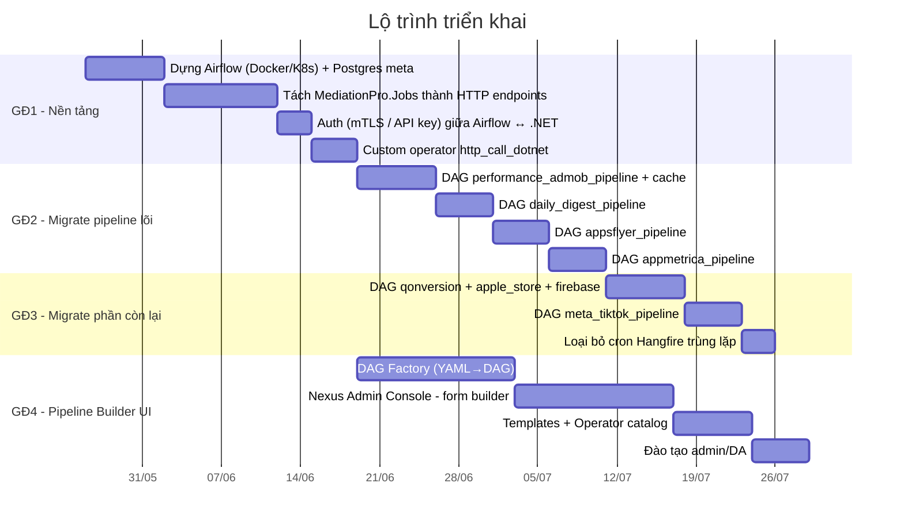

### Tiêu chí "Done" mỗi giai đoạn

- **GĐ1**: Chạy thử 1 DAG hello-world gọi được .NET endpoint, có log, retry, alert.
- **GĐ2**: 4 pipeline lõi (performance / digest / appsflyer / appmetrica) chạy trên Airflow song song với Hangfire trong **2 tuần**, đối chiếu kết quả → tắt cron Hangfire tương ứng.
- **GĐ3**: 100% job phụ thuộc đã ở Airflow. Hangfire chỉ còn ~15 job đơn lẻ.
- **GĐ4**: Một admin (không phải dev) tạo thành công 1 pipeline mới từ UI và đưa vào production.

---

## 8. Các điểm cần quyết định sớm

| Quyết định | Lựa chọn đề xuất | Lý do |
|---|---|---|
| Executor của Airflow | **KubernetesExecutor** (nếu đã có K8s) hoặc **CeleryExecutor + Redis** | Scale tốt, isolate task |
| Metadata DB | **PostgreSQL 15** (managed) | Airflow chính thức hỗ trợ |
| Nơi lưu DAG | **Git repo** (chính) + DB cho admin-built | Versioning + audit |
| Auth Airflow UI | OIDC qua **Keycloak / Azure AD** | SSO chung với Nexus |
| Thông báo | Slack/Teams webhook + email cho SLA miss | Đa kênh |
| Monitoring | Prometheus exporter + Grafana dashboard | Đã có sẵn stack |
| Lineage | OpenLineage plugin (sẵn có cho Airflow) | Tự động lineage StarRocks/SQL Server |

---

## 9. Rủi ro & cách giảm thiểu

| Rủi ro | Mức | Giảm thiểu |
|---|---|---|
| Hai hệ thống chạy song song gây job trùng | Cao | Feature flag per-job; chạy "dry-run" Airflow 2 tuần đối chiếu trước khi tắt Hangfire |
| Admin tạo DAG sai gây nghẽn cluster | Trung | Resource quota per-DAG, code review tự động (linter YAML), môi trường staging |
| Mất context khi tách logic ra HTTP endpoint | Trung | Endpoint chỉ là "thin wrapper", logic vẫn ở class hiện tại; thêm integration test |
| Học cong Airflow của team | Trung | Workshop 2 buổi + tài liệu Pipeline Builder cho non-dev |
| State DB Airflow phình nhanh | Thấp | Bật `db-cleanup` job, retention 90 ngày |

---

## 10. Tóm tắt giá trị mang lại

- ✅ **Giảm 80% job rời rạc trên Hangfire** (từ 78 → ~15) — phần còn lại nhóm thành 8 DAG có ý nghĩa nghiệp vụ.
- ✅ **Quan sát toàn pipeline** — biết ngay khi `meta-insights` lỗi thì digest BOD bị trễ.
- ✅ **Backfill 1-click** — chọn DAG + khoảng ngày trên Airflow UI.
- ✅ **Admin tự phục vụ** — pipeline mới không cần release code .NET.
- ✅ **SLA & cảnh báo theo task** — không còn cảnh báo "job X chạy lâu" mà biết chính xác bước nào.
- ✅ **Codebase .NET không phải viết lại** — chỉ wrap thành HTTP endpoint.

---

*Tài liệu chuẩn bị cho buổi review kiến trúc. Phản hồi/điều chỉnh: cập nhật trực tiếp vào file này hoặc tạo issue trong repo `Amobear.Mediation.Tools`.*
