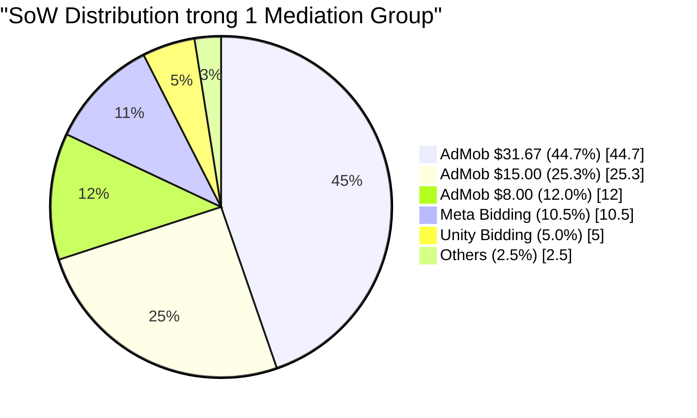
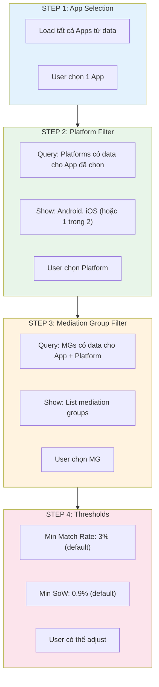
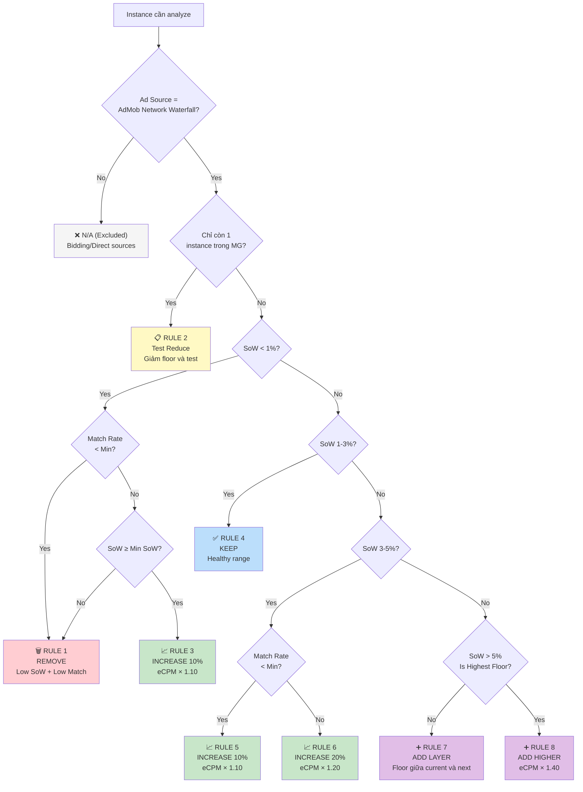
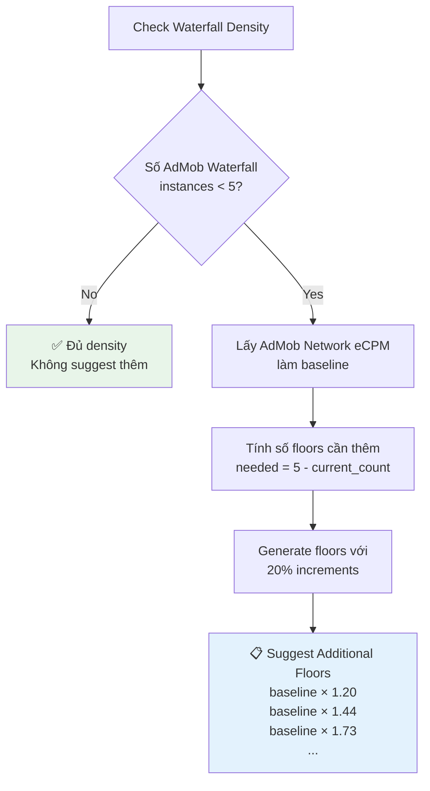
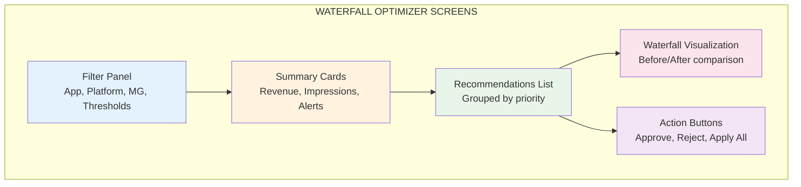

# WATERFALL OPTIMIZER MODULE

## Technical Specification for Cursor AI Implementation

**Document Version:** 2.0  
**Date:** February 2025  
**Source:** Amobear Studio Waterfall Optimizer Excel  
**Purpose:** Hướng dẫn chi tiết để Cursor AI implement module tương tự trong hệ thống Mediation Pro

---

## TABLE OF CONTENTS

1. Tổng quan Module
2. Data Sources & Schema
3. Input Parameters
4. Recommendation Engine Logic
5. Output Specifications
6. Implementation Checklist
7. UI Components

---

## 1. TỔNG QUAN MODULE

### 1.1 Mục đích

Waterfall Optimizer là module phân tích và đề xuất tối ưu hóa cấu hình waterfall cho ad mediation. Module này:

- Phân tích **Share of Wallet (SoW)** của từng ad source instance trong mediation group
- Đưa ra **recommendations** dựa trên 8 rules logic
- Hỗ trợ team Mediation quyết định: giữ nguyên, tăng/giảm floor, thêm/xóa instance

### 1.2 Workflow Overview

Biểu đồ dưới đây mô tả luồng xử lý chính của Waterfall Optimizer. Dữ liệu raw từ AdMob và Firebase được filter theo user selection, sau đó tính SoW cho từng instance, và cuối cùng apply 8 rules để generate recommendations.

```mermaid
flowchart LR
    subgraph Input["1. INPUT"]
        A1["Raw Data<br>(AdMob + Firebase)"]
        A2["7-day Mediation Report"]
    end
    
    subgraph Filter["2. FILTER"]
        B1["Select App"]
        B2["Select Platform"]
        B3["Select Mediation Group"]
        B4["Set Min Match Rate"]
        B5["Set Min SoW"]
    end
    
    subgraph Calculate["3. CALCULATE"]
        C1["Tính Total Revenue của MG"]
        C2["Tính SoW cho mỗi Instance"]
    end
    
    subgraph Generate["4. GENERATE"]
        D1["Apply 8 Rules"]
        D2["Generate Recommendations"]
        D3["Suggest Additional Floors"]
    end
    
    Input --> Filter --> Calculate --> Generate
    
    style Input fill:#e3f2fd
    style Filter fill:#fff3e0
    style Calculate fill:#e8f5e9
    style Generate fill:#fce4ec
```

### 1.3 Key Concepts

| Concept | Definition | Formula |
|---------|------------|---------|
| **SoW (Share of Wallet)** | Phần trăm revenue của 1 instance so với tổng revenue của Mediation Group | `instance_revenue / mg_total_revenue × 100` |
| **Match Rate** | Tỷ lệ requests được matched (có ad fill) | `matched_requests / total_requests` |
| **Observed eCPM** | eCPM thực tế từ AdMob report | `(revenue / impressions) × 1000` |
| **Floor Price** | Giá sàn minimum để ad được hiển thị | Set trong AdMob Console |
| **Waterfall** | Thứ tự priority của các ad sources | Sắp xếp theo floor price DESC |

### 1.4 SoW Concept Visualization

Biểu đồ dưới đây minh họa khái niệm Share of Wallet. Trong một Mediation Group, mỗi ad source instance đóng góp một phần revenue. SoW chính là tỷ lệ phần trăm của từng instance.

---

## 2. DATA SOURCES & SCHEMA

### 2.1 Raw Data: Mediation Report

Dữ liệu được pull từ **AdMob UI > Ads Activity > Mediation Report** (7 ngày gần nhất).

### 2.2 Required Columns

Bảng dưới đây liệt kê các columns cần thiết cho Waterfall Optimizer. Columns được đánh dấu ✅ là bắt buộc cho logic chính.

| # | Column Name | Data Type | Required | Description |
|---|-------------|-----------|----------|-------------|
| 1 | App | string | ✅ | Tên app |
| 2 | Platform | enum | ✅ | Android hoặc iOS |
| 3 | Mediation group | string | ✅ | Tên mediation group |
| 4 | Ad source | string | ✅ | Loại ad source |
| 5 | Ad source instance | string | ✅ | Tên instance (chứa floor cho waterfall) |
| 6 | Estimated earnings (USD) | decimal | ✅ | Revenue ước tính |
| 7 | Observed eCPM (USD) | decimal | ✅ | eCPM thực tế |
| 8 | Requests | integer | ✅ | Số lượng ad requests |
| 9 | Match rate | decimal | ✅ | Tỷ lệ match (0-1) |
| 10 | Impressions | integer | ✅ | Số impressions |
| 11-34 | Other metrics | various | | DAU, DAV, CTR, Clicks, Bidding metrics... |

### 2.3 Ad Source Classification

Biểu đồ dưới đây phân loại các Ad Sources thành 3 nhóm chính. Chỉ có **AdMob Network Waterfall** mới được apply recommendation rules vì đây là loại duy nhất có floor price configurable.

```mermaid
flowchart TB
    subgraph AdSources["AD SOURCE TYPES"]
        subgraph Bidding["BIDDING SOURCES<br>(Real-time auction, không có floor)"]
            B1["Meta Audience Network (bidding)"]
            B2["Pangle (bidding)"]
            B3["AppLovin (bidding)"]
            B4["Unity Ads (bidding)"]
            B5["Liftoff Monetize (bidding)"]
            B6["Mintegral (bidding)"]
            B7["ironSource Ads (bidding)"]
        end
        
        subgraph Waterfall["WATERFALL SOURCES<br>(Floor-based, có thể optimize)"]
            W1["AdMob Network Waterfall"]
            W2["Pangle (non-bidding)"]
            W3["AppLovin (non-bidding)"]
        end
        
        subgraph Direct["ADMOB DIRECT<br>(Không có floor)"]
            D1["AdMob Network"]
        end
    end
    
    W1 --> |"✅ Apply 8 Rules"| Rules["Recommendation Engine"]
    
    B1 --> |"❌ Excluded"| Excluded["N/A (Excluded)"]
    D1 --> |"❌ Excluded"| Excluded
    
    style Bidding fill:#e3f2fd
    style Waterfall fill:#e8f5e9
    style Direct fill:#fff3e0
    style W1 fill:#c8e6c9
```

### 2.4 Important Data Notes

| Note | Description |
|------|-------------|
| **Floor trong Instance Name** | Với AdMob Network Waterfall, `ad_source_instance` chứa floor price (VD: `31.67`, `85.67`) |
| **Bidding Sources** | Không có floor cố định - họ bid theo thời gian thực |
| **AdMob Network** | Ads trực tiếp từ Google, không có floor |
| **Data Period** | Luôn sử dụng 7-day aggregate để có đủ data |

---

## 3. INPUT PARAMETERS

### 3.1 User Inputs

| Parameter | Type | Default | Validation | Description |
|-----------|------|---------|------------|-------------|
| `selected_app` | string | (required) | Must exist in data | Tên app cần phân tích |
| `selected_platform` | enum | (required) | Android hoặc iOS | Platform |
| `selected_mediation_group` | string | (required) | Must exist for app+platform | Mediation group |
| `min_match_rate` | decimal | **0.03 (3%)** | 0.01 - 0.20 | Ngưỡng match rate tối thiểu |
| `min_sow` | decimal | **0.009 (0.9%)** | 0.001 - 0.05 | Ngưỡng SoW tối thiểu |

### 3.2 Cascading Filter Logic

Biểu đồ dưới đây mô tả logic cascading filters. Khi user chọn App, hệ thống chỉ show các Platforms có data cho app đó. Khi chọn Platform, chỉ show các Mediation Groups có data cho app + platform đó.

### 3.3 Default Values Rationale

| Parameter | Default | Lý do |
|-----------|---------|-------|
| **Min Match Rate: 3%** | Instance với match rate < 3% có quá ít traffic để đánh giá chính xác |
| **Min SoW: 0.9%** | Instance với SoW < 0.9% đóng góp quá nhỏ, không đáng để giữ lại |

---

## 4. RECOMMENDATION ENGINE LOGIC

### 4.1 Overview

Engine có **2 layers**:

| Layer | Mô tả | Số Rules |
|-------|-------|----------|
| **Layer 1: Main Rules** | Optimize existing waterfall instances | 8 rules |
| **Layer 2: Additional** | Suggest thêm AdMob Network floors nếu < 5 | 3 rules |

### 4.2 Pre-calculation: SoW

Trước khi apply rules, hệ thống phải tính SoW cho mỗi instance trong Mediation Group:

| Step | Calculation |
|------|-------------|
| 1 | Filter data theo App + Platform + MG đã chọn |
| 2 | Tính `mg_total_revenue` = SUM của tất cả instance earnings |
| 3 | Với mỗi instance: `sow` = `instance_revenue` / `mg_total_revenue` |

### 4.3 Layer 1: Main Recommendation Rules (8 Rules)

Bảng dưới đây tổng hợp 8 rules chính. Mỗi rule có điều kiện cụ thể về SoW và Match Rate, dẫn đến action tương ứng.

| Rule | SoW Condition | Match Rate Condition | Action | New Floor Formula |
|------|---------------|---------------------|--------|-------------------|
| **1** | < 1% | < Min Match Rate | **REMOVE** | N/A |
| **2** | (any) | (only 1 instance left) | **TEST REDUCE** | Manual decision |
| **3** | ≥ Min SoW AND < 1% | ≥ Min Match Rate | **INCREASE 10%** | `observed_ecpm × 1.10` |
| **4** | 1% - 3% | (any) | **KEEP** | No change |
| **5** | > 3% AND ≤ 5% | < Min Match Rate | **INCREASE 10%** | `observed_ecpm × 1.10` |
| **6** | > 3% AND ≤ 5% | ≥ Min Match Rate | **INCREASE 20%** | `observed_ecpm × 1.20` |
| **7** | > 5% | NOT highest floor | **ADD LAYER** | `(current + next_higher) / 2` |
| **8** | > 5% | IS highest floor | **ADD HIGHER** | `observed_ecpm × 1.40` |

### 4.4 Rule Decision Flowchart

Biểu đồ dưới đây mô tả logic quyết định của Recommendation Engine. Bắt đầu từ kiểm tra loại Ad Source, sau đó đi qua các điều kiện SoW và Match Rate để đưa ra recommendation phù hợp.

### 4.5 Rule Details với Examples

#### Rule 1: REMOVE

| Attribute | Value |
|-----------|-------|
| **Condition** | SoW < 1% AND Match Rate < Min Match Rate |
| **Action** | Remove instance from waterfall |
| **Rationale** | Instance không đóng góp đáng kể và cũng không có traffic tốt |
| **Example** | SoW = 0.5%, Match Rate = 2% → REMOVE |

#### Rule 2: TEST REDUCE

| Attribute | Value |
|-----------|-------|
| **Condition** | Chỉ còn 1 AdMob Waterfall instance trong MG |
| **Action** | Giảm floor và test (manual decision) |
| **Rationale** | Không nên remove instance cuối cùng, thử giảm floor để tăng match rate |
| **Example** | 1 instance left với SoW = 100% → TEST REDUCE |

#### Rule 3: INCREASE 10% (Low SoW, Good Match)

| Attribute | Value |
|-----------|-------|
| **Condition** | SoW ≥ Min SoW AND SoW < 1% AND Match Rate ≥ Min |
| **Action** | Tăng floor 10% so với observed eCPM |
| **Rationale** | Instance có traffic tốt nhưng revenue thấp → floor đang quá thấp |
| **Formula** | `new_floor = observed_ecpm × 1.10` |
| **Example** | eCPM = $10 → New floor = $11 |

#### Rule 4: KEEP

| Attribute | Value |
|-----------|-------|
| **Condition** | SoW trong khoảng 1% - 3% |
| **Action** | Giữ nguyên, không thay đổi |
| **Rationale** | Đây là "healthy range" - instance đóng góp vừa phải, cân bằng |
| **Example** | SoW = 2.1% → KEEP |

#### Rule 5: INCREASE 10% (Medium SoW, Low Match)

| Attribute | Value |
|-----------|-------|
| **Condition** | SoW > 3% AND SoW ≤ 5% AND Match Rate < Min |
| **Action** | Tăng floor 10% |
| **Rationale** | SoW cao nhưng match rate thấp → có room để tăng floor |
| **Formula** | `new_floor = observed_ecpm × 1.10` |

#### Rule 6: INCREASE 20% (Medium SoW, Good Match)

| Attribute | Value |
|-----------|-------|
| **Condition** | SoW > 3% AND SoW ≤ 5% AND Match Rate ≥ Min |
| **Action** | Tăng floor 20% |
| **Rationale** | Cả SoW và Match Rate đều tốt → có thể tăng mạnh hơn |
| **Formula** | `new_floor = observed_ecpm × 1.20` |

#### Rule 7: ADD LAYER (High SoW, Not Highest)

| Attribute | Value |
|-----------|-------|
| **Condition** | SoW > 5% AND instance KHÔNG phải floor cao nhất |
| **Action** | Thêm 1 floor giữa current và next higher |
| **Rationale** | SoW quá cao → cần split traffic bằng thêm floor trung gian |
| **Formula** | `new_floor = (current_floor + next_higher_floor) / 2` |
| **Example** | Current = $10, Next = $20 → Add $15 |

#### Rule 8: ADD HIGHER (High SoW, Highest Floor)

| Attribute | Value |
|-----------|-------|
| **Condition** | SoW > 5% AND instance LÀ floor cao nhất |
| **Action** | Thêm floor mới cao hơn 40% |
| **Rationale** | Highest floor vẫn chiếm quá nhiều SoW → thêm tier cao hơn để capture premium impressions |
| **Formula** | `new_floor = observed_ecpm × 1.40` |
| **Example** | eCPM = $25 → Add new floor = $35 |

### 4.6 Layer 2: Additional AdMob Network Rules

Biểu đồ dưới đây mô tả logic của Layer 2 - đề xuất thêm floors khi waterfall chưa đủ density.

| Rule | Condition | Action |
|------|-----------|--------|
| **A1** | Waterfall có < 5 instances | Đề xuất thêm floors dựa trên AdMob Bidding eCPM |
| **A2** | Khi đề xuất thêm floors | Sử dụng increments 20% |
| **A3** | Reference | Dựa trên AdMob Product team's guidance |

---

## 5. OUTPUT SPECIFICATIONS

### 5.1 Output Components

| Component | Description |
|-----------|-------------|
| **Analysis Metadata** | App, Platform, MG, thresholds, date range |
| **MG Summary** | Total revenue, impressions, avg match rate, instance count |
| **Recommendations List** | Từng instance với SoW, action, recommended floor |
| **Additional Suggestions** | Suggested floors nếu < 5 waterfall instances |

### 5.2 Recommendation Categories

| Category | Actions Included | UI Color |
|----------|-----------------|----------|
| **Add New** | ADD LAYER, ADD HIGHER | Purple |
| **Increase** | INCREASE 10%, INCREASE 20% | Green |
| **Remove** | REMOVE, TEST REDUCE | Red |
| **Keep** | KEEP | Blue |
| **Excluded** | N/A (Excluded) | Gray |

### 5.3 Priority Classification

| Priority | Condition | Description |
|----------|-----------|-------------|
| **High** | SoW > 5% hoặc REMOVE | Cần action ngay |
| **Medium** | INCREASE hoặc TEST REDUCE | Nên action sớm |
| **Low** | KEEP | Không cần action |
| **None** | Excluded | Không áp dụng |

### 5.4 Output Data Structure

| Field | Type | Description |
|-------|------|-------------|
| `ad_source` | string | Loại ad source |
| `ad_source_instance` | string | Tên instance |
| `current_floor` | decimal | Floor hiện tại (extract từ instance name) |
| `estimated_earnings` | decimal | Revenue 7 ngày |
| `observed_ecpm` | decimal | eCPM thực tế |
| `requests` | integer | Số requests |
| `match_rate` | decimal | Tỷ lệ match |
| `sow` | decimal | Share of Wallet |
| `action` | string | Recommendation text |
| `recommended_floor` | decimal | Floor đề xuất (nếu có) |
| `priority` | enum | high / medium / low / none |
| `rule_applied` | string | rule_1 đến rule_8 |

---

## 6. IMPLEMENTATION CHECKLIST

### 6.1 Backend Components

| Component | Description |
|-----------|-------------|
| **WaterfallAnalyzer Service** | Orchestrate toàn bộ analysis flow |
| **SoWCalculator** | Tính SoW cho từng instance |
| **RecommendationEngine** | Apply 8 rules, return recommendations |
| **AdditionalLayerSuggester** | Layer 2 logic |
| **FloorExtractor Utility** | Extract floor từ instance name |

### 6.2 Data Layer

| Component | Description |
|-----------|-------------|
| **Repository** | Query raw data từ StarRocks |
| **Filter Builder** | Build cascading filter queries |
| **Aggregation** | 7-day aggregate calculations |

### 6.3 API Endpoints

| Endpoint | Method | Description |
|----------|--------|-------------|
| `/filters` | GET | Get available apps, platforms, MGs |
| `/analyze` | POST | Run analysis, return recommendations |
| `/apply` | POST | Apply single recommendation |
| `/apply-bulk` | POST | Apply multiple recommendations |

### 6.4 Database Tables

| Table | Layer | Description |
|-------|-------|-------------|
| `admob_mediation_report` | Bronze | Raw data từ sync |
| `waterfall_analysis_7d` | Silver | Aggregated với SoW |
| `waterfall_recommendations` | Gold | Recommendations + tracking |
| `recommendation_apply_log` | Operational | Audit trail |

---

## 7. UI COMPONENTS

### 7.1 Screen Overview

### 7.2 Filter Panel Components

| Component | Type | Behavior |
|-----------|------|----------|
| App Dropdown | Select | Load all apps, required |
| Platform Dropdown | Select | Filter by selected app |
| Mediation Group Dropdown | Select | Filter by app + platform |
| Min Match Rate Input | Number | Default 3%, range 1-20% |
| Min SoW Input | Number | Default 0.9%, range 0.1-5% |
| Analyze Button | Button | Trigger analysis |

### 7.3 Recommendation Card Components

| Element | Description |
|---------|-------------|
| **Header** | Ad source + Instance name + Priority badge |
| **Metrics Row** | SoW, Match Rate, eCPM, Revenue |
| **Action Text** | Recommendation description |
| **New Floor** | Recommended floor (if applicable) |
| **Action Buttons** | Approve / Reject |

### 7.4 Waterfall Visualization

| View | Description |
|------|-------------|
| **Current State** | List of current floors, sorted DESC |
| **Recommended State** | After applying recommendations |
| **Visual Diff** | Highlight: Added (green), Removed (red), Changed (yellow) |

---

## APPENDIX A: RULE QUICK REFERENCE

| Rule | SoW | Match Rate | Action | Formula |
|------|-----|------------|--------|---------|
| 1 | < 1% | < Min | REMOVE | - |
| 2 | any | only 1 left | TEST REDUCE | Manual |
| 3 | ≥ Min & < 1% | ≥ Min | +10% | eCPM × 1.10 |
| 4 | 1-3% | any | KEEP | - |
| 5 | 3-5% | < Min | +10% | eCPM × 1.10 |
| 6 | 3-5% | ≥ Min | +20% | eCPM × 1.20 |
| 7 | > 5% (not max) | any | ADD LAYER | (curr + next) / 2 |
| 8 | > 5% (max) | any | ADD HIGHER | eCPM × 1.40 |

---

## APPENDIX B: GLOSSARY

| Term | Definition |
|------|------------|
| **SoW** | Share of Wallet - tỷ lệ revenue của instance so với tổng MG |
| **eCPM** | Effective Cost Per Mille - revenue per 1000 impressions |
| **Match Rate** | Tỷ lệ requests được fill |
| **Floor Price** | Giá sàn minimum để ad được serve |
| **Waterfall** | Priority-ordered list of ad sources |
| **Bidding** | Real-time auction giữa các ad sources |
| **Mediation Group** | Configuration nhóm targeting và ad sources |

---

**END OF DOCUMENT**
